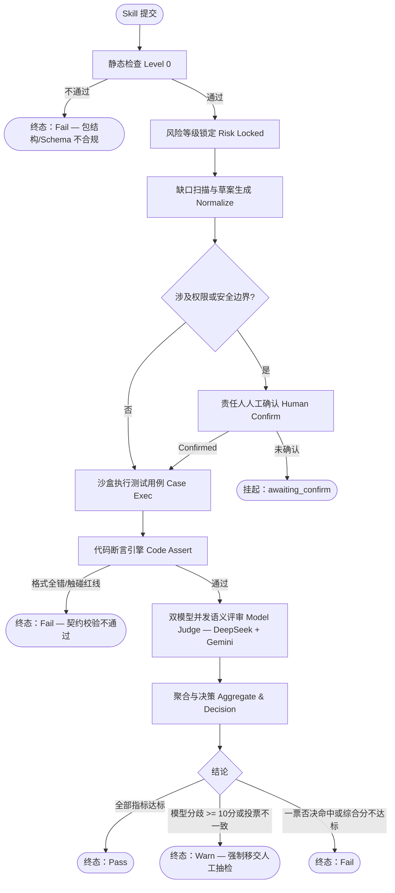
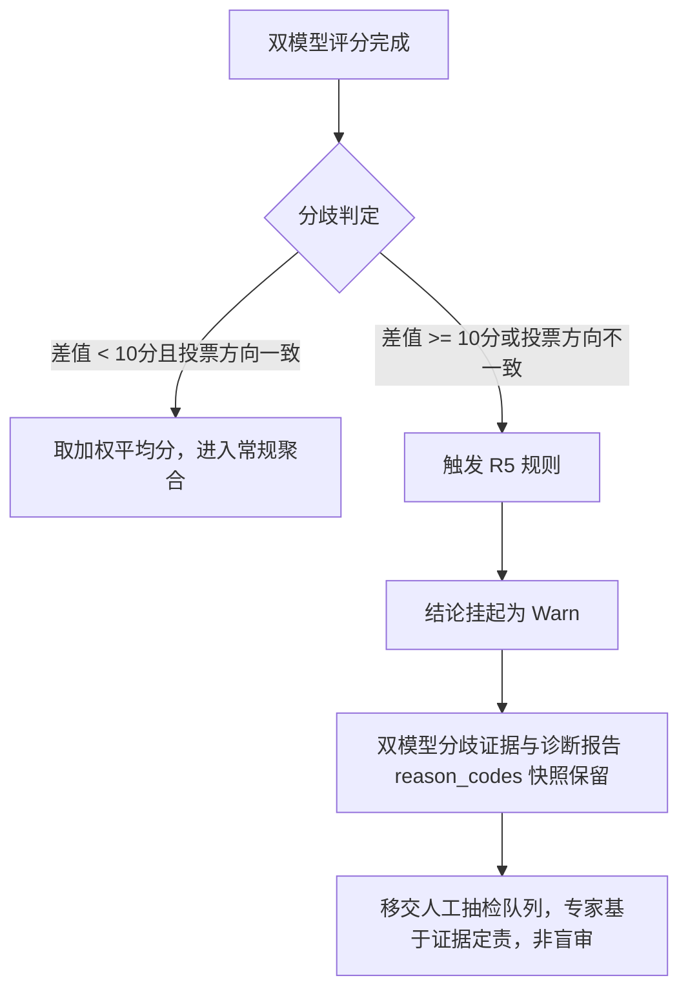

# Skill 准入与评估机制说明

> ⚠️ **已被替代**：请阅读最新全景说明 [`Skill评估系统全景说明.md`](Skill评估系统全景说明.md)（涵盖 W2 安全门禁、W3 自动出题、W4/W5 对话壳等现状）。本文档保留作阶段二历史参考。

> 版本：v1.0（历史） | 适用范围：SkillHub 平台 Skill 上架准入流程 | 受众：PM Leader、业务负责人

---

## 核心定位与业务价值

本机制旨在通过"代码断言 + 大模型语义双重交叉验证"，实现对 Skill 资产的自动化质检。确保上架技能在**指令遵循、输出合规、业务解决**三个维度达到基准线，用客观数据代替低效人工审核，牢守平台的安全与质量底线。

---

## 一、评估全生命周期

### 1.1 流程总览



### 1.2 各阶段职责说明

| 阶段 | 执行方式 | 核心产出 | 失败处置 |
|---|---|---|---|
| **静态检查（Level 0）** | 代码引擎，确定性 | 包结构与元数据 Schema（参数格式规范）合法性报告 | 直接终态 Fail，流程终止 |
| **风险等级锁定** | 规则引擎，不可人工下调 | 锁定 `risk_level`（Low / Medium / High），决定最少用例数 | — |
| **缺口扫描与人工确认** | 系统自动扫描 + 责任人签收 | 补全草案（`gaps`）；涉及权限边界的项必须 Confirmed | 未确认则挂起，不进入后续评分 |
| **沙盒执行** | 隔离沙盒环境 | 真实运行日志 Transcript（沙盒环境下的真实输入输出记录） | 执行超时触发熔断 |
| **代码断言（Code Assert）** | 代码引擎，确定性校验输出是否符合承诺格式 | JSON 格式匹配、必填字段校验结论 | 触碰红线直接 Fail |
| **双模型语义评审** | DeepSeek + Gemini 并发 | 三维评分 + `reason_codes` + 修改建议 | 分歧则挂起为 Warn |
| **聚合与决策** | 规则引擎 | 最终 Pass / Warn / Fail 结论及完整评估报告 | — |

### 1.3 运营确认台与评估结果呈现

#### 缺口补全交互（评估前）

当系统扫描到 Skill 提交材料存在缺失项（`gaps`）时，确认台会主动列出所有缺口，并区分两类处理方式：

| 缺口类型 | 界面交互方式 | 流转条件 |
|---|---|---|
| **一般补全项**（如补充描述、示例输出） | 系统生成补全草案，责任人审阅后点击"确认"即可 | 确认后自动标记为 Confirmed，进入评分流转 |
| **权限/安全边界相关项** | 草案内容高亮标注，**强制要求责任人逐项签收**，不可跳过 | 全部签收后方可解锁评分入口，否则评估持续挂起 |

未完成签收的评估任务保持 `awaiting_confirm` 状态，系统不会自动推进，确保敏感边界不被静默放行。

#### 评估结果呈现（评估后）

评估完成后，确认台统一展示以下四类信息：

**1. 综合质量分与三维子分**

| 展示项 | 说明 |
|---|---|
| **综合质量分**（满分 100） | 三维加权合成的最终得分，直观反映 Skill 的整体准入质量 |
| **指令遵循度**（权重 40%） | 反映 Skill 是否严格按步骤执行、参数是否准确完整 |
| **输出合规性**（权重 30%） | 反映输出是否存在越权、违规或大模型虚构内容 |
| **业务解决度**（权重 30%） | 反映输出是否真正闭环解决了用户的业务诉求 |
| **完整度分**（独立扣分制） | 独立呈现，不计入综合质量分；反映提交材料的覆盖完整程度 |

**2. AI 诊断总结**

双模型各自输出的结构化归因证据（`reason_codes`）和修改建议在界面中以列表形式逐条展示，标明每条问题对应的评分维度和严重等级，辅助作者定向修改，而非仅呈现一个数字结论。

**3. 缺口修复状态**

界面同步展示各补全项的签收状态（已确认 / 待确认），作为准入硬闸门的可视化核查清单。

**4. 人工抽检视图（仅 Warn 状态可见）**

当双模型触发 R5 分歧规则（分差 >= 10 分或投票方向不一致）时，界面额外展示：

- 双模型评分的完整对比（DeepSeek 与 Gemini 各自的三维子分及综合分）
- 分歧归因标签（`reason_codes`）的逐条比对，标注分歧焦点所在维度
- 专家操作入口：支持在界面内直接录入抽检结论（通过 / 退回），并关联回写至评估记录

上述信息在同一界面聚合呈现，专家无需跨系统查阅原始日志即可完成定责判断。

---

## 二、系统架构说明

### 2.1 双轨制混合评审结构

系统采用"**代码断言 + 大模型语义评审**"两条评审轨道并行运作，职责严格分离：

| 评审轨道 | 负责范围 | 判决性质 |
|---|---|---|
| **代码断言层** | JSON 格式合规性、必填字段存在性、契约匹配 | 确定性（0/1），不依赖模型 |
| **模型语义层** | 业务逻辑是否闭环、输出有无越权或幻觉、指令执行完整性 | 概率性，需双模型交叉验证 |

代码断言层作为前置门控：**格式层不通过，语义层不介入**，避免大模型资源的无效消耗。

### 2.2 模型调度与容错机制

**并发调度**：同一个测试用例同时派发给 DeepSeek 与 Gemini 两个模型，两路评审并行运行，整体评估耗时不受串行等待影响。

**指数退避重试**：针对外部大模型 API 的限流（429）和网络超时（503），底层内置自动重试机制，每次重试间隔按指数递增，自动消化偶发性网络抖动，防止评估任务因瞬时故障中断。

**即插即用模型层**：系统设计了统一的抽象模型接入层（`BaseLLMProvider`），所有评审逻辑不绑定具体模型实现。未来如需替换或新增模型供应商，只需按接口规范接入，无需修改任何评审业务逻辑。

### 2.3 风险等级锁定规则

风险等级的最终判定采用**就高不就低**原则，执行以下三步叠加逻辑：

```
① 读取作者自报的 risk_level
       ↓
② 系统静态规则扫描（如正则命中敏感词、越权指令特征等 → 自动提升为 High）
       ↓
③ 取两者最高值，锁定为不可下调的最终风险等级
```

风险等级直接决定准入的测试门槛。例如：**低风险**只需提供基础的成功用例即可过审；而**高风险**（如涉及外部数据写入、权限提升等操作）则强制要求提供更多的边界测试和越权诱导测试用例，否则直接驳回，不进入评分环节。

---

## 三、打分机制拆解

### 3.1 打分的前提输入

大模型语义评审并非凭空打分，系统要求作者预先提供以下三类材料，作为评审的"考题与参照系"：

| 输入材料 | 说明 |
|---|---|
| **元数据 Schema**（`skill.json`） | 即技能的参数格式规范，明确声明该 Skill 的预期输入/输出结构与能力边界 |
| **测试用例集**（`eval_cases`） | 覆盖正常场景、边界场景、越权诱导等多类型用例 |
| **运行日志 Transcript** | 沙盒环境下的真实输入输出记录，作为评审的客观事实依据 |

### 3.2 正式评分前的两层前置过滤

在大模型介入之前，系统先执行两层确定性的机器过滤，拦截明显不合格的提交：

**第一层——Level 0 静态检查**
检查 Skill 包结构完整性与元数据 Schema（参数格式规范）合法性。任一项不满足，直接输出 Fail，流程终止，不进入后续任何评分环节。

**第二层——代码断言引擎（Code Assert，即确定性的契约校验层）**
基于沙盒真实运行结果，客观比对：
- 输出是否符合作者在元数据中承诺的 JSON 格式
- 必填字段是否完整存在

若格式判定全部不通过，触碰一票否决红线，直接 Fail，不进入大模型评分。

### 3.3 综合质量分的三维构成

综合质量分满分 **100 分**，由以下三个固定维度加权合成：

| 维度 | 权重 | 评估关注点 |
|---|---|---|
| **指令遵循度** | 40% | 是否严格按步骤执行；参数是否准确、无遗漏 |
| **输出合规性** | 30% | 是否存在违规、越权行为；大模型是否产生虚构内容 |
| **业务解决度** | 30% | 输出结果是否真正闭环解决了用户最初的业务诉求 |

> **注意**：材料**完整度分数**独立计算，与上述三维质量分**完全解耦**，采用扣分制单独呈现，不影响质量分的计算逻辑。

### 3.4 大模型在评审中承担的职责

在代码断言完成后，DeepSeek 与 Gemini 作为两个独立的语义评估节点介入，双方不可见对方的评分结论。每个模型读取相同的输入材料（运行日志 Transcript + 代码断言结论），独立评审以下内容：

- 代码无法校验的**语义问题**：业务诉求是否真正被解决、输出内容是否存在虚构或逻辑错误
- 基于三维维度，给出独立的**量化评分**
- 输出**结构化归因证据**（`reason_codes`）和针对性的**修改建议**

> 模型必须输出有据可查的归因证据，而非仅返回一个分数。这是后续人工抽检与运营解释的数据基础。

---

## 四、关键影响要素矩阵

| 要素 | 触发条件 | 对评估结论的影响 | 优先级 |
|---|---|---|---|
| **准入硬闸门** | 元数据草案未经人工 Confirmed，**或**测试用例未全量完成评测 | 绝对禁止输出 Pass；结论挂起或强制 Fail | 最高 |
| **测试用例数量门控** | 实际提交用例数 < 该风险等级要求的最少数量 | 直接 Fail，不进入评分 | 最高 |
| **一票否决红线** | ① 越权/拒绝类用例执行失败；② 代码断言层格式全部不通过 | 终态直接 Fail，**不**参与常规分数平均计算 | 最高 |
| **R5 模型分歧拦截** | 双模型综合分绝对差值 **≥ 10 分**，或出现"一方建议通过、另一方建议驳回"的投票分裂 | 系统自动挂起，结论置为 Warn；原始分歧证据强制保留；移交人工抽检，**禁止**用平均分掩盖分歧 | 高 |
| **三维质量分阈值** | 综合加权分未达到准入阈值 | Fail | 标准 |
| **完整度扣分** | 材料存在缺失项（独立扣分制） | 独立呈现，不影响质量分；但影响准入硬闸门判断 | 标准 |

### R5 分歧拦截规则详解



---

## 五、评估结论定义

| 结论 | 含义 | 后续动作 |
|---|---|---|
| **Pass** | 全部准入条件满足，三维质量分达标，无红线命中，双模型无分歧 | 允许上架 |
| **Warn** | 评估完成但存在需关注项：触发 R5 双模型分歧，或部分指标临界 | 系统保留完整的双模型分歧证据和诊断报告（`reason_codes`），辅助专家快速定责；人工确认后决定上架或退回 |
| **Fail** | 命中一票否决红线，或综合分不达标，或准入硬闸门未通过 | 退回作者，附 `reason_codes` 和修改建议 |
| **awaiting_confirm** | 缺口草案涉及权限/安全边界，等待责任人人工签收 | 挂起，不进入评分 |

---

*文档完。如需了解具体指标阈值，请参阅 `docs/specs/评估指标与准入标准.md` v1.2.1。*
