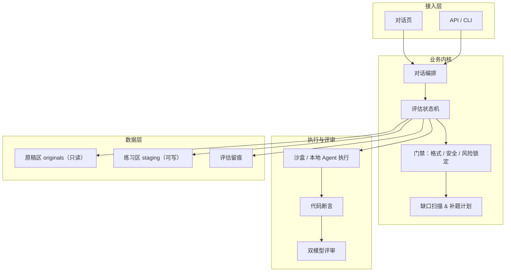
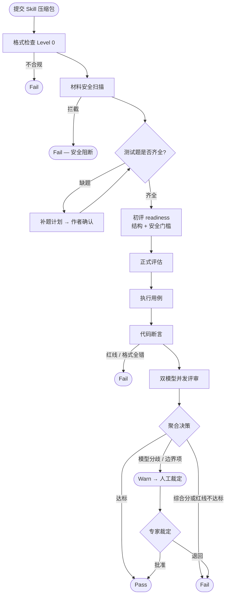
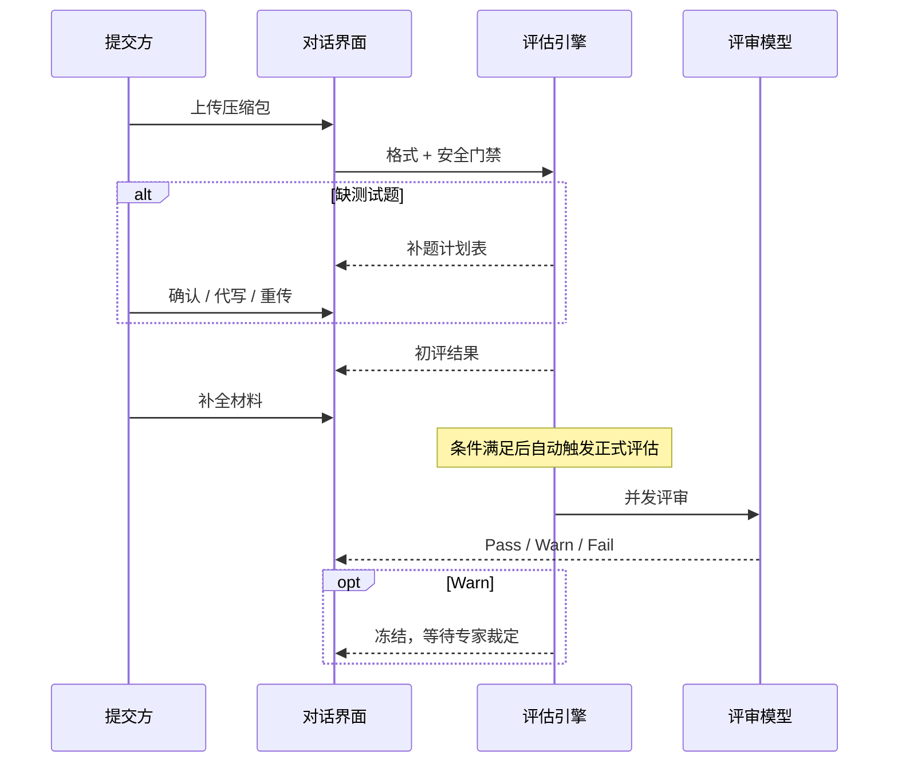

# Skill 评估机制 — 架构与流程

> 受众：产品经理、业务负责人

Skill 提交后，经门禁校验、材料补齐、用例执行与双模型评审，输出 Pass / Warn / Fail 准入结论。

---

## 1. 系统架构

| 层 | 职责 |
|----|------|
| 接入层 | 上传压缩包、对话补材料、查看报告 |
| 业务内核 | 编排全流程；评估进行中锁定包版本 |
| 执行与评审 | 跑测试用例 → 确定性格式校验 → 双 AI 语义打分 |
| 数据层 | 原稿保留作者提交内容；练习区承载补题与评估副本 |

**设计原则**：先代码断言、后 AI 评审；双模型独立打分、互相不可见；refusal / adversarial 类用例失败一票否决。

---

## 2. 评估主流程

| 阶段 | 方式 | 产出 |
|------|------|------|
| 格式检查 | 规则引擎 | 包结构与元数据合法性 |
| 安全扫描 | 静态规则 | blocked / pass |
| 补题 | 缺口扫描 + 作者确认 | staging 测试用例 |
| 初评 | 结构 + 安全门槛 | readiness 结论（无 AI 打分） |
| 正式评估 | 执行 + 断言 + 双模型 | 三维质量分、完整度分、终态 |

**三维质量分**（加权 0–100）：指令遵循度 40% · 输出合规性 30% · 业务解决度 30%。完整度分独立呈现，不计入质量加权。

---

## 3. 提交侧交互流程

- 评估运行中不可更换包，保证结果可追溯。  
- Warn 挂起后续操作，待专家 Approve 或退回。  
- 评估改动仅写入练习区，原稿区保持不变。
