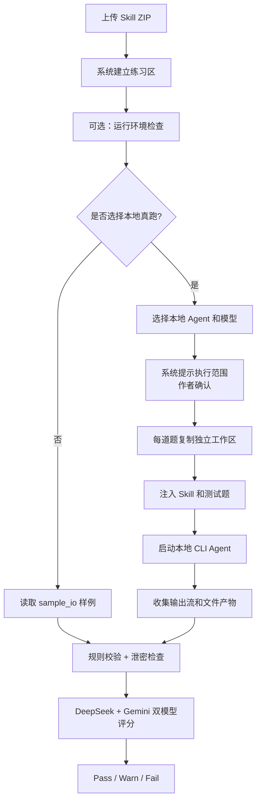
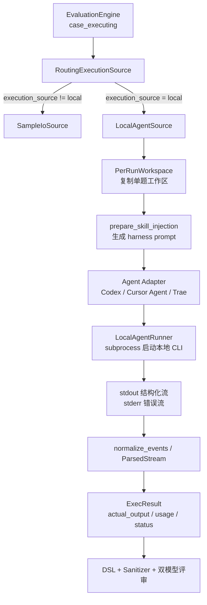

# 本地 CLI Agent 真跑机制说明

> 状态：当前机制说明
> 受众：产品经理、业务负责人、运营抽检

---

## 1. 一句话说明

本地 CLI Agent 真跑，是让作者本机已经装好的 Agent 工具实际执行测试题，把真实产出交给 SkillHub 评分。

它解决的是一个简单问题：**只看样例，能判断材料写得是否自洽；让本机 Agent 真跑，才能更接近真实使用效果。**

当前实现不是另起一套评分系统，而是在正式评估前增加一个“本机执行取数”环节：本地 Agent 负责产出，SkillHub 负责收集证据、判断是否真正跑完，并继续使用同一套评分标准。

---

## 2. 为什么需要本地真跑

Skill 评估有两种产出来源：

| 方式 | 能证明什么 | 不能证明什么 |
|------|------------|--------------|
| 样例评估 | 说明书、测试题、样例输出是否自洽 | 不证明真实执行一定能跑通 |
| 本地真跑 | 当前本机工具、模型、权限下能否实际产出结果 | 不证明所有机器、所有模型、所有权限环境都长期稳定 |

很多内部 Skill 依赖本地配置、内网权限、数据库、文件路径或已登录的工具。把这些 Skill 放到中央沙盒里跑，往往缺 VPN、缺 Token、缺本机上下文。
所以当前机制把真实执行放回作者本机，由作者已配置好的 CLI Agent 执行；SkillHub 仍负责裁判。

---

## 3. 支持哪些本地 Agent

当前机制面向本地命令行 Agent。系统用一份本地工具目录管理可选 Agent，并为每类 Agent 记录启动方式、模型发现方式、输出格式和安全能力。

| Agent | 作用 |
|------|------|
| Codex | 在本机按测试题执行任务，回传执行结果 |
| Cursor Agent | 复用作者本机 Cursor Agent 能力执行测试题 |
| Trae | 复用作者本机 Trae CLI 能力执行测试题 |
| Claude / Antigravity | 已纳入本地工具目录，作为同类本地 CLI 扩展位 |

产品口径上，不需要把它理解成三套评估系统。它们只是不同的“执行工具”；后面的评分、红线、双模型评审、专家复核仍然是 SkillHub 同一套标准。

系统会扫描本机是否能找到对应 CLI、是否可能已登录、能否列出或使用模型，并把结果展示在执行设置里。作者可以选择 Agent 和模型；如果不显式选模型，就使用该 CLI 自己的默认模型。

---

## 4. 作者侧流程

作者看到的是：

1. 上传 Skill。
2. 系统提示材料缺口，必要时补题。
3. 在执行设置里选择本地 Agent。
4. 可先点“运行环境检查”排查工具和模型状态。
5. 正式评估开始后，本地 Agent 按测试题执行。
6. 报告展示执行归属、耗时、Token、失败原因和评分结果。

---

## 5. 系统内部如何执行

正式评估选择本地真跑后，系统按测试题逐题组织执行。这里的“逐题”不是共用一个临时目录连续跑，而是每道题都有自己的执行环境和结果记录。

### 5.1 选择与授权

本地执行必须满足三件事：

| 条件 | 说明 |
|------|------|
| 作者选择本地执行 | 执行来源为 local，才会走本地 Agent |
| 作者确认授权 | 系统会要求作者确认本机执行范围，避免未经确认调用本机 CLI |
| 本机 Agent 可调用 | 系统能找到对应 CLI，并能按当前设置启动 |

如果缺少授权、CLI 未安装、未登录或不可调用，系统不会假装执行成功，而是记录为本地执行未完成。

### 5.2 独立工作区

每道题开始前，系统会把当前 Skill 包复制到一个临时工作区。Agent 只在这个工作区里执行，避免直接改动原始上传包或影响其他测试题。

执行前系统会记录工作区文件状态；执行后只收集新增或修改过的小文本文件。这样报告不仅能看到 Agent 最终回答，也能看到它是否生成了结果文件、日志片段或结构化产物。

### 5.3 Skill 注入

不同 CLI 加载 Skill 的方式不同。系统当前支持三种方式，并按 Agent 能力自动选择：

| 方式 | 产品解释 |
|------|----------|
| 原生注入 | Agent 自身支持读取 Skill 能力时，优先使用原生方式 |
| 文件放置 | 把 Skill 文件放在 Agent 当前工作区，让 Agent 直接读取 |
| Prompt 注入 | 如果前两种不可用，把必要的 Skill 内容放进执行指令里 |

无论使用哪种方式，系统都会生成一份执行指令，明确本题的用户意图、输入、Skill ID、case ID，以及是否必须调用入口脚本。对有脚本入口的 Skill，系统会要求 Agent 调用声明的入口，而不是手写一个看起来像结果的答案。

### 5.4 启动本地 CLI

系统不会把所有 Agent 当成同一个命令启动。每个 Agent 有自己的启动参数：

| Agent | 启动重点 |
|------|----------|
| Codex | 以结构化输出模式运行，工作区限制在当前题的临时目录；红线场景可使用更严格配置 |
| Cursor Agent | 以结构化输出模式运行，指定当前工作区和模型 |
| Trae | 以结构化输出模式运行，通过命令参数接收执行指令，并显式开放必要的命令执行能力 |

这些差异只存在于执行层。进入 SkillHub 后，所有 Agent 的输出都会被整理成同一种内部结果。

### 5.5 超时与并发

本地执行按 case 设置超时，不会无限等待。不同风险等级可以使用不同预算；如果 Agent 卡住，系统会终止进程。Windows 下会连同子进程一起终止，避免 CLI 包装进程退出但实际执行进程还留在后台。

系统也支持有限并发，多道题可以在受控数量内同时执行。遇到限流信号时，会自动把并发降到 1，并短暂重试，避免把模型或 CLI 压垮。

---

## 6. CLI 穿透技术架构

本地 CLI 真跑的技术核心，是把 SkillHub 的评估引擎和作者本机 CLI Agent 用一个执行接缝连接起来：评估引擎仍按 case 推进，实际产出来源从 `sample_io` 切到 `local_agent`。

### 6.1 执行路由

正式评估进入 `case_executing` 后，`EvaluationEngine` 会为每个 case 请求实际产出。路由层先判断执行来源：

| 路由 | 行为 |
|------|------|
| `sample_io` | 读取作者提供的样例输出 |
| `local` | 调用本机 CLI Agent，拿真实执行产出 |

`local` 路径由 `LocalAgentSource` 承接。它先检查执行授权，再读取当前选择的 Agent 和模型，解析出对应 adapter。如果 adapter 不存在、CLI 检测失败、未授权或红线题缺少加固能力，会返回 `ExecResult(status="incomplete")`，而不是继续假装执行成功。

### 6.2 Adapter 如何启动本地 CLI

每个本地 Agent 都有一个 adapter。adapter 负责三件事：

| 职责 | 说明 |
|------|------|
| detect | 判断本机能否找到并调用该 CLI |
| build_args | 生成本次执行需要的命令行参数 |
| normalize_events | 把该 CLI 的输出事件转成统一事件 |

当前核心差异如下：

| Agent | 启动方式 |
|------|----------|
| Codex | `codex exec --json`，指定工作目录、沙盒配置、模型和权限范围 |
| Cursor Agent | `cursor-agent --print --output-format stream-json`，指定 workspace 和模型 |
| Trae | `trae-cli -p --output-format stream-json`，通过命令参数传 prompt，并补充必要工具白名单 |

也就是说，SkillHub 不直接调用某个模型 API，而是启动作者本机已经登录、已经配置好的 CLI 进程。模型账号、内网权限、本地配置都继续留在作者机器上。

### 6.3 Prompt 与 Skill 注入

正式执行前，系统会生成一份 harness prompt。它包含：

| 内容 | 目的 |
|------|------|
| `skill_id` / `case_id` | 绑定本次执行对象 |
| `user_intent` / `input_template` | 给 Agent 明确测试题输入 |
| `SKILL.md` 使用要求 | 要求 Agent 按 Skill 说明执行 |
| `entrypoint` 要求 | 对有脚本入口的 Skill，要求必须调用入口处理输入 |
| 结构化返回要求 | 要求结尾返回符合 schema 的结构化结果 |

注入策略按 Agent 能力选择：原生加载优先，其次是把 Skill 文件放在工作区，最后把必要内容放进 prompt。这样可以兼容不同 CLI 的能力差异。

### 6.4 进程执行与超时控制

`LocalAgentRunner` 用 `subprocess` 启动本地 CLI，并把 prompt 通过 stdin 或命令参数传给 CLI。执行时会同时处理三类信号：

| 信号 | 用途 |
|------|------|
| stdout | 读取 CLI 的结构化执行事件 |
| stderr | 保留错误摘要，失败时写入报告 |
| timeout | 到期后终止进程，避免 case 长时间卡住 |

stdin 写入放在后台线程，避免 CLI 没有及时读取输入时阻塞主流程。Windows 下终止进程时使用进程树终止，避免只杀掉 `.cmd` 包装层而留下实际的 `node.exe` 子进程。

### 6.5 输出归一化

不同 CLI 的事件格式不一致。例如 Codex、Cursor Agent、Trae 对文本、工具调用、命令执行结果和完成事件的字段命名都不完全相同。adapter 会先把这些原始事件转成统一事件，再形成 `ParsedStream`：

| 统一字段 | 来源 |
|----------|------|
| `final_text` | Agent 最终文本或增量文本 |
| `tool_results` | 命令、脚本、工具调用结果 |
| `usage` | CLI 返回的 token / duration 等用量信息 |
| `is_complete` | 是否收到成功完成事件 |
| `is_error` / `error_text` | 是否收到错误完成事件或报错 |

只有 `is_complete=true` 且 `is_error=false`，系统才认为本地执行完成。否则该 case 会被标记为 `run_incomplete`。

### 6.6 ExecResult 如何回到评估引擎

`LocalAgentSource` 会把 `ParsedStream` 转成 `ExecResult`：

| ExecResult 字段 | 含义 |
|-----------------|------|
| `actual_output` | 给后续 DSL、Sanitizer、双模型评审使用的实际产出 |
| `source` | `local_agent` 或 `sample_io` |
| `status` | `ok` 或 `incomplete` |
| `agent_label` / `model_label` | 真正成功执行时使用的 Agent 和模型 |
| `usage` | 本地 CLI 返回的用量信息 |
| `degrade_reason` | 未完成或降级原因 |
| `stderr_excerpt` | 失败时保留的错误摘要 |

如果 Agent 返回了结构化 JSON，系统优先把它作为 `actual_output`；如果没有结构化 JSON，就用最终文本、工具结果和工作区文件产物合成 `actual_output`。有脚本入口的 Skill 还会额外校验 `tool_results` 中是否能看到入口调用证据。

### 6.7 失败不再静默回退

本地执行失败后，`RoutingExecutionSource` 会把原始失败结果返回给引擎。引擎会记录 `local_agent_failure` 事件，并把失败原因挂到对应 case。

如果所有本地执行 case 都失败，引擎会把整轮评估标为失败，并给出：

| 原因码 | 含义 |
|--------|------|
| `LOCAL_EXEC_UNAVAILABLE` | 本地 CLI、授权或基础可用性导致完全无法执行 |
| `LOCAL_EXEC_ALL_CASES_FAILED` | 已尝试本地执行，但没有任何 case 成功产出 |

唯一保留的样例回退，是红线题遇到 Agent 不支持加固执行配置时的有意降级。这属于明确设计的安全边界，不属于本地执行失败。

---

## 7. 环境检查是什么

环境检查是**体检**，不是**门禁**。

| 问题 | 当前口径 |
|------|----------|
| 检查什么 | 本机是否能找到 CLI Agent、是否可用、模型是否可选、基础执行是否正常 |
| 什么时候检查 | 上传 ZIP、练习区就绪后即可检查 |
| 检查失败怎么办 | 展示失败原因，帮助作者修本机环境 |
| 是否阻断正式评估 | 不阻断。正式评估仍以真实 case 执行结果为准 |

为什么不把环境检查做成硬门禁：轻量检查不等于真实业务 case。复杂 Skill 可能通过检查但正式 case 失败，也可能检查失败但样例评估仍可用于材料质检。
因此环境检查只帮助排障，不能替代正式评估。

当前环境检查会保存 24 小时缓存，并绑定当前 Skill、Agent、模型和 CLI 状态。工具、模型或 Skill 内容变化后，检查状态会过期，需要重新检查。即便检查失败，正式评估仍可继续；最终以真实 case 执行结果为准。

---

## 8. 结果如何返回

本地 Agent 执行时会持续输出事件流。SkillHub 不直接把原始日志丢给评分，而是先整理成稳定的结果结构：

| 字段 | 说明 |
|------|------|
| 最终文本 | Agent 对测试题的最终回答 |
| 工具结果 | Agent 调用命令、脚本或工具后的证据摘要 |
| 用量信息 | CLI 返回的 Token、耗时等数据；有则记录，没有则为空 |
| 完成状态 | 是否看到该 CLI 的完成信号，且没有报错 |
| 错误信息 | CLI 报错、超时、解析失败等原因 |
| 文件产物 | 工作区里新增或修改的小文本文件 |

如果 Agent 最终回答里带有符合要求的结构化结果，系统优先使用这份结果；如果没有，就把最终文本、工具结果和文件产物合成实际输出。

对有入口脚本的 Skill，系统还会检查工具证据里是否真的出现了入口调用。没有入口调用证据时，即使 Agent 写了回答，也会被标记为缺少关键执行证据。

---

## 9. 真跑结果如何进入评分

每道题的本地执行结果会形成一条执行结果记录：

| 状态 | 含义 |
|------|------|
| ok | 本地 Agent 完成执行，产出可进入后续评分 |
| incomplete | 本地 Agent 未完成、不可用、超时、缺证据或产出被拦截 |

`ok` 的结果会作为该题的实际产出，继续执行同一套评判：

1. 代码规则先查格式和字段契约。
2. 输出泄密检查扫描敏感信息。
3. DeepSeek 与 Gemini 分别评分。
4. 红线题失败直接 Fail。
5. 两个模型严重分歧则 Warn，交专家复核。

报告层会区分两组信息：

| 信息 | 说明 |
|------|------|
| 已选择的 Agent / 模型 | 作者本轮希望用哪个本地工具执行 |
| 实际执行成功的 Agent / 模型 | 只有至少一道题真实跑通时才展示为成功执行 |

这能避免一个常见误解：作者选择了某个 Agent，不代表它一定成功执行。报告会如实展示“选择了什么”和“实际跑成了什么”。

---

## 10. 失败如何处理

本地真跑失败不会再静默切回样例，也不会假装已经跑通。

| 场景 | 系统处理 |
|------|----------|
| 单道题本地失败 | 该题标记为未完成，并记录失败原因 |
| 全部题本地失败 | 整轮评估失败，报告显示本地执行未完成 |
| Agent 未安装或未登录 | 报告执行失败；作者可改用样例评估或修复本机环境后重跑 |
| Agent 跑得太慢 | 超时后终止本轮或该题，避免无限等待 |
| 模型没有给出可解析完成信号 | 记录为执行未完成，由报告呈现给作者和运营 |
| 产出疑似泄密 | 拦截为本地执行未完成，不进入评分 |
| 有脚本但未观察到入口调用 | 标记为缺少入口执行证据 |

这条规则很重要：**本地真跑的价值在于诚实。跑通就是跑通，没跑通就如实失败。**

当前只有一种例外：红线题需要更严格的执行配置。如果某个 Agent 不支持这种加固配置，系统会把这个场景作为“有意降级”处理，可回到样例证据继续评分；这不是执行失败，也不会伪装成本地真跑成功。

---

## 11. 失败原因如何呈现

系统会把底层失败整理成稳定的产品原因，便于作者、PM 和运营判断下一步。

| 产品原因 | 常见含义 |
|----------|----------|
| 尚未授权本机执行 | 作者还没有确认本地执行范围 |
| 本地 CLI 不可用 | 未安装、系统找不到命令，或 SkillHub 进程无法调用 |
| 本地 CLI 未登录或配置不可用 | CLI 在当前 Windows 账号或当前终端下没有可用登录状态 |
| Prompt 过大 | 某些 CLI 通过命令参数接收执行指令，超过安全长度 |
| Skill 注入不可用 | 当前 Agent 找不到可用方式读取 Skill |
| 本地执行未完成 | CLI 未返回完成信号、报错、卡住或被超时终止 |
| 缺少入口执行证据 | Skill 声明了脚本入口，但执行证据里没有看到入口被调用 |
| 产出疑似泄密 | 输出包含敏感信息，系统已拦截 |

报告和 UI 会把这些原因挂到具体 case 上。若所有 case 都失败，整轮会显示 `LOCAL_EXEC_UNAVAILABLE` 或 `LOCAL_EXEC_ALL_CASES_FAILED` 这类本地执行阻断原因，方便判断是环境问题、模型问题，还是 Skill 本身执行失败。

---

## 12. 和样例评估如何配合

样例评估和本地真跑不是互相替代，而是不同置信度的证据。

| 情况 | 建议 |
|------|------|
| 只想快速看材料是否齐全 | 用样例评估 |
| Skill 没有脚本或依赖外部人工动作 | 用样例评估 + 专家判断 |
| Skill 有明确执行入口 | 优先本地真跑 |
| 中高风险或权限敏感 | 本地真跑后仍建议专家看报告证据 |
| 本地环境暂时不可用 | 先用样例评估定位材料问题，修好环境后再真跑 |

---

## 13. 当前边界

| 边界 | 说明 |
|------|------|
| 不保证跨机器一致 | 不同作者本机工具、模型、权限不同，结果可能不同 |
| 不替代权限审批 | 系统记录执行证据，但权限是否允许仍需业务负责人判断 |
| 不承诺复杂 Skill 必然跑通 | 复杂任务可能因模型、工具、路径、超时失败 |
| 不改变评分标准 | 本地真跑只改变产出来源，不改变三维评分、红线和 R5 规则 |
| 不把环境检查当最终结论 | 环境检查只说明基础可用性，正式评估仍看真实 case |

---

*文档完。*
