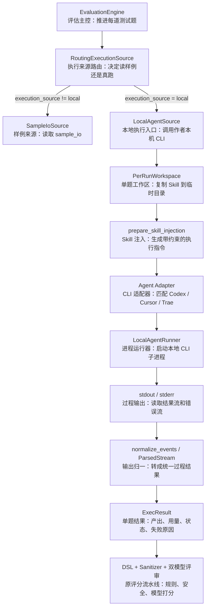
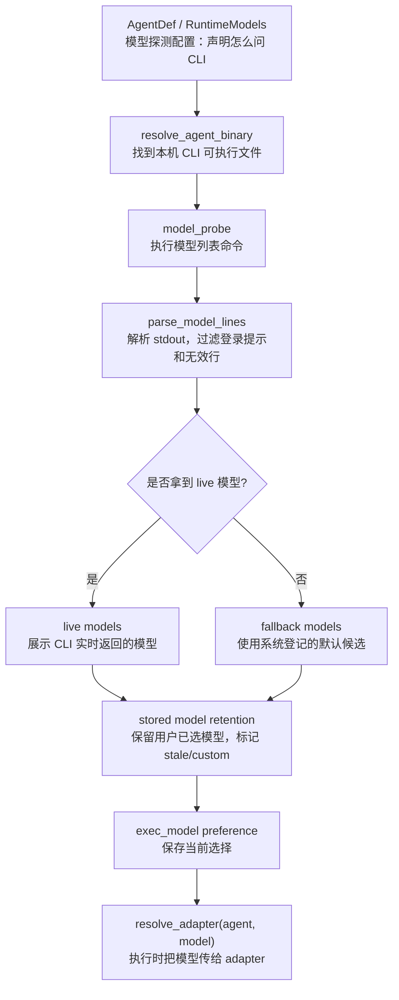

# 本地 CLI Agent 真跑机制说明

> 状态：当前机制说明
> 受众：产品经理、业务负责人、运营抽检

---

## 1. 总结说明

本地 CLI Agent 真跑，是让作者本机已经装好的 Agent 工具实际执行测试题，把真实产出交给 SkillHub 评分。

它解决的是一个简单问题：**只看样例，能判断材料写得是否自洽；让本机 Agent 真跑，才能更接近真实使用效果。**

当前实现不是另起一套评分系统，而是在正式评估前增加一个“本机执行取数”环节：本地 Agent 负责产出，SkillHub 负责收集证据、判断是否真正跑完，并继续使用同一套评分标准。

---

## 2. 为什么需要本地真跑

Skill 评估有两种产出来源：

| 方式 | 能证明什么 | 不能证明什么 |
|------|------------|--------------|
| 样例评估 | 说明书、测试题、样例输出是否自洽 | 不证明真实执行一定能跑通 |
| 本地真跑 | 当前本机工具、模型、权限下能否实际产出结果 | 不证明所有机器、所有模型、所有权限环境都长期稳定 |

很多内部 Skill 依赖本地配置、内网权限、数据库、文件路径或已登录的工具。把这些 Skill 放到中央沙盒里跑，往往缺 VPN、缺 Token、缺本机上下文。
所以当前机制把真实执行放回作者本机，由作者已配置好的 CLI Agent 执行；SkillHub 仍负责裁判。

---

## 3. 支持哪些本地 Agent

当前机制面向本地命令行 Agent。系统用一份本地工具目录管理可选 Agent，并为每类 Agent 记录启动方式、模型发现方式、输出格式和安全能力。

| Agent | 作用 |
|------|------|
| Codex | 在本机按测试题执行任务，回传执行结果 |
| Cursor Agent | 复用作者本机 Cursor Agent 能力执行测试题 |
| Trae | 复用作者本机 Trae CLI 能力执行测试题 |
| Claude / Antigravity | 已纳入本地工具目录，作为同类本地 CLI 扩展位 |

产品口径上，不需要把它理解成三套评估系统。它们只是不同的“执行工具”；后面的评分、红线、双模型评审、专家复核仍然是 SkillHub 同一套标准。

系统会扫描本机是否能找到对应 CLI、是否可能已登录、能否列出或使用模型，并把结果展示在执行设置里。作者可以选择 Agent 和模型；如果不显式选模型，就使用该 CLI 自己的默认模型。

---

## 4. 作者侧流程

作者看到的是：

1. 上传 Skill。
2. 系统提示材料缺口，必要时补题。
3. 在执行设置里选择本地 Agent。
4. 可先点“运行环境检查”排查工具和模型状态。
5. 正式评估开始后，本地 Agent 按测试题执行。
6. 报告展示执行归属、耗时、Token、失败原因和评分结果。

---

## 5. 系统内部如何执行

正式评估选择本地真跑后，系统按测试题逐题组织执行。这里的“逐题”不是共用一个临时目录连续跑，而是每道题都有自己的执行环境和结果记录。

### 5.1 选择与授权

本地执行必须满足三件事：

| 条件 | 说明 |
|------|------|
| 作者选择本地执行 | 执行来源为 local，才会走本地 Agent |
| 作者确认授权 | 系统会要求作者确认本机执行范围，避免未经确认调用本机 CLI |
| 本机 Agent 可调用 | 系统能找到对应 CLI，并能按当前设置启动 |

如果缺少授权、CLI 未安装、未登录或不可调用，系统不会假装执行成功，而是记录为本地执行未完成。

### 5.2 独立工作区

每道题开始前，系统会把当前 Skill 包复制到一个临时工作区。Agent 只在这个工作区里执行，避免直接改动原始上传包或影响其他测试题。

执行前系统会记录工作区文件状态；执行后只收集新增或修改过的小文本文件。这样报告不仅能看到 Agent 最终回答，也能看到它是否生成了结果文件、日志片段或结构化产物。

### 5.3 Skill 注入

不同 CLI 加载 Skill 的方式不同。系统当前支持三种方式，并按 Agent 能力自动选择：

| 方式 | 产品解释 |
|------|----------|
| 原生注入 | Agent 自身支持读取 Skill 能力时，优先使用原生方式 |
| 文件放置 | 把 Skill 文件放在 Agent 当前工作区，让 Agent 直接读取 |
| Prompt 注入 | 如果前两种不可用，把必要的 Skill 内容放进执行指令里 |

无论使用哪种方式，系统都会生成一份执行指令，明确本题的用户意图、输入、Skill ID、case ID，以及是否必须调用入口脚本。对有脚本入口的 Skill，系统会要求 Agent 调用声明的入口，而不是手写一个看起来像结果的答案。

### 5.4 启动本地 CLI

系统不会把所有 Agent 当成同一个命令启动。每个 Agent 有自己的启动参数：

| Agent | 启动重点 |
|------|----------|
| Codex | 以结构化输出模式运行，工作区限制在当前题的临时目录；红线场景可使用更严格配置 |
| Cursor Agent | 以结构化输出模式运行，指定当前工作区和模型 |
| Trae | 以结构化输出模式运行，通过命令参数接收执行指令，并显式开放必要的命令执行能力 |

这些差异只存在于执行层。进入 SkillHub 后，所有 Agent 的输出都会被整理成同一种内部结果。

### 5.5 超时与并发

本地执行按 case 设置超时，不会无限等待。不同风险等级可以使用不同预算；如果 Agent 卡住，系统会终止进程。Windows 下会连同子进程一起终止，避免 CLI 包装进程退出但实际执行进程还留在后台。

系统也支持有限并发，多道题可以在受控数量内同时执行。遇到限流信号时，会自动把并发降到 1，并短暂重试，避免把模型或 CLI 压垮。

---

## 6. CLI 穿透技术架构

本地 CLI 真跑的技术核心，是把 SkillHub 的评估引擎和作者本机 CLI Agent 用一个执行接缝连接起来：评估引擎仍按 case 推进，评分标准不变，只是把“这道题的实际产出从哪里来”从 `sample_io` 切到 `local_agent`。

用非技术语言说，这套架构分三层：

1. 上层评估系统决定“现在要评哪道题、需要什么产出”。
2. 中间本地执行平台决定“作者本机哪个 CLI 可以跑、用哪个模型、怎么启动”。
3. 底层 adapter 负责“把任务交给具体 CLI，并把 CLI 返回的信息翻译回 SkillHub 看得懂的格式”。

所以它不是让 SkillHub 接管作者电脑，也不是重写一套 Agent；它是在作者当前机器上启动已安装的 CLI，把执行结果收回来，再放回原评估流水线。

先把几个术语说清楚：

| 术语 | 在这里指什么 |
|------|--------------|
| Runtime Platform | 本地执行平台。负责登记有哪些本地 CLI、怎么检测、怎么选模型、怎么做环境检查 |
| Runtime | 一个具体本地工具的运行定义，例如 Codex、Cursor Agent、Trae |
| Adapter | 每个 CLI 的适配器。负责把 SkillHub 的请求翻译成该 CLI 能执行的命令，并把该 CLI 的输出翻译回统一格式 |
| Transport | 执行传输方式。当前主路径是启动本机 CLI 进程并读取结构化输出流 |
| ParsedStream | CLI 输出被解析后的统一过程结果，包括最终文本、工具调用、用量、完成状态、错误信息 |
| ExecResult | 给评估引擎使用的单题执行结果，包括实际产出、执行来源、Agent/模型、失败原因 |

这张图从左到右看即可：左边是评估系统，右边是评分系统，中间新增的是“本地 CLI 执行桥”。技术名词保留是为了方便和代码对应，节点里的第二行是它在业务流程里的作用。

### 6.1 执行路由

正式评估进入 `case_executing` 后，`EvaluationEngine` 会为每个 case 请求实际产出。路由层先判断执行来源：

| 路由 | 行为 |
|------|------|
| `sample_io` | 读取作者提供的样例输出 |
| `local` | 调用本机 CLI Agent，拿真实执行产出 |

`local` 路径由 `LocalAgentSource` 承接。它先检查执行授权，再读取当前选择的 Agent 和模型，解析出对应 adapter。如果 adapter 不存在、CLI 检测失败、未授权或红线题缺少加固能力，会返回 `ExecResult(status="incomplete")`，而不是继续假装执行成功。

这一步的非技术含义是：系统先决定“这道题是看作者样例，还是让本机工具真的跑一次”。只有明确选择本地执行并授权后，才会进入后面的 CLI 调用链。

### 6.2 Runtime Platform 管什么

Runtime Platform 是本地 CLI 真跑的底座。它不直接评分，也不直接判断 Skill 好坏；它负责把“本机有哪些可用执行工具”这件事标准化。

当前每个 runtime 定义会记录这些信息：

| 配置项 | 作用 |
|--------|------|
| runtime_id / label | 工具身份和展示名称，例如 `codex` / Codex |
| binary | CLI 主命令、别名、常见安装目录、版本探测参数 |
| models | 默认模型、模型枚举命令、备用模型枚举命令 |
| launch | prompt 传递方式、输出流格式、是否支持红线加固模式 |
| skill_injection | 优先用哪种方式把 Skill 给到 CLI |
| preflight | 环境检查使用的轻量用例和证据要求 |
| config_dirs | 用于判断登录或配置状态的本地配置目录 |

用非技术语言说，Runtime Platform 像是一张“本地工具能力登记表”：它告诉系统 Codex 怎么找、Cursor Agent 怎么列模型、Trae 怎么接收 prompt、哪个工具支持更严格的红线执行配置。

这层存在的原因是避免把每个 CLI 的安装路径、模型列表、prompt 传递方式写散在各处。产品上看到的是“可选择多个本地 Agent”；技术上靠 runtime 定义把这些 Agent 变成同一种可管理对象。

### 6.3 Runtime Platform 怎么发现本机能力

作者打开执行设置或点击扫描时，系统会遍历本地工具目录，做几类检查：

| 检查 | 返回到 UI 的含义 |
|------|------------------|
| CLI 是否存在 | 是否安装、能否找到命令或常见安装目录 |
| CLI 是否可调用 | 用版本命令验证当前 SkillHub 进程能否启动它 |
| 登录 / 配置是否存在 | 通过配置目录、诊断命令或工具自检判断是否可能可用 |
| 模型是否可选 | 优先在线枚举模型；枚举失败时使用 fallback 模型 |
| 已选模型是否仍有效 | 对当前选中的 runtime 和模型做 live probe |
| 环境检查状态 | 展示 missing / passed / failed / expired / blocked |

这些结果会形成 runtime readiness，给前端展示“已安装、待登录、模型可用、检查通过、检查过期”等状态。正式评估不会因为环境检查缺失而被拦住；环境检查只是诊断层，真正结论仍来自正式 case 执行。

换成产品语言，这一步解决的是“按钮能不能点、失败该提示什么、用户该修安装还是修登录”。它不是评分证据，只是把本机环境状态提前讲清楚。

### 6.4 本地模型如何探测和调用

本地模型不是 SkillHub 自己维护的一张固定表，而是尽量从作者本机 CLI 里实时读取。原因很直接：不同作者本机登录的账号、可用模型、CLI 版本和自定义 provider 可能不一样，中央系统不能假设所有人都有同一组模型。

模型探测的链路如下：

模型探测分四步：

| 步骤 | 技术动作 | 非技术解释 |
|------|----------|------------|
| 读取配置 | 从 runtime / agent 定义读取 `model_probe` 和备用探测命令 | 先知道“应该问这个 CLI 哪个命令才能列模型” |
| 找到 CLI | 通过命令名、别名、常见安装目录解析本机可执行文件 | 先确认本机真正能调用哪个 CLI |
| 执行探测 | 运行类似 `cursor-agent models`、`trae-cli models` 的命令 | 让 CLI 自己说当前账号有哪些模型 |
| 解析结果 | 过滤登录提示、空行、说明文字，提取模型 ID 和展示名 | 把 CLI 输出整理成 UI 下拉框能用的模型列表 |

如果 live probe 成功，模型来源标记为 `live`，UI 优先展示 CLI 实时返回的模型，并额外放一个“默认模型”。默认模型的含义是：SkillHub 不指定具体模型，让该 CLI 使用自己的默认配置。

如果 live probe 失败，系统不会直接让选择框空掉，而是使用 fallback models。fallback 不是证明模型一定可用，只是保留一个可选项，避免 CLI 暂时无法枚举模型时整个本地执行设置不可操作。

还有一种情况是用户之前选过某个模型，但这次 live probe 没有返回它。系统会保留这个已选模型，并标记为 `stale` 或 `custom`：

| 标记 | 含义 |
|------|------|
| `live` | 本次从 CLI 实时探测到 |
| `fallback` | 系统登记的备用模型 |
| `stale` | 之前选过，但本次 live 列表没有出现，可能已失效或名称变化 |
| `custom` | 无法 live 探测时保留的用户自定义模型 |

正式执行时，模型选择通过 `exec_model` preference 保存。`LocalAgentSource` 读取当前 `exec_agent` 和 `exec_model` 后，会调用 `resolve_adapter(agent_id, model)` 生成带模型参数的 adapter。adapter 再把模型写进本地 CLI 启动命令：

| Agent | 模型如何传给 CLI |
|------|------------------|
| Codex | 启动命令追加 `--model <model>` |
| Cursor Agent | 启动命令追加 `--model <model>` |
| Trae | 启动命令追加 `-c model.name=<model>` |
| 默认模型 | 不追加具体模型参数，让 CLI 使用自己的默认模型 |

因此，SkillHub 调用的不是“平台内置模型”，而是“作者本机 CLI 当前账号下可用的模型”。模型能否真正执行，最终仍以正式 case 的本地执行结果为准；模型探测只负责尽量提前发现可选项和明显失效项。

### 6.5 环境检查如何跑

环境检查由 `PreflightRunner` 执行，流程和正式本地执行相似，但用的是更轻量的检查题：

1. 读取当前 Skill 包，计算 skill fingerprint。
2. 读取 runtime 定义，确认 CLI 路径、版本、模型、配置状态。
3. 生成或选择轻量 preflight case。
4. 复制独立工作区。
5. 用同一套 Skill 注入和本地 CLI 启动机制跑一次轻量检查。
6. 检查是否完成、是否报错、是否能看到入口文件或入口调用证据。
7. 把结果写入缓存，默认 24 小时有效。

缓存绑定 runtime、模型、Skill 指纹和 CLI 状态。换了 Skill、换了模型、CLI 版本或配置变化后，检查会过期。这样 UI 可以提示“上次检查是否还可信”，但不会把这次检查当作正式评分依据。

也就是说，环境检查回答的是“这个工具大概率能不能被 SkillHub 调起来”，不是“这个 Skill 的正式业务 case 一定能跑通”。正式结论仍要看正式 case。

### 6.6 Adapter 如何启动本地 CLI

每个本地 Agent 都有一个 adapter。adapter 负责三件事：

| 职责 | 说明 |
|------|------|
| detect | 判断本机能否找到并调用该 CLI |
| build_args | 生成本次执行需要的命令行参数 |
| normalize_events | 把该 CLI 的输出事件转成统一事件 |

当前核心差异如下：

| Agent | 启动方式 |
|------|----------|
| Codex | `codex exec --json`，指定工作目录、沙盒配置、模型和权限范围 |
| Cursor Agent | `cursor-agent --print --output-format stream-json`，指定 workspace 和模型 |
| Trae | `trae-cli -p --output-format stream-json`，通过命令参数传 prompt，并补充必要工具白名单 |

也就是说，SkillHub 不直接调用某个模型 API，而是启动作者本机已经登录、已经配置好的 CLI 进程。模型账号、内网权限、本地配置都继续留在作者机器上。

Adapter 和 Runtime Platform 的关系是：Runtime Platform 决定“这个工具怎么被发现、有哪些能力、默认怎么运行”；adapter 负责“这一次具体怎么拼命令、怎么解释输出”。新增本地 CLI 时，原则上先补 runtime 定义，再补对应 adapter。

非技术理解可以简单记成：Runtime Platform 负责“登记和检查”，adapter 负责“执行落地”。前者让系统知道工具是否存在、能力是什么；后者负责一次真实执行。

### 6.7 Prompt 与 Skill 注入

正式执行前，系统会生成一份 harness prompt。它包含：

| 内容 | 目的 |
|------|------|
| `skill_id` / `case_id` | 绑定本次执行对象 |
| `user_intent` / `input_template` | 给 Agent 明确测试题输入 |
| `SKILL.md` 使用要求 | 要求 Agent 按 Skill 说明执行 |
| `entrypoint` 要求 | 对有脚本入口的 Skill，要求必须调用入口处理输入 |
| 结构化返回要求 | 要求结尾返回符合 schema 的结构化结果 |

注入策略按 Agent 能力选择：原生加载优先，其次是把 Skill 文件放在工作区，最后把必要内容放进 prompt。这样可以兼容不同 CLI 的能力差异。

这里的关键点是：SkillHub 不把 Skill 当作普通文本随便问模型，而是明确要求 Agent 在当前工作区读取 Skill、执行指定 case，并在必要时调用声明的入口脚本。也就是说，本地 CLI 是被“带着任务约束”启动的。

这一步保证本地真跑不是让 Agent 自由发挥，而是让它在明确测试题、明确输入、明确 Skill 规则下完成任务。后续评分才有稳定依据。

### 6.8 进程执行与超时控制

`LocalAgentRunner` 用 `subprocess` 启动本地 CLI，并把 prompt 通过 stdin 或命令参数传给 CLI。执行时会同时处理三类信号：

| 信号 | 用途 |
|------|------|
| stdout | 读取 CLI 的结构化执行事件 |
| stderr | 保留错误摘要，失败时写入报告 |
| timeout | 到期后终止进程，避免 case 长时间卡住 |

stdin 写入放在后台线程，避免 CLI 没有及时读取输入时阻塞主流程。Windows 下终止进程时使用进程树终止，避免只杀掉 `.cmd` 包装层而留下实际的 `node.exe` 子进程。

这就是“CLI 穿透”的实际含义：SkillHub 服务端进程不接管作者账号，也不替作者登录模型；它只在作者当前机器上启动已安装的 CLI，把任务交给 CLI，再读取 CLI 返回的结构化过程数据。

对用户来说，这意味着本地账号、模型权限、内网访问和文件路径仍然由作者机器提供。SkillHub 做的是调度、记录和评判，不把这些本机能力搬到中央服务器。

### 6.9 信息如何从 CLI 返回

本地 CLI 返回信息分三层：

| 层级 | 内容 | 处理方式 |
|------|------|----------|
| 原始输出 | CLI stdout 的逐行结构化事件、stderr 错误文本 | `LocalAgentRunner` 持续读取 |
| 统一事件 | 文本增量、工具结果、用量、完成、错误 | adapter 的 `normalize_events` 负责转换 |
| 评估结果 | `ParsedStream` 和 `ExecResult` | 交回评估引擎继续评分 |

不同 CLI 的事件格式不一致。例如 Codex、Cursor Agent、Trae 对文本、工具调用、命令执行结果和完成事件的字段命名都不完全相同。adapter 会先把这些原始事件转成统一事件，再形成 `ParsedStream`：

| 统一字段 | 来源 |
|----------|------|
| `final_text` | Agent 最终文本或增量文本 |
| `tool_results` | 命令、脚本、工具调用结果 |
| `usage` | CLI 返回的 token / duration 等用量信息 |
| `is_complete` | 是否收到成功完成事件 |
| `is_error` / `error_text` | 是否收到错误完成事件或报错 |

只有 `is_complete=true` 且 `is_error=false`，系统才认为本地执行完成。否则该 case 会被标记为 `run_incomplete`。

这一层的价值是把不同 CLI 的输出差异统一成 SkillHub 的标准格式。Codex、Cursor Agent、Trae 返回格式不同，但进入评分前都必须变成同一种 `ParsedStream`。

### 6.10 actual_output 怎么拿到

`LocalAgentSource` 会把 `ParsedStream` 转成 `ExecResult`。其中最关键的是 `actual_output`，也就是后续评分真正读取的“本题实际产出”。

`actual_output` 的生成顺序是：

1. 先看 Agent 最终文本里是否有 fenced JSON。
2. 如果有结构化 JSON，就把它作为主体结果。
3. 如果工作区里有新增或修改的小文本文件，把这些文件作为 `artifacts` 附上。
4. 如果没有结构化 JSON，就用最终文本、工具结果和文件产物合成结果。
5. 如果 Skill 声明了入口脚本，还要检查工具结果里是否能看到入口调用证据。

形成的 `ExecResult` 字段如下：

| ExecResult 字段 | 含义 |
|-----------------|------|
| `actual_output` | 给后续 DSL、Sanitizer、双模型评审使用的实际产出 |
| `source` | `local_agent` 或 `sample_io` |
| `status` | `ok` 或 `incomplete` |
| `agent_label` / `model_label` | 真正成功执行时使用的 Agent 和模型 |
| `usage` | 本地 CLI 返回的用量信息 |
| `degrade_reason` | 未完成或降级原因 |
| `stderr_excerpt` | 失败时保留的错误摘要 |

`ExecResult` 会被缓存到当前 run 的 case 执行结果里。后续 DSL 断言、输出泄密检查、双模型评分、报告归因都会通过这个结果读取实际产出。换句话说，CLI 返回不是直接写进最终报告，而是先变成标准执行结果，再进入原有评估流水线。

非技术理解是：系统不会把一大段原始日志直接交给评委，而是先整理成“这道题的最终答案、执行证据、产物文件、是否成功、失败原因”。评审只看这份整理后的标准结果。

### 6.11 执行归属如何返回到报告

报告会区分“用户选择了什么”和“实际成功跑了什么”：

| 报告字段 | 口径 |
|----------|------|
| `exec_requested_agent_label` / `exec_requested_model_label` | 用户本轮选择的 Agent 和模型 |
| `exec_agent_label` / `exec_model_label` | 至少一个 case 真实通过本地 Agent 跑通后才填充 |
| `provider_summary.per_case.exec_status` | 每个 case 的本地执行状态 |
| `provider_summary.per_case.exec_degrade_reason` | 每个 case 的本地失败原因 |
| `usage_summary` | 本地 Agent、Provider A、Provider B 的 token / 耗时汇总 |

这样可以避免“选了某个 Agent”被误读成“该 Agent 已经成功执行”。如果用户选了 Cursor Agent 但所有 case 都失败，报告会显示已选择 Cursor Agent，但不会把 Cursor Agent 写成成功执行来源。

这一点是报告诚实性的关键：选择是用户意图，成功执行是系统证据。两者分开记录，才能解释清楚“用户想用哪个工具”和“实际哪个工具跑出了可评分产出”。

### 6.12 失败不再静默回退

本地执行失败后，`RoutingExecutionSource` 会把原始失败结果返回给引擎。引擎会记录 `local_agent_failure` 事件，并把失败原因挂到对应 case。

如果所有本地执行 case 都失败，引擎会把整轮评估标为失败，并给出：

| 原因码 | 含义 |
|--------|------|
| `LOCAL_EXEC_UNAVAILABLE` | 本地 CLI、授权或基础可用性导致完全无法执行 |
| `LOCAL_EXEC_ALL_CASES_FAILED` | 已尝试本地执行，但没有任何 case 成功产出 |

唯一保留的样例回退，是红线题遇到 Agent 不支持加固执行配置时的有意降级。这属于明确设计的安全边界，不属于本地执行失败。

所以整套 CLI 穿透架构的闭环是：能跑就拿真实产出评分；跑不成就保留失败证据；只有明确设计的安全降级才回到样例。这样本地真跑既能提高评估真实性，也不会把失败包装成成功。

---

## 7. 环境检查是什么

环境检查是**体检**，不是**门禁**。

| 问题 | 当前口径 |
|------|----------|
| 检查什么 | 本机是否能找到 CLI Agent、是否可用、模型是否可选、基础执行是否正常 |
| 什么时候检查 | 上传 ZIP、练习区就绪后即可检查 |
| 检查失败怎么办 | 展示失败原因，帮助作者修本机环境 |
| 是否阻断正式评估 | 不阻断。正式评估仍以真实 case 执行结果为准 |

为什么不把环境检查做成硬门禁：轻量检查不等于真实业务 case。复杂 Skill 可能通过检查但正式 case 失败，也可能检查失败但样例评估仍可用于材料质检。
因此环境检查只帮助排障，不能替代正式评估。

当前环境检查会保存 24 小时缓存，并绑定当前 Skill、Agent、模型和 CLI 状态。工具、模型或 Skill 内容变化后，检查状态会过期，需要重新检查。即便检查失败，正式评估仍可继续；最终以真实 case 执行结果为准。

---

## 8. 结果如何返回

本地 Agent 执行时会持续输出事件流。SkillHub 不直接把原始日志丢给评分，而是先整理成稳定的结果结构：

| 字段 | 说明 |
|------|------|
| 最终文本 | Agent 对测试题的最终回答 |
| 工具结果 | Agent 调用命令、脚本或工具后的证据摘要 |
| 用量信息 | CLI 返回的 Token、耗时等数据；有则记录，没有则为空 |
| 完成状态 | 是否看到该 CLI 的完成信号，且没有报错 |
| 错误信息 | CLI 报错、超时、解析失败等原因 |
| 文件产物 | 工作区里新增或修改的小文本文件 |

如果 Agent 最终回答里带有符合要求的结构化结果，系统优先使用这份结果；如果没有，就把最终文本、工具结果和文件产物合成实际输出。

对有入口脚本的 Skill，系统还会检查工具证据里是否真的出现了入口调用。没有入口调用证据时，即使 Agent 写了回答，也会被标记为缺少关键执行证据。

---

## 9. 真跑结果如何进入评分

每道题的本地执行结果会形成一条执行结果记录：

| 状态 | 含义 |
|------|------|
| ok | 本地 Agent 完成执行，产出可进入后续评分 |
| incomplete | 本地 Agent 未完成、不可用、超时、缺证据或产出被拦截 |

`ok` 的结果会作为该题的实际产出，继续执行同一套评判：

1. 代码规则先查格式和字段契约。
2. 输出泄密检查扫描敏感信息。
3. 评审模型 A / B 分别评分；当前演示配置为 DeepSeek / Gemini。
4. 红线题失败直接 Fail。
5. 两个模型严重分歧则 Warn，交专家复核。

报告层会区分两组信息：

| 信息 | 说明 |
|------|------|
| 已选择的 Agent / 模型 | 作者本轮希望用哪个本地工具执行 |
| 实际执行成功的 Agent / 模型 | 只有至少一道题真实跑通时才展示为成功执行 |

这能避免一个常见误解：作者选择了某个 Agent，不代表它一定成功执行。报告会如实展示“选择了什么”和“实际跑成了什么”。

---

## 10. 失败如何处理

本地真跑失败不会再静默切回样例，也不会假装已经跑通。

| 场景 | 系统处理 |
|------|----------|
| 单道题本地失败 | 该题标记为未完成，并记录失败原因 |
| 全部题本地失败 | 整轮评估失败，报告显示本地执行未完成 |
| Agent 未安装或未登录 | 报告执行失败；作者可改用样例评估或修复本机环境后重跑 |
| Agent 跑得太慢 | 超时后终止本轮或该题，避免无限等待 |
| 模型没有给出可解析完成信号 | 记录为执行未完成，由报告呈现给作者和运营 |
| 产出疑似泄密 | 拦截为本地执行未完成，不进入评分 |
| 有脚本但未观察到入口调用 | 标记为缺少入口执行证据 |

这条规则很重要：**本地真跑的价值在于诚实。跑通就是跑通，没跑通就如实失败。**

当前只有一种例外：红线题需要更严格的执行配置。如果某个 Agent 不支持这种加固配置，系统会把这个场景作为“有意降级”处理，可回到样例证据继续评分；这不是执行失败，也不会伪装成本地真跑成功。

---

## 11. 失败原因如何呈现

系统会把底层失败整理成稳定的产品原因，便于作者、PM 和运营判断下一步。

| 产品原因 | 常见含义 |
|----------|----------|
| 尚未授权本机执行 | 作者还没有确认本地执行范围 |
| 本地 CLI 不可用 | 未安装、系统找不到命令，或 SkillHub 进程无法调用 |
| 本地 CLI 未登录或配置不可用 | CLI 在当前 Windows 账号或当前终端下没有可用登录状态 |
| Prompt 过大 | 某些 CLI 通过命令参数接收执行指令，超过安全长度 |
| Skill 注入不可用 | 当前 Agent 找不到可用方式读取 Skill |
| 本地执行未完成 | CLI 未返回完成信号、报错、卡住或被超时终止 |
| 缺少入口执行证据 | Skill 声明了脚本入口，但执行证据里没有看到入口被调用 |
| 产出疑似泄密 | 输出包含敏感信息，系统已拦截 |

报告和 UI 会把这些原因挂到具体 case 上。若所有 case 都失败，整轮会显示 `LOCAL_EXEC_UNAVAILABLE` 或 `LOCAL_EXEC_ALL_CASES_FAILED` 这类本地执行阻断原因，方便判断是环境问题、模型问题，还是 Skill 本身执行失败。

---

## 12. 和样例评估如何配合

样例评估和本地真跑不是互相替代，而是不同置信度的证据。

| 情况 | 建议 |
|------|------|
| 只想快速看材料是否齐全 | 用样例评估 |
| Skill 没有脚本或依赖外部人工动作 | 用样例评估 + 专家判断 |
| Skill 有明确执行入口 | 优先本地真跑 |
| 中高风险或权限敏感 | 本地真跑后仍建议专家看报告证据 |
| 本地环境暂时不可用 | 先用样例评估定位材料问题，修好环境后再真跑 |

---

## 13. 当前边界

| 边界 | 说明 |
|------|------|
| 不保证跨机器一致 | 不同作者本机工具、模型、权限不同，结果可能不同 |
| 不替代权限审批 | 系统记录执行证据，但权限是否允许仍需业务负责人判断 |
| 不承诺复杂 Skill 必然跑通 | 复杂任务可能因模型、工具、路径、超时失败 |
| 不改变评分标准 | 本地真跑只改变产出来源，不改变三维评分、红线和 R5 规则 |
| 不把环境检查当最终结论 | 环境检查只说明基础可用性，正式评估仍看真实 case |

---

*文档完。*
