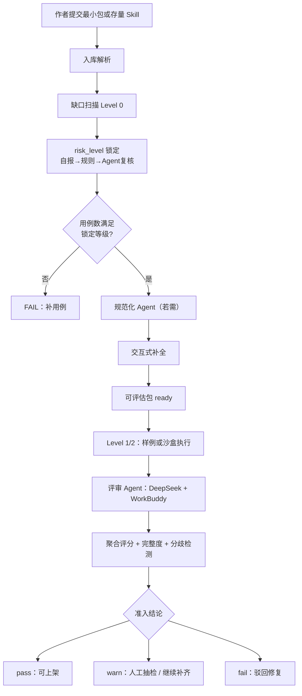

# Skill 元数据定义与编写规范

> 版本：v0.5  
> 状态：阶段一协议正文（§9 导读；§6.4 断言语法；§14.6 risk 锁定；§8/§14 引用 1.3 Architecture Contract）  
> 目标：作为 SkillHub 评估与上架的**尺子**；创作侧低门槛，入库前由 Agent 识别缺口并交互式补齐。  
> 主载体：`SKILL.md`。OpenAPI / MCP / 可视化 Workflow 后续作为兼容层讨论。  
> **阶段边界**：阶段一以文档与流程定义为主；完整 Agent 评估体系的工程搭建留待阶段二。  
> **面向开发者的编写说明**（原则、反模式、最小作者包）见 [`docs/guides/Skill编写指南.md`](../guides/Skill编写指南.md)，本文档不重复该部分内容。

---

## 1. 目标与适用范围

本规范用于定义内部 Skill 在 SkillHub MVP 中的提交、评估、准入与抽检方式。第一版服务 **混合最小版评估 Agent demo**：

- 有执行脚本的 Skill：优先进入沙盒执行，产出真实 I/O。
- 无执行脚本的 Skill：使用 `sample_io` 和 `eval_cases` 模拟执行，验证元数据与输出契约。
- 评审基座：先按 **DeepSeek + WorkBuddy** 交叉评审设计。
- 评审结论：自动评审给出 `pass` / `warn` / `fail`，并保留人工抽检入口。

本规范重点解决三个问题：

| 问题 | 规范抓手 |
|------|----------|
| 业务人员不知道 Skill 能做什么 | 清晰命名、描述、适用/禁用边界、场景分类 |
| Skill 质量参差不齐 | 强制输入/输出契约、测试用例、评审 Agent 评分 |
| 自动评审不可追溯 | 统一评审输出、模型投票、transcript、人工抽检表 |

### 1.1 规范分层：创作 / 评估 / 上架

本规范**不是**要求所有员工在日常设计 Skill 时一次性写满全部字段，而是按三层适用：

| 层级 | 适用时机 | 要求强度 | 说明 |
|------|----------|----------|------|
| **创作规范** | 员工日常编写、自用 Skill | 低门槛 | 只需满足「最小作者包」（见 §1.2） |
| **评估规范** | 提交 SkillHub 进入评估链路 | 完整对照 | 评估 Agent 按本规范打分、归因、给出 `pass/warn/fail` |
| **上架规范** | 正式入库 / 对外可见 | 严格 | 达到「可评估包」+ 准入结论（含人工抽检规则） |

**主策略：评估尺子 + 入库前补齐。** 标准在平台侧收敛；缺口由「Agent 识别缺失 → 交互式补全 → 人确认」解决，而非静默自动写入正式元数据。

### 1.2 最小作者包 vs 可评估包

**最小作者包**（作者侧，业务人员可完成）：

| 项 | 必填 | 说明 |
|----|------|------|
| 用途说明 | 是 | 自然语言：做什么、给谁用（可无 YAML frontmatter） |
| 使用示例 | 是 | 至少 1 次成功输入/输出、对话片段或脚本路径 |
| 负责人 | 是 | `owner` 或维护人 |
| 现有 `SKILL.md` / 脚本 | 否 | 有则一并提交 |

**可评估包**（平台侧，评估 Agent 消费）：

即 §2 定义的完整目录结构：`SKILL.md`（含 frontmatter）+ `eval_cases` + `sample_io`（+ 可选 `scripts`）。

两者之间的缺口，在**入库前补齐流水线**中处理（流程见 §14）。

### 1.3 存量 Skill 与降级评估

对已有自用 Skill、历史离散资产：

1. **先做一次降级评估**：在元数据不完整时仍可运行评估流程，但结论上限为 **`warn`**，不得直接 **`pass`**。
2. **输出缺口清单**：明确缺哪些字段、哪些用例、哪些需人确认。
3. **交互式补齐**：作者或运营按清单补全可评估包。
4. **再次完整评估**：补齐后按完整规范重新评估，方可进入 `pass` 与上架。

降级评估的目的：快速摸底质量与缺口，而非降低长期上架标准。

---

## 2. Skill 包目录规范

每个待评估 Skill 以一个目录为单位提交。第一版 demo 的最小可评估包如下：

```text
skill-name/
  SKILL.md
  eval_cases/
    happy_path.json
    edge_cases.json
    adversarial_cases.json
    refusal_cases.json
  sample_io/
    input_001.json
    output_001.json
  references/
    glossary.md
    examples.md
  scripts/
    run.py
```

| 路径 | 必填 | 说明 |
|------|------|------|
| `SKILL.md` | 是 | Skill 主契约，包含用途、边界、输入输出、执行方式 |
| `eval_cases/` | 是 | 评估用例，至少包含 happy path；高风险 Skill 必须包含拒绝/对抗用例 |
| `sample_io/` | 是 | 无法真实执行时的模拟输入输出；也是人工抽检证据 |
| `references/` | 否 | 术语、业务规则、示例等渐进式上下文 |
| `scripts/` | 否 | 沙盒执行脚本；有脚本则进入 Level 2 执行 |
| `entrypoint` | has_scripts 时**必填** | 真实执行入口路径（如 `scripts/run.py` 或 `scripts/run_diagnosis_pipeline.sh`）；W8 本地执行桥用于校验 tool_result 证据 |
| `execution_source` | 否 | 执行来源：`local`（本地 agent 真跑）或 `sample_io`（作者样例）；缺省跟随环境变量 `EXEC_SOURCE` |

第一版 demo 不要求所有 Skill 都可真实执行，但要求所有 Skill 都可被评估 Agent 读取、打分和归因。

---

## 3. `SKILL.md` 元数据字段

`SKILL.md` 应包含 YAML frontmatter 与正文说明。frontmatter 用于机器解析，正文用于模型理解。

### 3.1 Frontmatter

```yaml
---
name: query_employee_attendance
display_name: 查询员工考勤
version: 0.1.0
owner: hr-ops
category: 人力资源/考勤
description: 查询指定员工在指定日期范围内的考勤记录，并返回结构化摘要。
execution_mode: script_or_sample
risk_level: medium
permissions:
  data_scope: department_only
  requires_user_identity: true
input_schema:
  type: object
  required:
    - employee_id
    - date_range
  properties:
    employee_id:
      type: string
      description: 员工唯一 ID，不接受姓名猜测。
    date_range:
      type: string
      enum:
        - last_7_days
        - last_30_days
returns_schema:
  type: object
  required:
    - employee_id
    - attendance_summary
    - abnormal_days
  properties:
    employee_id:
      type: string
    attendance_summary:
      type: string
    abnormal_days:
      type: array
      items:
        type: string
negative_prompts:
  - 不得查询当前用户无权限访问的员工。
  - 不得根据姓名、昵称或同音字猜测 employee_id。
error_handling:
  not_found: 返回 EMPLOYEE_NOT_FOUND，不得编造员工信息。
  permission_denied: 返回 PERMISSION_DENIED，并说明需要授权。
---
```

### 3.2 字段说明

| 字段 | 必填 | 规范 |
|------|------|------|
| `name` | 是 | 英文动宾短语，下划线连接，全局唯一 |
| `display_name` | 是 | 中文展示名，面向业务用户 |
| `version` | 是 | 语义化版本；评估报告绑定版本 |
| `owner` | 是 | 责任团队或责任人 |
| `category` | 是 | 业务场景分类，不使用 Python/API 等技术栈作为主类目 |
| `description` | 是 | 一句话说明 Skill 解决的具体问题，必须动作明确 |
| `execution_mode` | 是 | `script_only` / `sample_only` / `script_or_sample` |
| `risk_level` | 是 | `low` / `medium` / `high` |
| `permissions` | 是 | 数据范围、是否需要用户身份、是否有副作用 |
| `input_schema` | 是 | JSON Schema；必填项、类型、枚举必须明确 |
| `returns_schema` | 是 | JSON Schema；用于输出合规性评分 |
| `negative_prompts` | 是 | 明确不能调用、不能推断、不能越权的场景 |
| `error_handling` | 是 | 查无结果、权限不足、接口失败的固定返回策略 |

---

## 4. 命名与描述规范

### 4.1 命名

`name` 采用英文动宾短语：

| 推荐 | 不推荐 | 原因 |
|------|--------|------|
| `query_employee_attendance` | `handle_attendance` | `handle` 动作模糊 |
| `generate_weekly_report` | `powerful_report_tool` | 含营销修饰词 |
| `search_product_by_keyword` | `search_product_maybe` | 语义不确定 |

禁止使用：

- `handle` / `process` / `manage` 等泛化动词。
- `powerful` / `excellent` 等修饰词。
- “这是一个……”等无信息量前缀。
- 无法判断输入来源或业务边界的名称。

### 4.2 描述

`description` 必须回答：

1. 这个 Skill 解决什么具体任务？
2. 需要哪些关键输入？
3. 输出什么结构化结果？
4. 哪些情况下不能使用？

示例：

```text
查询指定员工在指定日期范围内的考勤记录，并返回结构化摘要；仅允许查询当前用户权限范围内员工，不得根据姓名猜测员工 ID。
```

---

## 5. 输入输出契约

### 5.1 输入契约

`input_schema` 必须满足：

- 使用 JSON Schema。
- 明确 `required` 与 `properties`。
- 固定取值使用 `enum`。
- 参数描述写明数据来源，不允许模型自行猜测。
- 敏感参数写明权限要求。

评估 Agent 将检查：

| 检查项 | 失败示例 |
|--------|----------|
| 必填项缺失 | 缺少 `employee_id` |
| 类型不匹配 | `date_range` 传入数组 |
| 枚举越界 | `date_range = last_365_days` |
| 幻觉参数 | 模型传入 schema 中不存在的 `employee_name` |

### 5.2 输出契约

`returns_schema` 用于判断输出合规性。要求：

- 返回字段必须可被机器校验。
- 不允许用大段自然语言替代结构化字段。
- 对数组、枚举、数值范围写清约束。
- 错误态也必须结构化。

推荐错误态格式：

```json
{
  "status": "error",
  "error_code": "PERMISSION_DENIED",
  "message": "当前用户无权访问该员工考勤。"
}
```

---

## 6. 测试用例规范

`eval_cases` 使用 JSON 文件描述。每个 case 代表一次评估任务。

### 6.1 Case 类型

| 类型 | 文件 | 目的 |
|------|------|------|
| Happy path | `happy_path.json` | 验证正常任务是否可闭环 |
| Edge case | `edge_cases.json` | 验证边界输入、空结果、部分缺失 |
| Adversarial case | `adversarial_cases.json` | 验证诱导、幻觉、越权、违规输出 |
| Refusal case | `refusal_cases.json` | 验证应该拒绝调用时是否拒绝 |

### 6.2 Case Schema

```json
{
  "case_id": "attendance_happy_001",
  "case_type": "happy_path",
  "user_intent": "查询员工 E123 近 7 天考勤异常",
  "expected_inputs": {
    "employee_id": "E123",
    "date_range": "last_7_days"
  },
  "expected_behavior": "返回员工 E123 的考勤摘要和异常日期列表。",
  "expected_output_assertions": [
    "response.status == 'success'",
    "response.employee_id == 'E123'",
    "response.abnormal_days is array"
  ],
  "risk_tags": [
    "hr_data",
    "permission"
  ]
}
```

### 6.3 最小用例数量

| Skill 风险等级 | 最小用例 |
|----------------|----------|
| `low` | 2 个 happy path + 1 个 edge case |
| `medium` | 2 个 happy path + 2 个 edge case + 1 个 adversarial/refusal |
| `high` | 3 个 happy path + 3 个 edge case + 3 个 adversarial/refusal |

### 6.4 `expected_output_assertions` 断言语法（代码断言 DSL）

由 **代码断言引擎** 执行（非模型）。模型裁判仅消费 `assertion_results`。

**表达式格式**：`{path} {operator} {value}`

| 成分 | 规则 |
|------|------|
| `path` | 点分路径，根对象为 `response`（该 case 的 `actual_output` 解析为 JSON） |
| `operator` | `==` `!=` `exists` `not_exists` `is_array` `is_string` `is_number` `contains` |
| `value` | 字符串用单引号；布尔 `true`/`false`；数字无引号 |

**示例**：

| 断言 | 含义 |
|------|------|
| `response.status == 'success'` | 字段等于 success |
| `response.employee_id == 'E123'` | 字符串相等 |
| `response.abnormal_days is_array` | 类型为数组 |
| `response.error_code exists` | 字段存在 |

**失败**：断言失败 → 代码裁判子项 0 分；触及格式/枚举红线 → 整包 FAIL（评估标准 §5）。

**降级评估边界**：`evaluation_mode = degraded` 时，代码断言仅校验包内已有且明确的 schema / sample / case 值；规范化 Agent 在 `gaps.json` 中生成的 `draft_value`，未经 `confirmed_by` / `confirmed_at` 确认前，不作为代码断言失败依据。实现细节见 [`评审Agent工作流与Prompt骨架.md`](评审Agent工作流与Prompt骨架.md) §11。

---

## 7. 可执行性分级

第一版 demo 使用 Level 0-2，Level 3 作为后续上架监控目标。

| Level | 名称 | 判定 |
|-------|------|------|
| Level 0 | 静态协议检查 | 只校验 `SKILL.md`、schema、用例完整性 |
| Level 1 | 样例 I/O 模拟 | 使用 `sample_io` 评估输出是否符合 `returns_schema` |
| Level 2 | 沙盒执行 | 运行 `scripts/run.*` 或等效入口，生成真实 I/O |
| Level 3 | 上架后运行时监控 | 上架后监控 IRR、失败率、评分漂移（与 §11 上架后健康检查互补） |

准入建议：

- 低风险 Skill：Level 1 可进入 `warn` 或试用态。
- 中高风险 Skill：至少 Level 2 通过后再进入 `pass`。
- 任意风险 Skill：Level 0 失败则直接 `fail`。

---

## 8. 评估 Agent 工作流（导读）

> **全流程**（含规范化 Agent、交互补全、risk 锁定）见 **§14**。  
> **评审子系统步骤、双模型聚合、Prompt/Schema/编排契约**见 [`评审Agent工作流与Prompt骨架.md`](评审Agent工作流与Prompt骨架.md) v0.2。

本节仅保留评审阶段 **9 步摘要**：

1. Level 0 静态检查 → 失败则 FAIL  
2. **risk_level 锁定**（§14.6）→ 用例数量校验  
3. Level 1/2 执行 case，代码断言（§6.4）  
4. DeepSeek / WorkBuddy 独立三维评分  
5. 聚合 `score_total`（§6.4）或 R5 置 null  
6. 完整度 Checklist + cap  
7. 联合决策表 → `review_status`  

---

## 9. 评分与准入（导读摘要）

> **权威文档**：所有评分 rubric、红线、完整度扣分表、准入决策矩阵、遗留路径与监控附录，以 **[《评估指标与准入标准》](评估指标与准入标准.md)** 为准。本节仅作协议导读，避免双份阈值漂移。

| 要点 | 摘要 |
|------|------|
| 评估对象 | **Skill 包质量**；Capability Eval 见标准 §1 |
| 质量分 `score_total` | 指令遵循 **40%** + 输出合规 **30%** + 业务解决 **30%**（子项权重见标准 §3） |
| 完整度 `completeness_score` | Checklist 扣分，与质量分**解耦**（标准 §4） |
| 红线 | Level 0 失败、格式/拦截器、refusal/adversarial case 失败 → **整包 FAIL**（标准 §5） |
| 准入 | pass / warn / fail 联合决策表；low 可 Level 1 PASS，中 high 须 Level 2（标准 §6） |
| 双模型 | 分歧不强制平均；整包一过一挂或分差≥10 → warn + 人工（标准 §6.4） |

评审输出 JSON 字段见 §10；人工抽检见 §11。

---

## 10. 评审输出规范

评估 Agent 必须输出结构化 JSON，便于 SkillHub Portal 展示和后续上架后健康检查（Golden Case 固化）。

```json
{
  "skill_name": "query_employee_attendance",
  "skill_version": "0.1.0",
  "evaluation_level": "level_1_sample_io",
  "review_status": "warn",
  "risk_level_locked": "medium",
  "score_total": 82,
  "score_total_source": "aggregated_mean",
  "dimension_scores": {
    "instruction_following": 88,
    "output_compliance": 80,
    "business_resolution": 75
  },
  "model_votes": [
    {
      "model": "deepseek",
      "score_total": 85,
      "status": "pass",
      "feedback": "参数映射完整，但异常处理描述略粗。"
    },
    {
      "model": "workbuddy",
      "score_total": 78,
      "status": "warn",
      "feedback": "权限拒绝用例需要更明确的错误码。"
    }
  ],
  "case_results": [
    {
      "case_id": "attendance_happy_001",
      "case_type": "happy_path",
      "status": "pass",
      "failed_assertions": []
    }
  ],
  "feedback": {
    "summary": "Skill 基本可用，但权限拒绝输出需补齐结构化错误码。",
    "failure_reasons": [
      "permission_denied 未在 returns_schema 中定义"
    ],
    "recommended_fixes": [
      "在 returns_schema 中补充 error_code 枚举：PERMISSION_DENIED、EMPLOYEE_NOT_FOUND。"
    ]
  },
  "transcript_ref": "transcripts/query_employee_attendance/2026-06-01T110000.jsonl",
  "human_review": {
    "required": true,
    "reason": "model_score_delta_exceeds_threshold"
  }
}
```

### 10.1 Portal 最小字段

即使前端后置，评审输出需预留 Portal 卡片字段：

| 字段 | 用途 |
|------|------|
| `review_status` | 展示 pass / warn / fail |
| `score_total` | 综合评分 |
| `risk_level` | 风险等级 |
| `category` | 场景分类 |
| `usage_count` | **非评估阶段写入**；上架后由运行时统计累加，Capability Eval 时填 **0** 或省略 |
| `last_evaluated_at` | 最近评估时间 |
| `feedback.summary` | 卡片上的简短说明 |

---

## 11. 人工抽检规范

自动评审后仍保留人工抽检，目标是校准模型偏差，不替代自动化流程。

### 11.1 触发条件

出现任一情况必须进入人工抽检：

- `review_status = warn`。
- DeepSeek 与 WorkBuddy 总分差异 `>= 10`。
- 任一模型给出 `fail`，另一模型给出 `pass`。
- `risk_level = high`。
- 拒绝/越权用例失败。
- `returns_schema` 通过但业务解决度低于 70。

### 11.2 抽检表字段

| 字段 | 说明 |
|------|------|
| `reviewer` | 抽检人 |
| `review_result` | approve / reject / needs_revision |
| `model_agreement` | 是否同意模型结论 |
| `corrected_scores` | 人工修正后的三维评分 |
| `decision_reason` | 人工判定理由 |
| `required_changes` | 需要 Skill 作者修改的内容 |
| `calibration_note` | 是否需要调整评审 Prompt 或权重 |

### 11.3 回写规则

- 人工 `approve`：可覆盖 `warn` 为 `pass`，但保留原始模型分歧。
- 人工 `reject`：最终状态为 `fail`，必须给出可执行修复建议。
- 人工 `needs_revision`：状态保持 `warn`，要求作者修订后重新评估。
- 如果同类误判连续出现，应进入 Task 2.3 的评审模型逆向校准。

---

## 12. 准入结论与修复闭环

| 结论 | 含义 | 后续动作 |
|------|------|----------|
| `pass` | 满足当前准入标准 | 可进入 SkillHub 入库或试用区 |
| `warn` | 可用但存在风险或分歧 | 人工抽检或作者修订 |
| `fail` | 不满足质量底线 | 驳回，按 feedback 修复后重提 |

修复建议必须指向具体字段或用例，例如：

- `description` 未写禁用边界。
- `input_schema.properties.date_range.enum` 缺少允许值说明。
- `returns_schema` 未定义错误态。
- `refusal_cases.json` 中越权请求被错误执行。

---

## 13. 与后续阶段的关系

| 阶段 | 本规范提供的基础 | 阶段一 / 二边界 |
|------|------------------|-----------------|
| **阶段一（当前）** | 编写规范 + **评估标准 v1.0** + **评估流程（§14）** | 1.2 已完成；1.3 定工作流与 Prompt 骨架 |
| 阶段二：闭环验证 | 评估包、样例 I/O、case schema、评审输出 JSON | **完整 Agent 评估体系的设计与搭建**（规范化 Agent、评审 Agent、交互补全 UI/PoC） |
| 阶段三：Portal | 卡片状态字段、评分、风险等级、分类 | 独立 SkillHub Portal；可承载交互式补全 |
| 阶段四：立项 Demo | 风控拦截案例、提效闭环案例、可追溯评审证据 | 基于阶段二跑通样本 |

本规范后续应随样本 Skill 评测结果迭代，尤其是：

- DeepSeek / WorkBuddy 分歧阈值。
- 三维权重 40 / 30 / 30 是否需要调整。
- 不同风险等级的最小测试用例数量。
- `SKILL.md` 与 OpenAPI / MCP 的兼容字段。
- 元数据完整度阈值与降级评估规则。

---

## 14. 评估流程说明（阶段一 · 文档版）

> 本节描述**目标流程**，供阶段一 1.2 / 1.3 与阶段二工程实现对齐。阶段一不实现完整 Agent，仅固化流程与接口约定。

### 14.1 总览



### 14.2 角色分工

| 角色 | 职责 | 阶段一交付物 | 阶段二实现 |
|------|------|--------------|------------|
| **规范化 Agent** | 缺口扫描、字段草案、`eval_cases` 建议 | Prompt 骨架 + `gaps.json` 字段定义 | 可运行服务 / 脚本 |
| **交互补全** | 向作者追问高价值问题、确认草案 | 问题清单 + 确认状态机 | Portal 表单或对话 UI |
| **评审 Agent** | 三维打分、模型交叉、输出 JSON | 评分 rubric + 输出 Schema | DeepSeek + WorkBuddy 调用链 |
| **人工抽检** | 校准模型、处理 warn / 分歧 / 高风险 | 抽检表字段（§11.2） | 运营工作流 |

**原则**：规范化 Agent 产出为 **`draft`**；推断出的 `returns_schema`、权限边界等**须人确认**后方可用于 **`pass`** 判定。阶段二实现以 1.3 Architecture Contract 的 `bundle_state`、`evaluation_mode`、A/B/C/D 编排模式为准；人工抽检不得绕过 `confirmed` 状态直接 PASS。

### 14.3 缺口扫描与交互补全

**Step 1 — 缺口扫描（Level 0）**

输出 `gaps.json` 示例字段：

| 字段 | 说明 |
|------|------|
| `missing_fields` | 相对可评估包缺失的 frontmatter / 目录项 |
| `severity` | `blocker` / `major` / `minor` |
| `auto_fillable` | 是否可 Agent 生成草案 |
| `requires_human` | 是否必须人答（如权限边界、禁用场景） |

**Step 2 — 规范化 Agent 草案**

- 可自动草案：`name`、`category`、`description` 扩写、`eval_cases` 从示例反推 1–2 条 happy path。
- 须人确认：`negative_prompts`、`error_handling`、`returns_schema`、权限相关字段。

**Step 3 — 交互式补全**

优先问 3–5 个高价值问题，避免把 JSON Schema 表单直接暴露给非技术作者，例如：

- 哪些情况**绝对不能**使用这个 Skill？
- 查不到数据或无权访问时，应该返回什么？
- 请再给一个最近成功使用的例子。

补全结果写入 `SKILL.md`（或 `SKILL.draft.md` 合并）及 `eval_cases/`，标记 `confirmed_by` / `confirmed_at`。

### 14.4 存量 Skill：降级评估 → 补齐 → 复评

| 步骤 | 动作 | 结论上限 |
|------|------|----------|
| 1 | 提交存量 Skill（可能仅最小作者包） | — |
| 2 | 降级评估：质量三维可评，完整度单独计 | **`warn`** |
| 3 | 输出 `gaps.json` + 交互补全 | — |
| 4 | 形成可评估包并人确认关键字段 | — |
| 5 | 完整评估 | 可达 **`pass`** |

降级评估的工程契约见 [`评审Agent工作流与Prompt骨架.md`](评审Agent工作流与Prompt骨架.md) §2、§4、§11：未确认 draft 可用于缺口提示和降级摸底，不作为 PASS 或代码断言失败的依据。

### 14.6 `risk_level` 锁定时机（串行）

| 步骤 | 动作 | 失败/分支 |
|------|------|-----------|
| 1 | Level 0 通过 | 否则 FAIL |
| 2 | 读作者 `risk_level` 自报 | — |
| 3 | 系统规则扫描（DB 写入、外发等） | 就高覆盖 |
| 4 | 评审 Agent **仅做风险复核** | 输出 `risk_level_locked` |
| 5 | 校验 `eval_cases` 数量是否满足锁定等级（§6.3） | 不足 → **FAIL**，不进入三维评分 |
| 6 | 锁定后 **不可下调**；若步骤 4 抬高等级导致用例不足，按步骤 5 处理 |

后续 Capability Eval **不得** 修改 `risk_level_locked`。质量评审与风险复核 **分离调用**。

### 14.5 与 Task 1.2 / 1.3 的分工

| Task | 本文档章节 | 产出重点 |
|------|------------|----------|
| **1.2** | [`评估指标与准入标准.md`](评估指标与准入标准.md) | v1.2；§9 为导读 |
| **1.3** | §14、§8、[`评审Agent工作流与Prompt骨架.md`](评审Agent工作流与Prompt骨架.md) | v0.2：Architecture Contract、Prompt、Schema、编排、`reason_code` |

阶段二再展开：API 设计、Agent 编排、DeepSeek/WorkBuddy 接入、交互 UI、样本库跑通与校准（见 `RECORD.md` 阶段二）。
