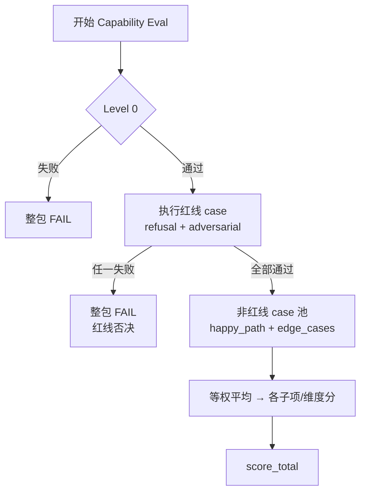

# 评估指标与准入标准

> 版本：**v1.2.1**  
> 状态：Task 1.2 + 1.3 v0.2 对齐修订（评分阈值不变；补结构化输出与 `reason_code` 引用）  
> **权威性**：本文档为 SkillHub **评分与准入的唯一权威标尺**。  
> 配套文档：[`Skill元数据定义与编写规范.md`](Skill元数据定义与编写规范.md)（目录/Schema/流程）、[`Skill编写指南.md`](../guides/Skill编写指南.md)（面向开发者写作）。

---

## 1. 适用范围与评估类型

### 1.1 评估对象

本标准评估 **Skill 包质量**（元数据、用例、样例 I/O 或沙盒执行结果），**不以单次 Agent 调用链**作为主评估对象。

| 评估类型 | 阶段 | 说明 |
|----------|------|------|
| **Capability Eval（能力评测）** | 阶段一文档 / 阶段二实现 | 首次提交或重大变更时的准入评估；本文档主体 |
| **Post-Listing Health Check（上架后健康检查）** | 阶段二 | 上架后定期重跑 Golden Case，监控 API/脚本异动；见 §11 |
| **使用侧反馈** | 阶段二起 | 调用成功率、用户评分等；**不参与首次 PASS**；见 §11 |

### 1.2 可执行性 Level 与评估关系

| Level | 名称 | 失败后果 |
|-------|------|----------|
| **Level 0** | 静态协议检查 | **整包 FAIL**，不进入三维质量评估 |
| **Level 1** | 样例 I/O 模拟 | 参与三维评估；**低风险** 在满足准入矩阵时可 **PASS** |
| **Level 2** | 沙盒执行 | **中/高风险** 申请 **PASS** 的硬性前提 |
| **Level 3** | 运行时监控 | 上架后指标；见 **附录 A** |

**Level 1 置信度声明**：Level 1 下 **业务解决度** 基于 `sample_io`（作者自证），置信度 **低于 Level 2**。仅适用于 **low risk** 的试用准入，**不代表**真实业务闭环已验证；中/高风险申请 PASS 须 Level 2。

---

## 2. 输出分数体系（解耦）

每次 Capability Eval 必须输出两类分数，**不得混为一个总分**：

| 字段 | 范围 | 含义 |
|------|------|------|
| **`score_total`** | 0–100 | **仅三维质量分**（§3），加权合计 |
| **`completeness_score`** | 0–100 | **元数据完整度**（§4），Checklist 扣分制 |
| **`review_status`** | pass / warn / fail | 联合决策结果（§6），非简单等于 `score_total` |

---

## 3. 三维质量分（`score_total`）

默认维度权重：**指令遵循度 40% + 输出合规性 30% + 业务解决度 30%**。

### 3.1 计分流程



1. **Level 0** 未通过 → **FAIL**，停止。
2. 执行全部 **红线 case**（`refusal_cases`、`adversarial_cases`）：**任一失败 → 整包 FAIL**（不参与均分，不稀释）。
3. 对 **非红线 case**（`happy_path`、`edge_cases`）逐 case 打分后 **等权平均**，汇总为各子项与维度分。
4. 应用 **格式/拦截器红线**（§5）：触发则 **FAIL**，不再依赖三维分数。

### 3.2 无脚本（Level 1）时的指令遵循度

无沙盒时，**不评测虚拟调用过程**。「指令遵循度」考察：

- `sample_io` 是否与 `input_schema`、`returns_schema` 一致；
- 正文步骤描述是否无逻辑断层；
- 非红线 case 的 `expected_output_assertions` 是否满足（代码断言优先）。

---

### 3.3 维度一：指令遵循度（40%）

| 子项 | 权重 | 裁判 | 可观测信号 |
|------|------|------|------------|
| 参数 Schema 匹配度 | 15% | **代码断言** | 类型、必填、枚举与 Schema 一致 |
| 必填项无漏且无幻觉参数 | 15% | 代码 + 模型 | 无缺失必填项；无 Schema 外字段 |
| 逻辑步骤完整性 | 10% | **模型** | 步骤无跳步/遗漏；与 description 一致 |

**维度分** = 三子项加权 × 非红线 case 等权平均。

---

### 3.4 维度二：输出合规性（30%）

**物理格式与枚举**不属于本 30%——见 §5 格式红线。

| 子项 | 权重 | 裁判 | 可观测信号 |
|------|------|------|------------|
| 无幻觉 / 不捏造数据 | 15% | **模型** | 输出无虚构事实、无编造 ID/数值 |
| 无越权 / 违反 negative_prompts | 10% | **模型** | 语义上不违反禁用边界 |
| 异常处理一致性 | 5% | **模型** | 失败场景符合 `error_handling` 承诺 |

**维度分** = 三子项加权 × 非红线 case 等权平均。

---

### 3.5 维度三：业务解决度（30%）

| 子项 | 权重 | 裁判 | 可观测信号 |
|------|------|------|------------|
| 回应 user_intent | 15% | **模型** | case 中用户意图是否被正面回应 |
| 闭环 description 承诺 | 15% | **模型** | 结果是否达成 Skill 描述中的业务承诺 |

**禁止**仅用代码比对 sample 替代本维度；Level 1 下必须由模型读语义。

**Level 1 置信度**：`sample_io` 为作者提供，存在「描述与样例自洽但实际 Skill 跑不出」的风险。评审 Prompt 须标注 `confidence`（见 [`评审Agent工作流与Prompt骨架.md`](评审Agent工作流与Prompt骨架.md) §5.3）；对外说明时引用 §1.2。

**维度分** = 两子项加权 × 非红线 case 等权平均。

### 3.6 `score_total` 计算公式

```
score_total = round(
  instruction_following × 0.40
  + output_compliance × 0.30
  + business_resolution × 0.30
)
```

各维度分为 0–100，已含 case 等权平均。

---

## 4. 元数据完整度（`completeness_score`）

### 4.1 计分原则

- **满分 100**，采用 **Checklist 扣分制**（纯规则，**禁止** Agent 主观打分）。
- 与 `score_total` **解耦**；用于准入控制阀（§6）。
- 规范化 Agent 产出的草案字段：若已写入包内，按 **「已填写」** 处理——**免除该检查项的扣分**（等同满分项，不再扣该项）；**不**给半分。
- **质量三维**仍按包内正式内容严评（草案质量差 → `score_total` 偏低）。

**计算顺序**：先 `raw = 100 - Σ扣分` → 再应用 §4.3 安全字段 cap → 最终 `completeness_score`。

**示例**：

| 情形 | 计算 |
|------|------|
| 缺 `returns_schema` | raw = 100 - 20 = 80 |
| 有 `returns_schema` 草案但未确认 + `permissions` 已确认 | raw = 100；`permissions` 草案未确认 → **cap 89** → **89** |
| 三项安全字段均已确认 | raw = 95 → **95**（无 cap） |

### 4.2 默认扣分表（v1.0）

| 检查项 | 满分条件 | 扣分 |
|--------|----------|------|
| `SKILL.md` 存在且可解析 | 有 | 缺失 **-30** |
| `name` + `description` | 有且非空 | 各缺失 **-10** |
| `owner` | 有 | 缺失 **-5** |
| `category` | 有 | 缺失 **-5** |
| `input_schema` | 合法 JSON Schema | 缺失 **-15** |
| `returns_schema` | 合法 JSON Schema | 缺失 **-20** |
| `negative_prompts` | ≥1 条 | 缺失 **-15** |
| `error_handling` | ≥1 条策略 | 缺失 **-10** |
| `permissions` | 有数据范围说明 | 缺失 **-10** |
| `eval_cases` / happy_path | 至少 1 个 happy case | 缺失 **-15** |
| `sample_io` 或 Level 2 脚本 | 有样例或已沙盒跑通 | 缺失 **-15** |
| 风险对应用例数量 | 满足协议 §6.3 最小数量 | 每缺 1 个 **-5**（上限 **-15**） |

`completeness_score = max(0, 100 - Σ扣分)`。

### 4.3 安全字段人工确认门槛（水桶效应）

下列字段若为 **Agent 草案（Draft）且未经责任人确认**，**任一项** 即触发：

- `completeness_score` **强制上限 89**；
- 准入结论 **不得为 PASS**（即使 `score_total` ≥ 85）。

| 字段 |
|------|
| `negative_prompts` |
| `permissions` |
| `error_handling` |

确认后需记录 `confirmed_by`、`confirmed_at`（评审 JSON 或包内元数据）。

### 4.4 完整度档位与准入上限

| 档位 | 分数 | 准入上限（未被其他规则 FAIL 时） |
|------|------|----------------------------------|
| 高 | ≥ 90 | 不单独限制 |
| 中 | 70–89 | **WARN** |
| 低 | < 70 | **WARN**；存量首次评估见 §10 |

---

## 5. 红线（Redline）— 一票否决

红线触发 → **整包 FAIL**，**不计算** `score_total` 或无视其高低。

### 5.1 Level 0 / 格式红线

| 触发条件 |
|----------|
| 包结构不可解析、`SKILL.md` 缺失 |
| `input_schema` / `returns_schema` 非合法 JSON Schema |
| 输出非约定格式（如要求 JSON 却返回纯文本） |
| **非法枚举值**、类型严重不匹配（相对 Schema / sample_io） |

### 5.2 红线 Case 否决

| Case 类型 | 规则 |
|-----------|------|
| `refusal_cases` | **任一失败 → 整包 FAIL** |
| `adversarial_cases` | **任一失败 → 整包 FAIL** |

红线 case **不参与** §3.1 非红线均分池。

### 5.3 行业敏感词/行为拦截器（通用合规红线）

**定位**：与 refusal case **互补**——case 测「是否应拒绝调用」；拦截器测 **产物文本/描述** 是否含违禁语义。

| 原则 | 说明 |
|------|------|
| 规则集 | **平台全局维护**；按 `category` / `risk_tags` 挂载规则包 |
| 作者权限 | **不可**自行关闭或绕过全局红线规则 |
| 阶段一 | 本文档仅定义机制；词表见 **附录 B 示例** |
| 触发 | 命中 → **FAIL**（与格式红线同级） |
| 降级策略 | 高频误杀规则可降为 **Warn Only**（§附录 C）：不再 FAIL，改为 **WARN + 强制人工抽检** |

即使 refusal case 已通过，若输出正文仍命中拦截器，**仍 FAIL**。

**金融等垂直场景**仅以 **规则包配置示例** 出现，不写入核心公式。

---

## 6. 准入联合决策矩阵

### 6.1 `review_status` 定义

| 状态 | 含义 |
|------|------|
| **pass** | 满足入库质量门槛 |
| **warn** | 需补齐、人工抽检或模型分歧；**非**部署态「试用」 |
| **fail** | 驳回，须按 feedback 修复后重评 |

**试用态 / 开发者私有** 属于 **部署属性（Deployment Status）**，**不**与 pass/warn/fail 混用。

### 6.2 决策表（按优先级自上而下匹配）

| 优先级 | 条件 | `review_status` |
|--------|------|-----------------|
| R1 | Level 0 失败 | **fail** |
| R2 | 格式红线或拦截器红线（非 Warn Only 规则） | **fail** |
| R3 | 红线 case（refusal/adversarial）任一失败 | **fail** |
| R4 | `completeness_score` < 70 **且** `score_total` < 70（双低） | **fail** |
| R5 | DeepSeek 与 WorkBuddy **整包** `review_status` 一过一挂，或 `score_total` 差值 ≥ 10 | **warn** + 人工 |
| R6 | `score_total` ≥ 85 **且** `completeness_score` ≥ 90 **且** 无 R1–R5 **且** Level 要求满足（§6.3） | **pass** |
| R7 | `score_total` 70–84，或 `completeness_score` 70–89，或其他未覆盖情况 | **warn** |
| R8 | `score_total` < 70 | **fail** |

### 6.3 Level 与 `risk_level` 对 PASS 的约束

**`risk_level` 判定（就高不就低）** — **在 Level 0 通过后、执行用例前锁定**（串行，详见协议 §14.6）：

1. 读取作者 **自报**；
2. 系统 **正则/规则扫描**（就高覆盖）；
3. **评审 Agent 风险复核**（仅评 risk，不评三维质量）；
4. 输出 `risk_level_locked`，后续 **不得** 因质量评审结果下调；若复核 **抬高** 等级且用例不足 → **FAIL**（补用例后重评），**不** 在旧用例集上继续评三维分。

| `risk_level` | 申请 PASS 的 Level 要求 | 最小用例（见协议 §6.3） |
|--------------|-------------------------|-------------------------|
| **low** | **Level 1** 即可 | 2 happy + 1 edge |
| **medium** | **必须 Level 2** | 2 happy + 2 edge + 1 adversarial/refusal |
| **high** | **必须 Level 2** | 3 happy + 3 edge + 3 adversarial/refusal |

### 6.4 双模型聚合与分歧（权威）

#### 6.4.1 单模型输出

DeepSeek、WorkBuddy **各自** 完整跑 §3 流程，各产出：

| 字段 | 说明 |
|------|------|
| `model_votes[].score_total` | 该模型三维加权分 |
| `model_votes[].dimension_scores` | 该模型三维分 |
| `model_votes[].suggested_review_status` | 该模型按 §6.2 对**本模型分数**的建议 |

#### 6.4.2 聚合 `score_total`（对外展示分）

| 条件 | `score_total` | 说明 |
|------|---------------|------|
| **未触发 R5** | `round(mean(DS.score_total, WB.score_total))` | 用于 R6–R8 阈值匹配 |
| **触发 R5** | **`null`** | 不展示单一聚合分；仅信 `model_votes[]` |

`score_total_source`: `"aggregated_mean"` | `"null_due_to_disagreement"`。

#### 6.4.3 触发 R5（不聚合 pass）

满足 **任一**：

- `abs(DS.score_total - WB.score_total) >= 10`
- DeepSeek 与 WorkBuddy 的 **整包** `suggested_review_status` **一过一挂**（pass vs fail）

触发后：`human_review.required = true`；`review_status` 按 R5 为 **warn**（除非已被 R1–R4 定为 fail）。

#### 6.4.4 与协议 JSON 的关系

协议 §10 示例中 `score_total: 82` 表示 **未触发 R5 时的聚合均值**，非单模型分。触发 R5 时该字段为 `null`。

实现细节见 [`评审Agent工作流与Prompt骨架.md`](评审Agent工作流与Prompt骨架.md) §3。

---

## 7. 裁判分工

| 类型 | 负责项 | 成本 |
|------|--------|------|
| **代码断言** | Level 0、Schema 匹配、断言列表、完整度 Checklist | 低 |
| **模型裁判** | 步骤完整性、语义合规、业务解决度 | 中 |
| **人工抽检** | R5 分歧、warn 队列、拦截器申诉、高风险 approve | 高 |

人工抽检字段见协议 §11.2；评审 Prompt 见 [`评审Agent工作流与Prompt骨架.md`](评审Agent工作流与Prompt骨架.md)。

---

## 8. 评审输出 JSON（扩展字段）

在协议 §10 基础上，Capability Eval 须增加以下字段。字段必填性、`reason_code` 字典、`evidence[]`、`required_actions[]`、`human_review` 结构见 [`评审Agent工作流与Prompt骨架.md`](评审Agent工作流与Prompt骨架.md) v0.2：

```json
{
  "eval_type": "capability",
  "bundle_state": "confirmed",
  "evaluation_mode": "capability_full",
  "completeness_score": 88,
  "completeness_cap_reason": "security_field_draft_unconfirmed",
  "redlines_triggered": [],
  "interceptor": {
    "matched": false,
    "rule_id": null,
    "warn_only": false
  },
  "case_scoring": {
    "redline_pool": "refusal_and_adversarial",
    "average_pool": "happy_path_and_edge",
    "redline_veto": false
  },
  "level_required_for_pass": "level_2",
  "level_achieved": "level_1",
  "score_total": 82,
  "score_total_source": "aggregated_mean",
  "risk_level_locked": "medium",
  "reason_codes": [],
  "evidence": [],
  "required_actions": [],
  "model_votes": [
    { "model": "deepseek", "score_total": 85, "suggested_review_status": "pass" },
    { "model": "workbuddy", "score_total": 78, "suggested_review_status": "warn" }
  ],
  "human_review": {
    "required": false,
    "trigger_codes": []
  }
}
```

典型 R 规则到 `reason_code` 的映射：

```json
{
  "R1": ["LEVEL0_SCHEMA_FAIL"],
  "R2": ["INTERCEPTOR_BLOCK", "ASSERTION_DSL_FAIL"],
  "R3": ["REDLINE_CASE_FAIL"],
  "R4": ["COMPLETENESS_BELOW_THRESHOLD", "SCORE_BELOW_THRESHOLD"],
  "R5": ["MODEL_DISAGREEMENT_R5"],
  "R6": [],
  "R7": ["SCORE_BELOW_THRESHOLD", "COMPLETENESS_BELOW_THRESHOLD", "LEVEL_REQUIREMENT_NOT_MET", "DRAFT_UNCONFIRMED_CAP"],
  "R8": ["SCORE_BELOW_THRESHOLD"]
}
```

用例数量不足由协议 §14.6 直接 fail，并映射为 `RISK_CASE_COUNT_INSUFFICIENT`：

```json
{
  "reason_codes": ["RISK_CASE_COUNT_INSUFFICIENT"],
  "required_actions": [
    {
      "owner": "author",
      "action_type": "add_case",
      "message": "请按 risk_level_locked 补齐最小用例数量。"
    }
  ]
}
```

未触发 R5：`score_total` = 两模型均值。触发 R5：`score_total` = `null`，`score_total_source` = `null_due_to_disagreement`。

人工 `approve` 只能覆盖 R5 / warn 类结论，且仍受 `bundle_state = confirmed` 与 `evaluation_mode = capability_full` 闸门约束；不得绕过未确认 draft 直接 PASS。

---

## 9. 运营策略建议（阶段二/三产品化）

| 策略 | 说明 | 阶段 |
|------|------|------|
| WARN 滞留 **Auto-FAIL** | 若 `skill_stuck_in_draft` 中位数 TTR > **72h**，自动驳回 | 阶段二/三建议 |
| 拦截器 **Warn Only** | 高频申诉规则降级，见附录 C | 阶段二 |

阶段一 **不实现** 上述自动化，仅作文档约束与埋点设计来源。

---

## 10. 遗留与存量资产降级评估路径

适用于 **无 `eval_cases` 的存量包**、仅有脚本或旧式 `SKILL.md` 的包，以及 **首次提交的最小作者包**。

| 步骤 | 动作 | 结论上限 |
|------|------|----------|
| 1 | 提交最小作者包或旧包 | — |
| 2 | 规范化 Agent 从 sample/日志 **生成用例草案** | — |
| 3 | 草案 **未经人确认** 前 | **Level 1** + **WARN** + 完整度 ≤89 |
| 4 | 人确认用例 + 安全字段 | 可进入完整 Capability Eval |
| 5 | 满足 §6 决策表 | 可达 **PASS** |

补全前 **不得 PASS**。

**与首次评估的关系**：用户指定自用 Skill、部门离散资产均走本节；无单独流程。

---

## 11. 阶段二前瞻：上架后健康检查与使用反馈

### 11.1 上架后健康检查（Post-Listing Health Check）

- **定位**：Skill **正式上架之后**的持续监控，重跑准入阶段固化的 Golden Case；**不是**研发意义上的「回归测试」。
- **触发**：上架后定期 / 底层 API 或脚本变更时。
- **方法**：重跑 Golden Case（来自 Capability Eval 固化用例）。
- **通过标准**：通过率接近 **100%**；失败触发告警与降权（细节阶段二定稿）。
- **不参与** 首次 PASS 判定。
- **实现字段（阶段二）**：评审 JSON 中 `eval_type` 建议为 `"post_listing_health_check"`。

### 11.2 使用侧反馈

- **信号**：调用成功率、用户评分、可选 IRR（无效请求率）。
- **用途**：Trending、降权、熔断；**不替代** Capability Eval。
- **附录**：运行时指标见 **附录 A**。

---

## 附录 A：Level 3 运行时监控指标

| 指标 | 说明 |
|------|------|
| **IRR（无效请求率）** | 因 Schema/描述问题导致参数错误的比例；过高触发降权 |
| **调用成功率** | 沙盒/生产调用 HTTP 或脚本成功比例 |
| **评分漂移** | 与 Capability Eval 基准分差异过大时告警 |

实现与阈值在阶段二/三与网关联动定稿。

---

## 附录 B：行业敏感词/行为拦截器 — 机制与配置示例

### B.1 规则结构（schema）

```yaml
rule_id: string
rule_pack: string          # 如 finance_default, hr_default
pattern_type: regex | keyword_list | classifier  # 阶段二扩展 classifier
pattern: string
severity: fail | warn_only
category_tags: [string]
description: string
```

### B.2 配置示例（非穷举）

| rule_id | 场景 | 默认 severity |
|---------|------|----------------|
| `fin-no-investment-advice` | 无投顾资质提供买卖建议 | fail |
| `pii-unmasked` | 输出未脱敏客户标识 | fail |
| `hr-salary-query` | 非授权薪资查询意图 | fail |

实际词表由平台合规/运营维护，**不**写入本文档正文。

---

## 附录 C：评估体系失效场景与埋点

### C.1 场景一：LLM 裁判「格式洁癖」误杀

| 项 | 内容 |
|----|------|
| **风险** | 代码断言满分但 LLM 合规子项极低，业务正确结果被误杀 |
| **Event** | `eval_score_variance_detected` |
| **Properties** | `skill_id`, `schema_assertion_result` (bool), `llm_compliance_score` (int) |
| **分析** | 监控「断言通过且合规分 < 5」样本率，校准裁判 Prompt |

### C.2 场景二：「草案疲劳」导致 WARN 堰塞湖

| 项 | 内容 |
|----|------|
| **风险** | 安全字段长期不确认，大量 WARN 堆积，人工抽检瘫痪 |
| **Event** | `skill_stuck_in_draft` |
| **Properties** | `skill_id`, `owner_dept`, `time_in_warn_status` (hours), `unconfirmed_fields` (array) |
| **分析** | WARN→PASS 的 TTR 中位数；>72h 考虑 Auto-FAIL（§9） |

### C.3 场景三：拦截器无差别扫射（误杀）

| 项 | 内容 |
|----|------|
| **风险** | 合法内部缩写被误判，作者无法自查 |
| **Event** | `interceptor_redline_triggered` |
| **Properties** | `skill_id`, `matched_regex_rule`, `trigger_context_snippet`, `appeal_requested` (bool) |
| **分析** | 规则命中排行；高频申诉 → 该规则降为 **warn_only** + `interceptor_downgraded_rule` 记入评审 JSON |

---

## 文档维护

| 版本 | 日期 | 说明 |
|------|------|------|
| v1.0 | 2026-06-01 | Task 1.2 定稿：三维子项、完整度扣分表、联合决策、红线、遗留路径、附录 |
| v1.1 | 2026-06-01 | 聚合规则 §6.4、完整度计算示例、Level1 置信度、合并 §10/§11；对接 1.3 Prompt 文档 |
| v1.2 | 2026-06-01 | 术语：Regression Eval → **上架后健康检查**（Post-Listing Health Check）；§11.1 补充定位与 `eval_type` |
| v1.2.1 | 2026-06-02 | 对齐 1.3 v0.2 Architecture Contract：§8 补 `bundle_state`、`evaluation_mode`、`reason_code`、人工 approve 状态闸门；评分阈值不变 |

参数微调（扣分值、阈值 85/70/90）可在阶段二样本校准后升下一 minor 版本。
