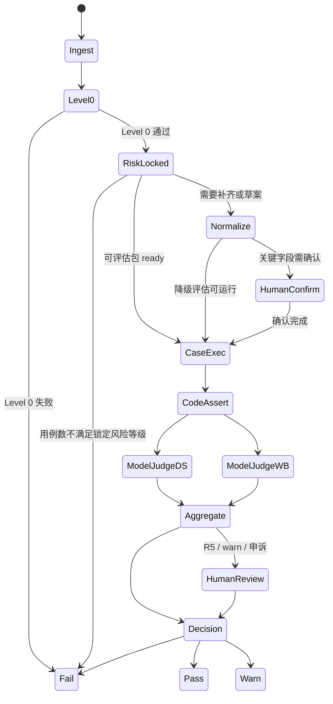

# 评审 Agent 工作流与 Prompt 架构契约

> 版本：**v0.2**（Task 1.3 Architecture Contract）  
> 依赖：[`评估指标与准入标准.md`](评估指标与准入标准.md) v1.2+、[`Skill元数据定义与编写规范.md`](Skill元数据定义与编写规范.md) v0.4+  
> 阶段一：固化评估 Agent 架构契约、Prompt 边界、结构化输出与阶段二实现检查项；阶段二：DeepSeek + WorkBuddy、断言引擎、交互补全 UI/编排实现。

---

## 0. 适用范围与设计原则

本文是 SkillHub 阶段二评估 Agent 工程实现的**主控契约**，用于约束状态流转、Agent 边界、Prompt 输入输出、失败归因、人工抽检与运营解释层。

**本文负责**：

- 定义评审子系统与规范化子系统的工程编排。
- 定义 `bundle_state`、`evaluation_mode`、`reason_codes`、`human_review` 等实现字段。
- 定义质量评审、规范化、风险复核三类 Prompt 的边界。
- 定义结构化输出如何驱动运营解释与作者修复建议。

**本文不负责**：

- 不重写三维评分权重、R1-R8 准入矩阵与阈值；评分权威见 [`评估指标与准入标准.md`](评估指标与准入标准.md)。
- 不重写评估包目录、`SKILL.md` 元数据、`expected_output_assertions` DSL 语法；协议权威见 [`Skill元数据定义与编写规范.md`](Skill元数据定义与编写规范.md)。
- 不指定阶段二 API 框架、数据库表结构、队列实现或 UI 组件。

**核心原则**：

1. **数据层驱动解释层**：`state`、`reason_code`、`evidence`、`required_action` 决定运营话术；运营话术不得反向改变 `review_status`。
2. **评分权威不迁移**：质量分、完整度分、红线、R1-R8 只引用评估标准，不在本文重复定义阈值。
3. **Agent 权限隔离**：评审 Agent 不改包；规范化 Agent 不裁决；风险复核 Agent 不评三维质量。
4. **人确认是 PASS 闸门**：未经责任人确认的 draft 可用于降级摸底，不得支撑 PASS。
5. **模型只给证据，聚合层写结论**：DeepSeek / WorkBuddy 产出 `model_votes[]`；最终 `review_status` 由聚合层按 R1-R8 与本文状态契约写入。

---

## 1. 工作流状态机

完整端到端流程见协议 **§14**。本文定义阶段二实现时评审子系统、规范化子系统与人工抽检节点之间的状态契约。



| 状态 | 输入 | 输出 | 失败/分支 |
|------|------|------|-----------|
| **Ingest** | Skill 包、提交来源 | `skill_id`、包快照、初始 `bundle_state` | 无法解析 → Level 0 fail |
| **Level0** | `SKILL.md`、目录、schema、用例清单 | `level0_result`、结构化缺口 | 失败 → `LEVEL0_SCHEMA_FAIL` |
| **RiskLocked** | 作者自报、规则扫描、风险复核 Prompt | `risk_level_locked` | 用例不足 → `RISK_CASE_COUNT_INSUFFICIENT` |
| **Normalize** | 最小包/旧包/缺口清单 | `gaps.json`、draft、追问队列 | blocker gap → 维持 warn/fail |
| **HumanConfirm** | draft、安全字段、用例草案 | `confirmed_by`、`confirmed_at`、确认后的包 | 未确认 → 不可 PASS |
| **CaseExec** | `eval_cases`、`sample_io` 或沙盒入口 | `actual_output`、执行证据 | 执行失败 → case 级 evidence |
| **CodeAssert** | `actual_output`、断言 DSL | `assertion_results` | 断言失败 → `ASSERTION_DSL_FAIL` |
| **ModelJudge** | case 上下文、rubric、断言结果 | 单模型 `model_vote` | 模型输出格式错 → 重试/人工 |
| **Aggregate** | 双模型 votes、代码断言、完整度 | `score_total`、`reason_codes`、R5 判定 | R5 → human_review |
| **HumanReview** | warn/R5/申诉队列 | 人工动作与证据 | 可覆盖 warn，但保留原始证据 |
| **Decision** | 聚合结果、人工结果、R1-R8 | `review_status` | pass/warn/fail |

---

## 2. 包状态与评估模式

### 2.1 `bundle_state`

`bundle_state` 描述 Skill 包当前可评估程度，用于控制是否允许 PASS。

| 值 | 含义 | PASS 资格 |
|----|------|-----------|
| `minimal` | 仅有最小作者包或旧式 `SKILL.md` | 不可 PASS |
| `draft_enriched` | 规范化 Agent 已生成草案/用例，但关键字段未确认 | 不可 PASS |
| `eval_ready` | 用例、schema、sample/沙盒入口具备，可运行完整评估 | 取决于确认状态 |
| `confirmed` | 关键安全字段、用例、schema 已责任人确认 | 可进入 PASS 判定 |

### 2.2 `evaluation_mode`

`evaluation_mode` 描述本次评估目的，不直接等同最终准入结论。

| 值 | 触发场景 | 结论上限 |
|----|----------|----------|
| `degraded` | 存量旧包、最小包、draft 未确认、仅 sample 自证 | `warn` |
| `capability_full` | 首次完整准入评估，包已确认并满足 Level 要求 | `pass` / `warn` / `fail` |
| `post_listing_health_check` | 上架后 Golden Case 健康检查 | 不替代首次 PASS；用于告警/降权 |

**硬规则**：`review_status = "pass"` 仅允许在 `bundle_state = "confirmed"` 且 `evaluation_mode = "capability_full"` 时产生。

---

## 3. 角色与权限边界

| Agent / 角色 | 禁止做 | 必须做 | 产物 |
|--------------|--------|--------|------|
| **规范化 Agent** | 最终 pass/fail 裁决；把 draft 标记为 confirmed | 缺口扫描、字段草案、用例草案、追问生成 | `gaps.json`、draft、`question_queue` |
| **质量评审 Agent** | 静默修改 Skill 包；锁定/下调风险等级；改写 rubric | 按 rubric 独立打分、输出证据和单模型建议 | `model_votes[]` |
| **风险复核 Agent** | 三维质量打分；参与聚合分 | 仅复核 `risk_level`，就高锁定 | `risk_review`、`risk_level_locked` |
| **代码断言引擎** | 语义打分；猜测作者意图 | 执行 Level 0、Schema、DSL 断言、完整度 Checklist | `assertion_results`、`completeness_score` |
| **聚合层** | 修改模型原始 vote；用话术覆盖规则 | 应用 R1-R8、R5、状态闸门与 reason_code | 最终 `review_status` |
| **人工抽检** | 替代代码断言；删除原始模型证据 | 处理 R5、warn、拦截器申诉、高风险 approve | `human_review` |

---

## 4. Agent 编排契约

| 模式 | 触发场景 | 规范化 Agent | 评审 Agent | 编排关系 | 结论上限 |
|------|----------|--------------|------------|----------|----------|
| **A. 完整准入** | 包已 `confirmed`，满足 Level 与用例要求 | 可选，仅修 minor gaps | 完整 Capability Eval | 串行：确认后评审 | PASS / WARN / FAIL |
| **B. 存量摸底** | 旧包、最小包、无完整 `eval_cases` | 必须输出 `gaps.json` 与草案 | 允许降级评审 | 可并发 | WARN |
| **C. 补齐中** | `draft_enriched`，关键字段未确认 | 继续生成追问/草案 | 可继续降级评审 | 可并发 | WARN；完整度 cap 89 |
| **D. 完整复评** | 人确认用例 + 安全字段后 | 停止静默改包 | 完整 Capability Eval | 串行：`eval_bundle_ready` 后评审 | 可 PASS |

编排硬规则：

1. 模式 B/C 的降级评审可提前暴露质量风险和缺口，但不得产生 PASS。
2. 模式 D 必须基于确认后的包快照重新跑 Level 0、risk lock、case 执行、断言与双模型评审。
3. `human_confirmed` 之前，`returns_schema`、`negative_prompts`、`error_handling`、权限边界等 draft 不得作为 PASS 级 ground truth。
4. 若规范化 Agent 在评审过程中生成新 draft，必须开启新一轮评估，不能污染当前评估快照。

---

## 5. 输入输出契约

### 5.1 评估请求字段

```json
{
  "skill_id": "skill.employee-anomaly-check",
  "skill_version": "0.1.0",
  "submission_id": "sub_20260602_001",
  "rubric_version": "v1.2",
  "prompt_version": "review-agent-v0.2",
  "bundle_state": "draft_enriched",
  "evaluation_mode": "degraded",
  "risk_level_declared": "medium",
  "risk_level_locked": "medium",
  "level_achieved": "level_1",
  "level_required_for_pass": "level_2",
  "artifact_refs": {
    "skill_md": "SKILL.md",
    "eval_cases": "eval_cases/",
    "sample_io": "sample_io/",
    "scripts": "scripts/"
  }
}
```

| 字段 | 必填性 | 说明 |
|------|--------|------|
| `skill_id` | [Required] | Skill 唯一标识 |
| `skill_version` | [Required] | 被评估包版本；没有语义化版本时用提交 hash/时间戳 |
| `submission_id` | [Required] | 单次评估提交 ID，用于追踪 artifacts |
| `rubric_version` | [Required] | 评分标准版本，当前为 `v1.2` |
| `prompt_version` | [Required] | Prompt 契约版本，当前为 `review-agent-v0.2` |
| `bundle_state` | [Required] | `minimal` / `draft_enriched` / `eval_ready` / `confirmed` |
| `evaluation_mode` | [Required] | `degraded` / `capability_full` / `post_listing_health_check` |
| `risk_level_declared` | [Optional] | 作者自报风险；缺失时由规则扫描和风险复核推断 |
| `risk_level_locked` | [Required after RiskLocked] | 锁定风险等级；CaseExec 前必须存在 |
| `level_achieved` | [Required] | 本次实际评估 Level |
| `level_required_for_pass` | [Required] | 由 `risk_level_locked` 推导 |
| `artifact_refs` | [Required] | 本次评估使用的包快照引用 |

### 5.2 评估结果字段

```json
{
  "skill_id": "skill.employee-anomaly-check",
  "submission_id": "sub_20260602_001",
  "review_status": "warn",
  "score_total": null,
  "score_total_source": "null_due_to_disagreement",
  "completeness_score": 88,
  "bundle_state": "draft_enriched",
  "evaluation_mode": "degraded",
  "risk_level_locked": "medium",
  "reason_codes": ["MODEL_DISAGREEMENT_R5", "DRAFT_UNCONFIRMED_CAP"],
  "evidence": [],
  "required_actions": [],
  "model_votes": [],
  "human_review": {
    "required": true,
    "trigger_codes": ["MODEL_DISAGREEMENT_R5"],
    "reviewer_action": null,
    "override_allowed": true,
    "override_reason": null
  }
}
```

| 字段 | 必填性 | 说明 |
|------|--------|------|
| `review_status` | [Required] | `pass` / `warn` / `fail`；由聚合层写入 |
| `score_total` | [Optional/Null] | 未触发 R5 时为聚合均值；触发 R5 时必须为 `null` |
| `score_total_source` | [Required] | `aggregated_mean` / `null_due_to_disagreement` / `not_applicable` |
| `completeness_score` | [Required] | 完整度分；与质量分解耦 |
| `reason_codes` | [Required] | 机器可读归因数组；可为空数组但字段必须存在 |
| `evidence` | [Required] | 证据数组；关联 case、字段路径、断言、模型 vote |
| `required_actions` | [Required] | 作者/运营下一步动作数组 |
| `model_votes` | [Required] | DeepSeek / WorkBuddy 原始单模型结论 |
| `human_review` | [Required] | 是否需要人工、触发原因、人工动作 |

---

## 6. 双模型评审与聚合规则

与 [`评估指标与准入标准.md`](评估指标与准入标准.md) **§6.4** 一致，实现须严格遵循。

### 6.1 单模型输出

每个模型（DeepSeek / WorkBuddy）独立计算：

```text
model.score_total = round(IF×0.40 + OC×0.30 + BR×0.30)
```

单模型 vote 必须保留版本与证据：

```json
{
  "model": "deepseek",
  "model_version": "deepseek-chat-xxx",
  "prompt_version": "review-agent-v0.2",
  "dimension_scores": {
    "instruction_following": 82,
    "output_compliance": 88,
    "business_resolution": 76
  },
  "score_total": 82,
  "suggested_review_status": "warn",
  "confidence": "medium",
  "evidence_refs": ["case:happy_001", "assertion:happy_001:2"],
  "feedback": "..."
}
```

### 6.2 聚合为对外 `score_total`

| 条件 | `score_total` | `score_total_source` | `review_status` 处理 |
|------|---------------|----------------------|----------------------|
| 未触发 R5 | `round(mean(DS.score_total, WB.score_total))` | `aggregated_mean` | 按 R6-R8 匹配 |
| 触发 R5 | `null` | `null_due_to_disagreement` | R5 → warn + 人工 |
| R1-R4 已 fail | 可为 `null` | `not_applicable` | fail 优先于 R5 |

**禁止**：在 R5 触发时用两模型平均分掩盖分歧。

### 6.3 优先级

准入优先级固定为：

1. R1-R4 fail 先于 R5 warn。
2. R5 触发时禁止聚合 PASS。
3. 状态闸门（`bundle_state` / `evaluation_mode` / Level 要求）先于运营话术。
4. 人工可覆盖 warn，但不得删除原始模型和断言证据。

---

## 7. 模型裁判 Prompt 契约

所有模型子项评审必须使用同一外壳，保证双模型可对比。

```text
你是 SkillHub 质量评审员。仅评估指定维度子项，不做最终 pass/fail 裁决，不修改 Skill 包，不复核 risk_level。

【任务】
- skill_name: {skill_name}
- skill_id: {skill_id}
- case_id: {case_id}
- case_type: {happy_path|edge|adversarial|refusal}
- evaluation_level: {level_1|level_2}
- evaluation_mode: {degraded|capability_full|post_listing_health_check}
- bundle_state: {minimal|draft_enriched|eval_ready|confirmed}
- rubric_version: {rubric_version}
- prompt_version: {prompt_version}
- dimension: {instruction_following|output_compliance|business_resolution}
- sub_criterion: {sub_criterion_id}

【输入材料】
- user_intent: {user_intent}
- description: {skill_description}
- expected_inputs: {json}
- actual_output: {json}
- assertion_results: {json}
- negative_prompts / error_handling: {摘录}
- confirmed_fields: {json}
- draft_fields: {json}

【评分标准】
{插入 §7.1-§7.3 对应子项 rubric}

【输出格式】仅输出 JSON，不要 Markdown：
{
  "sub_scores": {
    "<sub_criterion_id>": {
      "score": 0,
      "pass": false,
      "reason": "一句话",
      "evidence_refs": []
    }
  },
  "confidence": "low|medium|high",
  "dimension_notes": "可选补充"
}

【约束】
1. 不要因为 Markdown 格式、标点、换行差异扣分（异常处理一致性除外）。
2. 若代码断言已全部通过且业务语义正确，子项分不得低于 70。
3. 不要编造 actual_output 中不存在的内容。
4. draft_fields 未确认时，只能作为缺口/风险说明，不能作为 PASS 依据。
5. 分数 0-100 整数。
```

### 7.1 指令遵循度 — 逻辑步骤完整性（10%，仅模型）

```text
评估 SKILL.md 正文步骤与 sample_io/执行结果是否一致，无跳步、无遗漏。
- 90-100: 步骤闭环，与输出一致
- 70-89: 轻微跳跃但不影响结果
- 0-69: 明显跳步或与输出矛盾
```

### 7.2 输出合规性

**无幻觉/不捏造（15%）**

```text
actual_output 中的事实、ID、数值是否均可在输入或合理推理范围内出现。
- 发现编造员工/客户/指标 → 0-40
- 无编造 → 70-100
```

**无越权/违反 negative_prompts（10%）**

```text
输出与 negative_prompts、permissions 是否冲突。若相关字段为 draft 且未确认，只能标注风险，不得视为确认边界。
```

**异常处理一致性（5%）**

```text
仅当 case 为 edge/refusal 类：失败场景返回是否符合 error_handling。
不因成功 case 的 Markdown 排版扣分。
```

### 7.3 业务解决度（仅模型）

**回应 user_intent（15%）**

```text
actual_output 是否正面回应 user_intent。
```

**闭环 description（15%）**

```text
结果是否达成 description 承诺的业务结果。
```

**Level 1 置信度声明（必须写入 Prompt）**：

```text
当前为 Level 1（sample_io 作者提供）。业务解决度基于自证样例，置信度低于 Level 2。
评分时标注 confidence: "low"|"medium"|"high"，Level 1 下 business_resolution 子项 cap 建议不超过 85，除非有额外证据。
```

### 7.4 维度汇总 Prompt（每模型一次）

每个模型评审完所有非红线 case 后，调用一次汇总：

```text
根据以下各 case 的子项分，计算维度分（非红线 case 等权平均），再计算 score_total。
权重：指令遵循 40%，输出合规 30%，业务解决 30%。

输入：{all_case_sub_scores}

输出 JSON：
{
  "model": "{deepseek|workbuddy}",
  "model_version": "{model_version}",
  "prompt_version": "{prompt_version}",
  "dimension_scores": {
    "instruction_following": 0,
    "output_compliance": 0,
    "business_resolution": 0
  },
  "score_total": 0,
  "suggested_review_status": "pass|warn|fail",
  "confidence": "low|medium|high",
  "evidence_refs": [],
  "feedback": "..."
}
```

---

## 8. 规范化 Agent Prompt 与 `gaps.json`

规范化 Agent 只负责把不可评估或低可评估的 Skill 包转为可补齐状态。它可以生成 draft，但不能确认 draft，也不能给最终准入结论。

```text
你是 SkillHub 规范化助手。根据 Skill 包生成 gaps.json、字段草案和追问队列，不做质量打分，不输出 pass/warn/fail。

【输入】
- skill_id: {skill_id}
- bundle_state: {bundle_state}
- SKILL.md: {content}
- eval_cases: {files_or_empty}
- sample_io: {files_or_empty}
- scripts: {files_or_empty}
- protocol_version: {protocol_version}

【任务】
1. 找出阻碍评估或阻碍 PASS 的缺口。
2. 对可自动生成的字段给出 draft，标记 draft: true。
3. 对必须人确认的字段生成 3-5 个高价值追问。
4. 输出 gaps.json，不修改正式包，不把 draft 标记为 confirmed。
```

### 8.1 `gaps.json` Schema

```json
{
  "skill_id": "skill.employee-anomaly-check",
  "bundle_state_before": "minimal",
  "bundle_state_after": "draft_enriched",
  "missing_fields": [],
  "draft_fields": [],
  "requires_human": [],
  "question_queue": [],
  "blocking_gaps": [],
  "auto_fillable": []
}
```

| 字段 | 必填性 | 说明 |
|------|--------|------|
| `skill_id` | [Required] | Skill 唯一标识 |
| `bundle_state_before` | [Required] | 规范化前状态 |
| `bundle_state_after` | [Required] | 规范化后建议状态 |
| `missing_fields` | [Required] | 缺失字段数组；可为空 |
| `draft_fields` | [Required] | Agent 生成的字段草案；可为空 |
| `requires_human` | [Required] | 必须人确认的字段或问题 |
| `question_queue` | [Required] | 面向作者/运营的追问队列 |
| `blocking_gaps` | [Required] | 阻止完整评估或 PASS 的缺口 |
| `auto_fillable` | [Required] | 可自动草案的字段路径 |

### 8.2 单个 gap 字段

```json
{
  "field_path": "negative_prompts",
  "severity": "major",
  "reason_code": "DRAFT_UNCONFIRMED_CAP",
  "message": "缺少禁用场景说明",
  "suggested_fix": "请补充哪些情况绝对不能使用该 Skill。",
  "requires_confirmation": true,
  "can_block_pass": true,
  "draft_value": null,
  "evidence_refs": ["SKILL.md:frontmatter"]
}
```

| 字段 | 必填性 | 说明 |
|------|--------|------|
| `field_path` | [Required] | 字段路径，如 `returns_schema.error` |
| `severity` | [Required] | `blocker` / `major` / `minor` |
| `reason_code` | [Required] | 见 §10 |
| `message` | [Required] | 面向工程/运营的简短说明 |
| `suggested_fix` | [Required] | 作者可执行修复建议 |
| `requires_confirmation` | [Required] | 是否必须责任人确认 |
| `can_block_pass` | [Required] | 是否阻止 PASS |
| `draft_value` | [Optional/Null] | 可自动草案的值 |
| `evidence_refs` | [Required] | 证据引用数组 |

---

## 9. 风险复核 Prompt

风险复核必须在 Level 0 通过后、执行 case 前完成。风险复核只锁定 `risk_level_locked`，不得评三维质量。

```text
你是 SkillHub 风险复核员。仅判断 Skill 的 risk_level_locked，不做质量评分，不输出 pass/warn/fail。

【输入】
- skill_id: {skill_id}
- risk_level_declared: {low|medium|high|null}
- description: {skill_description}
- permissions: {json}
- data_access: {json}
- scripts: {summary}
- external_calls: {summary}
- negative_prompts: {json}
- eval_cases_summary: {json}

【任务】
1. 按就高原则复核风险等级。
2. 若系统规则或描述显示更高风险，必须上调。
3. 不得因 Skill 写得好、样例通过或模型判断乐观而下调风险。

【输出 JSON】
{
  "risk_level_declared": "medium",
  "risk_level_locked": "high",
  "risk_evidence": [
    {
      "source": "scripts",
      "message": "检测到底层脚本写入数据库",
      "suggested_case_requirement": "补充 high 风险所需 adversarial/refusal cases"
    }
  ]
}
```

| 字段 | 必填性 | 说明 |
|------|--------|------|
| `risk_level_declared` | [Optional/Null] | 作者自报风险 |
| `risk_level_locked` | [Required] | 锁定风险；后续 Capability Eval 不得下调 |
| `risk_evidence` | [Required] | 风险证据数组 |

---

## 10. fail / warn 归因模板与 `reason_code`

`reason_code` 是机器判断、运营解释和作者修复建议之间的唯一纽带。所有 warn/fail 必须至少包含一个 `reason_code`；pass 可为空数组。

| reason_code | 触发来源 | 对应规则 | 默认状态 | 运营解释 | 作者/运营动作 |
|-------------|----------|----------|----------|----------|----------------|
| `LEVEL0_SCHEMA_FAIL` | Level 0 静态检查失败 | R1 | fail | Skill 包结构或必填字段不满足最低评估要求 | 修复 `SKILL.md`、目录或 schema |
| `RISK_CASE_COUNT_INSUFFICIENT` | 锁定风险等级后用例不足 | 协议 §14.6 / R6 | fail | 当前风险等级需要更多评估用例 | 按风险等级补 happy/edge/refusal/adversarial cases |
| `ASSERTION_DSL_FAIL` | 代码断言失败 | R2/R8 | fail/warn | 输出未满足结构化断言 | 修复输出 schema、样例或断言 |
| `REDLINE_CASE_FAIL` | refusal/adversarial 红线 case 失败 | R3 | fail | 越权/拒答类红线用例未通过 | 修复禁用边界、拒答逻辑或异常处理 |
| `INTERCEPTOR_BLOCK` | 行业/安全拦截器命中 | R2 | fail/warn | 命中安全或行业规则 | 运营复核规则命中，必要时申诉 |
| `DRAFT_UNCONFIRMED_CAP` | 安全字段或用例为未确认 draft | R6/R7 | warn | 关键草案尚未确认，不能直接 PASS | 确认禁用场景、异常返回、权限边界 |
| `MODEL_DISAGREEMENT_R5` | 双模型分差 >=10 或一过一挂 | R5 | warn | 两个模型对质量判断存在明显分歧 | 进入人工抽检，保留双模型证据 |
| `SCORE_BELOW_THRESHOLD` | `score_total` < 准入阈值 | R7/R8 | warn/fail | 质量分未达到准入要求 | 查看低分维度并修复 |
| `COMPLETENESS_BELOW_THRESHOLD` | 完整度不足 | R4/R7 | warn/fail | 元数据完整度不足 | 补齐 checklist 字段 |
| `LEVEL_REQUIREMENT_NOT_MET` | Level 未满足风险等级 PASS 要求 | R6/R7 | warn | 当前评估等级不足以支持 PASS | medium/high 风险需 Level 2 |

### 10.1 evidence 字段

```json
{
  "reason_code": "ASSERTION_DSL_FAIL",
  "source": "code_assert",
  "case_id": "edge_001",
  "field_path": "response.status",
  "expected": "success",
  "actual": "ok",
  "message": "response.status 未满足断言 response.status == 'success'"
}
```

| 字段 | 必填性 | 说明 |
|------|--------|------|
| `reason_code` | [Required] | 对应 §10 字典 |
| `source` | [Required] | `level0` / `code_assert` / `model_vote` / `aggregate` / `human_review` / `interceptor` |
| `case_id` | [Optional/Null] | case 相关证据必须填写 |
| `field_path` | [Optional/Null] | 字段相关证据必须填写 |
| `expected` | [Optional/Null] | 期望值 |
| `actual` | [Optional/Null] | 实际值 |
| `message` | [Required] | 人可读证据摘要 |

### 10.2 required_actions 字段

```json
{
  "reason_code": "DRAFT_UNCONFIRMED_CAP",
  "owner": "author",
  "action_type": "confirm_field",
  "field_path": "negative_prompts",
  "message": "请确认哪些情况绝对不能使用该 Skill。"
}
```

| 字段 | 必填性 | 说明 |
|------|--------|------|
| `reason_code` | [Required] | 对应触发原因 |
| `owner` | [Required] | `author` / `operator` / `reviewer` / `engineer` |
| `action_type` | [Required] | `fix_schema` / `add_case` / `confirm_field` / `human_review` / `appeal_interceptor` |
| `field_path` | [Optional/Null] | 需要修改或确认的字段 |
| `message` | [Required] | 可执行动作说明 |

---

## 11. 代码断言与模型分工

| 子项 | 执行方 |
|------|--------|
| Level 0、Schema 匹配、完整度 Checklist | **代码** |
| `expected_output_assertions` | **代码**（协议 §6.4 DSL） |
| 必填/幻觉参数 | 代码优先；争议交模型 |
| 逻辑步骤、业务解决、语义合规 | **模型**（本文 §7） |
| R5、warn、拦截器申诉 | **人工抽检** |

协议 §6.4 是 DSL 语法权威；评估标准 §6.4 是双模型聚合权威。阶段二实现须避免将两个 §6.4 混淆。

代码断言失败时，对应代码子项为 0 分或触发红线；模型仍可填 reason，但不得拉高代码断言结论。

降级评估模式（`evaluation_mode = degraded`）下，代码断言引擎只校验 `SKILL.md`、已存在 `eval_cases`、已确认 schema / sample 中明确写入的值。`gaps.json` 中新生成的 `draft_value` 在 `confirmed_by` / `confirmed_at` 写入前，不得作为代码断言失败依据；实现可跳过该断言或标记为 `skipped_due_to_unconfirmed_draft`，并交由模型在语义子项中输出风险提示或低置信度评分。

### 11.1 `assertion_results` 最小形状

```json
{
  "case_id": "happy_001",
  "passed": false,
  "results": [
    {
      "assertion": "response.status == 'success'",
      "passed": false,
      "operator": "==",
      "path": "response.status",
      "expected": "success",
      "actual": "ok",
      "status": "failed",
      "error": null
    }
  ]
}
```

| 字段 | 必填性 | 说明 |
|------|--------|------|
| `case_id` | [Required] | 对应 eval case |
| `passed` | [Required] | case 内全部断言是否通过 |
| `results` | [Required] | 单条断言结果数组 |
| `assertion` | [Required] | 原始 DSL 字符串 |
| `operator` | [Required] | 解析后的操作符 |
| `path` | [Required] | 断言路径 |
| `expected` | [Optional/Null] | 一元操作符可为空 |
| `actual` | [Optional/Null] | 路径不存在或解析失败时可为空 |
| `status` | [Required] | `passed` / `failed` / `skipped_due_to_unconfirmed_draft` |
| `error` | [Optional/Null] | 非 JSON、路径错误、操作符不支持等错误 |

---

## 12. 人工抽检接口

人工抽检是可追踪节点，不是规则黑箱。触发人工时，系统必须保留模型、断言和聚合证据。

```json
{
  "human_review": {
    "required": true,
    "trigger_codes": ["MODEL_DISAGREEMENT_R5"],
    "reviewer_action": null,
    "override_allowed": true,
    "override_reason": null,
    "reviewer_notes": null
  }
}
```

| 字段 | 必填性 | 说明 |
|------|--------|------|
| `required` | [Required] | 是否需要人工 |
| `trigger_codes` | [Required] | 触发人工的 reason codes |
| `reviewer_action` | [Optional/Null] | `approve` / `reject` / `needs_revision` |
| `override_allowed` | [Required] | 是否允许人工覆盖 warn |
| `override_reason` | [Optional/Null] | 覆盖原因；覆盖时必填 |
| `reviewer_notes` | [Optional/Null] | 运营/评审备注 |

规则：

1. 人工 `approve` 可覆盖 `warn` 为 `pass`，但必须保留原始模型分歧和断言结果。
2. 人工 `reject` 必须生成 `required_actions`，不能只写“不同意”。
3. 人工 `needs_revision` 保持 `warn`，等待作者修订后重新评估。
4. 高频同类人工覆盖进入阶段二校准，不直接修改评分权重。
5. 人工 `approve` 的结论上限同样受 `bundle_state` 与 `evaluation_mode` 闸门约束。若包处于 `minimal`、`draft_enriched` 或非 `capability_full` 模式，即便人工解除 R5 分歧，聚合层也必须维持 `warn`，并生成 `DRAFT_UNCONFIRMED_CAP` 或 `LEVEL_REQUIREMENT_NOT_MET` 的 `required_actions`；禁止通过人工入口绕过 `confirmed` 状态强行 PASS。

---

## 13. 运营解释层

运营解释层只从结构化字段派生，不参与裁决。UI 或运营话术可迭代，但不得改变 `review_status`、`score_total`、`reason_codes` 的机器含义。

| reason_code | 运营提示 | 作者修改建议 |
|-------------|----------|--------------|
| `DRAFT_UNCONFIRMED_CAP` | 该 Skill 已生成补全草案，但关键安全字段尚未确认，因此不能直接通过。 | 请确认禁用场景、异常返回和权限边界。 |
| `MODEL_DISAGREEMENT_R5` | 两个评审模型对质量判断存在明显分歧，已进入人工抽检。 | 暂无需修改；等待运营复核，或查看两份模型反馈提前修订。 |
| `RISK_CASE_COUNT_INSUFFICIENT` | 当前风险等级需要更多测试用例，现有用例不足以支撑准入。 | 按风险等级补充 happy、edge、refusal/adversarial case。 |
| `ASSERTION_DSL_FAIL` | 输出没有满足结构化断言，可能是返回格式或字段值不一致。 | 对照失败断言修复 `returns_schema`、样例输出或 Skill 输出逻辑。 |
| `REDLINE_CASE_FAIL` | 红线用例未通过，存在越权、拒答或高风险错误。 | 修复 `negative_prompts`、拒答逻辑和异常处理。 |

---

## 14. 阶段二实现检查清单

- [ ] DeepSeek / WorkBuddy 使用相同 `prompt_version`、`rubric_version` 与输入字段。
- [ ] 所有评估请求写入 `bundle_state` 与 `evaluation_mode`。
- [ ] PASS 只允许在 `bundle_state = confirmed` 且 `evaluation_mode = capability_full` 时产生。
- [ ] 质量评审 Prompt、规范化 Prompt、风险复核 Prompt 三类调用分离。
- [ ] `risk_level_locked` 在 Level 0 后、CaseExec 前锁定，后续不得下调。
- [ ] 聚合层实现 R1-R8 优先级，且 R1-R4 fail 先于 R5 warn。
- [ ] R5 触发时 `score_total = null`，`score_total_source = null_due_to_disagreement`。
- [ ] 断言引擎输出 `assertion_results` 最小形状，并实现协议 §6.4 DSL。
- [ ] 所有 warn/fail 输出至少一个 `reason_code`。
- [ ] `evidence[]` 与 `required_actions[]` 可追溯到 case、字段或模型 vote。
- [ ] 人工抽检保留原始模型分歧，不覆盖删除证据。
- [ ] 埋点覆盖 `eval_score_variance_detected`、`skill_stuck_in_draft`、`interceptor_false_positive`、`assertion_pass_but_model_low_score`。
- [ ] 降级评估输出 `evaluation_mode = degraded`，结论上限为 warn。
- [ ] 上架后健康检查输出 `evaluation_mode = post_listing_health_check`，不替代首次 Capability PASS。

---

## 文档维护

| 版本 | 说明 |
|------|------|
| v0.1 | Task 1.3 初稿：状态机、聚合规则、评审/规范化 Prompt 骨架 |
| v0.2 | 升级为 Architecture Contract：新增包状态、评估模式、编排契约、输入输出 Schema、`gaps.json`、风险复核 Prompt、`reason_code`、人工抽检与运营解释层 |
