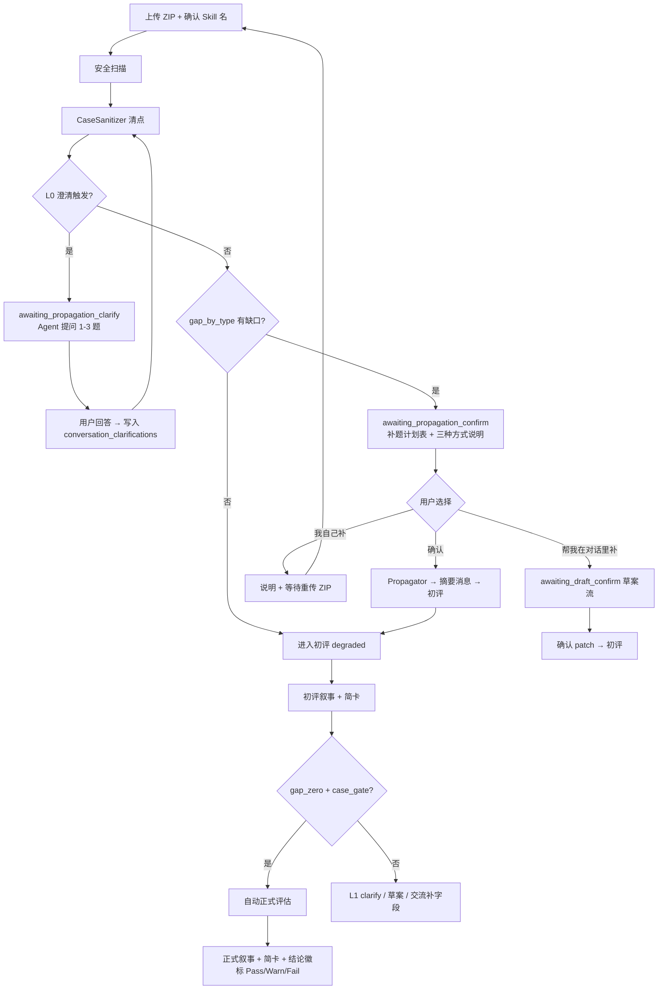

# Design: Chat UI 透明化 + 补题确认 + 全对话澄清（W5.2）

> **状态**：草案 — 待用户审阅后进入 `writing-plans` / OpenSpec `wave5.2-ui-transparency`  
> **日期**：2026-06-10  
> **前置**：W5 Chat-First ✅、W5.1 简卡分流 ✅（413 tests）  
> **触发**：W5.5 Demo 反馈 FB-01～05（Pass 不显、Propagator 黑盒、流程断裂）

---

## 1. 问题陈述

| ID | 现象 | 根因 |
|----|------|------|
| FB-01 | 正式评估完成后无明确「通过/需人工/不通过」 | W5.1 简卡移除 `review_status` 结论徽标 |
| FB-02 | 缺 eval_case/sample_io 时系统静默 Propagator | API 有 `propagator_used`，对话/UI 未消费；无用户确认 |
| FB-03 | 「结构检查已通过」过粗 | gap_zero 自动正式路径跳过过程叙事 |
| FB-04 | 聊天内无缺口/补题/来源信息 | 工作台信息块移除后未在对话中等价重建 |
| FB-05 | 「系统做了什么→用户做什么→结论是什么」断裂 | 自动动作与对话叙事脱节 |

**产品原则（用户确认）**：

- **UI-B3**：缺 eval_case 时**暂停**，展示补题计划表；默认自行重传 ZIP；可说「帮我在对话里补」切草案流；「确认」才 Propagator。
- **UI-S2**：**全对话生命周期**内，对 Skill 设计有任何不确定，**必须主动询问**，禁止静默猜测后写 staging / 出题 / patch。

---

## 2. 目标与非目标

### 2.1 目标

1. 任何**写 staging** 或 **启动评估** 的系统动作前，用户已在对话中**知情并选择路径**。
2. 缺 eval_case 时展示**表格化补题计划**（题型、数量、测什么、业务预期、sample_io）。
3. 正式简卡显式展示 **Pass / Warn需人工 / Fail** 结论（含分数行）。
4. LuiAgent 全局 **`clarify` 意图**：不确定时提问，不 mutation、不触发 Propagator。
5. 保留 Chat-First 低门槛，**不**恢复 W4 独立工作台 Tab。

### 2.2 非目标（本 change）

- 第三 Tab「包状态」（后续若 S2 仍不足再议）
- 修改 1.2 阈值或 R5 规则
- Propagator 出题质量算法大改（仅改触发时机与 prompt 注入澄清答案）
- 修改 originals vs staging 上架隔离原则

---

## 3. 用户旅程（修订）



---

## 4. 三种补题方式（UI-B3）

每条 **补题计划** agent 消息固定包含四段：

1. **清点结论**（原包有什么 / 缺什么 / 损坏 case 是否移入 `_broken/`）
2. **（可选）L0 澄清** — 见 §5
3. **补题计划表** — 见 §6
4. **三种方式 + 交流引导**

**话术模板（确定性 + 变量替换）：**

> 你的压缩包在练习区清点结果：…  
>  
> **方式一 · 自行补包**（默认）  
> 按上表补好 `eval_cases/` 与 `sample_io/` 后**重新上传 ZIP**，我会重新清点。  
>  
> **方式二 · 对话协作**  
> 回复「**帮我在对话里补**」或描述使用场景；我先出**草案**，你**确认后**才写入练习区。  
>  
> **方式三 · 系统自动出题**  
> 回复「**确认**」，我按上表 AI 生成题目（`prop_*` 前缀），然后进入初评。  
>  
> 你也可以**直接跟我聊** Skill 用来做什么、成功输出长什么样，我会帮你收窄题目方向。

| 用户回复 | 动作 | 下一状态 |
|----------|------|----------|
| `确认` / `允许自动出题` | `CasePropagator.propagate()` + 写入摘要消息 | `active` → 初评 |
| `我自己补` / 默认等待 | 不 Propagator；返回模板链接 | `awaiting_manual_upload`（或保持 `awaiting_propagation_confirm`） |
| `帮我在对话里补` / 描述场景 | LuiAgent 生成 eval_cases 草案 | `awaiting_draft_confirm`（复用 W5.1） |
| 自由文本（业务描述） | L1 `clarify` 或更新 `conversation_clarifications` 后刷新表 | 视意图 |

**重传 ZIP**：bootstrap 检测到 `awaiting_manual_upload` / `awaiting_propagation_confirm` 时重新 Sanitizer；仍缺则再展示计划表（可带上轮澄清答案）。

---

## 5. 全对话澄清（UI-S2）

### 5.1 原则

> **对 Skill 设计有任何不确定，必须先问用户，再写 staging、再出题、再 patch、再改评估路径。**

适用阶段：**上传清点、Skill 名确认、补题、初评后补字段、warn 解释、正式前、用户主动改包** 等全生命周期。

### 5.2 两层机制

| 层 | 触发 | 执行者 | 阻塞写盘? |
|----|------|--------|-----------|
| **L0 规则澄清** | 确定性条件（见 §5.3） | 模板 + 可选 LLM 润色问句 | **是** — 进入 `awaiting_clarify` 子状态 |
| **L1 对话澄清** | LLM 判断 `confidence=low` 或用户消息歧义 | LuiAgent `intent=clarify` | **是** — 禁止 `mutation` / Propagator / 自动正式 |

### 5.3 L0 触发条件（MVP 清单）

| 条件 | 示例问题 |
|------|----------|
| `category` frontmatter 缺失或 slug 非法 | 「这个 Skill 属于哪类业务场景？（给 taxonomy 叶子选项）」 |
| `description` 为空或 &lt; 30 字 | 「用一句话说明 Skill 解决什么问题？」 |
| `risk_level` 与正文关键词明显不符 | 「你标注 low，但正文含越权描述，实际风险更接近？」 |
| eval_cases 全空且 SKILL.md excerpt &lt; 200 字 | 「成功输出长什么样？贴一个例子或描述格式。」 |
| 用户 message 与 SKILL.md 用途矛盾 | 「你说的是 XX，但 SKILL 写的是 YY，以哪个为准？」 |
| high risk 且将 Propagator refusal/adversarial | 「拒绝类/对抗类题目会测越权场景，是否有必须覆盖的禁区？」 |

**上限**：每轮 L0 最多 **3 个问题**；优先选择题（A/B/C）+ 可选「其他」。

### 5.4 LuiAgent 扩展

**新 intent**：`clarify`

```json
{
  "intent": "clarify",
  "reply": "1-2 个中文问题，带选项更佳",
  "patch": null,
  "clarification_keys": ["audience", "success_output_shape"]
}
```

**Prompt 硬规则**：

- 对 Skill 设计（用途、受众、输出形态、边界、风险、case 意图）**不确定 → 必须 `clarify`**，禁止 `mutation`。
- `clarify` 时 **禁止** 同时返回 patch。
- 用户回答后，将答案 merge 进 `conversation_clarifications`（JSON），后续 Propagator / 草案 / 叙事 prompt **必须注入**。
- 与 W5.1 冲突时：**澄清优先于草案**；已 `awaiting_draft_confirm` 下用户改意图 → 先 clarify 再更新 pending_patch。

**现有 intent 保留**：`explain_only` | `mutation` | `system_action` | **`clarify`**

### 5.5 Session gate 修订

| status | 允许 | 禁止 |
|--------|------|------|
| `awaiting_propagation_clarify` | 回答问题、explain、clarify | Propagator、初评、mutation |
| `awaiting_propagation_confirm` | 三种方式选择、clarify、explain | Propagator（未确认）、mutation（除非切方式二） |
| `awaiting_manual_upload` | 重传 ZIP、explain、clarify | Propagator、mutation |
| `awaiting_draft_confirm` | 同 W5.1 + clarify | 未确认 mutation |
| `awaiting_clarify`（通用 L1） | 回答、explain | mutation、Propagator、trigger_next_run |

---

## 6. 补题计划表

### 6.1 消息类型

`message_type = propagation_plan`  
`payload_json` 结构：

```python
{
  "risk_level_declared": "low",
  "existing_counts": {"happy_path": 0},
  "gap_by_type": {"happy_path": 3},
  "broken_moved": 0,
  "sample_io_gap": 3,
  "category_hint": "...",
  "rows": [
    {
      "type": "happy_path",
      "type_zh": "正常场景",
      "need": 3,
      "have": 0,
      "tests_what": "典型输入下 Skill 能否完成任务",
      "business_expectation": "来自 category case_template_hint",
      "fields_required": ["user_intent", "input_template", "expected_behavior"],
      "redline": false
    }
  ],
  "sample_io_row": {
    "need": 3,
    "have": 0,
    "tests_what": "无脚本时的输入/输出 JSON 样例",
    "note": "与 eval_case 一一对应"
  },
  "clarifications_applied": {"audience": "团队评审"},
  "three_ways_html": "..."
}
```

UI：`renderPropagationPlanHtml(payload)` 渲染表格 + 三种方式（不依赖 LLM 生成表格数字）。

### 6.2 数据来源

| 列 | 来源 |
|----|------|
| 需补/已有 | `CaseSanitizer.gap_by_type` / `existing_counts` |
| 测什么 | `TYPE_DESCRIPTIONS`（propagator.py） |
| 业务预期 | `category_taxonomy.yaml` → `case_template_hint` |
| sample_io | ingest `has_sample_io` + gaps 扫描 |
| 红线 | refusal/adversarial 行 `redline: true` + 脚注 |

---

## 7. Propagator 触发变更

**现况**：`_phase_eval` 内 security → sanitizer → **立即** propagate → engine。

**修订**：

1. security 通过后 **仅** sanitizer + `build_propagation_plan()`。
2. 若 L0 澄清未满足 → `awaiting_propagation_clarify`，**return**（无 run_id）。
3. 若 `needs_propagation` → append `propagation_plan` 消息，`status=awaiting_propagation_confirm`，**return**。
4. 用户「确认」→ chat handler 调 Propagator → append **propagation_summary** 消息（写了哪些文件）→ 再 `_phase_eval` 剩余（创建 run、engine）。
5. Propagator prompt 注入 `conversation_clarifications` + 用户自由文本摘要。

**bootstrap/chat 响应**：保留 `propagator_used`；新增 `propagation_deferred: bool` 当计划已展示但未执行。

---

## 8. 结论呈现（FB-01）

`build_rich_report_payload` / 正式简卡增加：

```python
"verdict_zh": "通过" | "需人工复核" | "不通过",
"verdict_badge_class": "pass" | "warn" | "fail",
"score_line_html": "...",  # 已有
```

映射：`review_status` pass → 通过；warn + human_review → 需人工复核；fail → 不通过。

初评（`report_phase=initial`）仍 **无分数、无 pass 徽标**（C2 保持）。

---

## 9. 对话 vs 工作台（设计定位）

| 维度 | 原工作台 | W5.2 对话式 |
|------|----------|-------------|
| 信息载体 | 固定面板 | **阶段消息 + 结构化卡片**（plan / 简卡 / clarify） |
| 系统自动化 | 静默 | **先表后确认**（B3） |
| 不确定时 | 用户自己猜 | **L0/L1 主动问**（S2） |
| 深度详情 | 同页折叠 | 历史详情模态（不变） |
| 门槛 | 高 | 低 + **知情同意** |

---

## 10. 数据模型（DB v5 草案）

| 变更 | 说明 |
|------|------|
| `conversations.clarifications_json TEXT` | 累积用户澄清答案 `{key: value}` |
| `conversations.status` += `awaiting_propagation_confirm`, `awaiting_propagation_clarify`, `awaiting_manual_upload`, `awaiting_clarify` | 与 W5.1 并列 |
| `lui_messages.message_type` += `propagation_plan`, `propagation_summary` | UI 渲染 |

`SCHEMA_VERSION = 5`（实现时 TDD migration）。

---

## 11. 文件触点（预估）

| 文件 | 变更 |
|------|------|
| `core/case_sanitizer.py` | 暴露 plan builder 输入；可选 sample_io 缺口 |
| `core/propagator.py` | 注入 clarifications；不在 bootstrap 内自动调用 |
| `core/propagation_plan.py` | **新建** — 表格 payload + L0 触发检测 |
| `core/lui_agent.py` | `clarify` intent；S2 prompt；全局不确定则问 |
| `core/chat_notifications.py` | `verdict_zh`；初评/正式叙事补 Propagator 摘要引用 |
| `adapters/api/routes/conversations.py` | 拆分 _phase_eval；deferred propagation |
| `adapters/api/routes/chat.py` | 确认/方式二/重传/clarify 路由 |
| `adapters/api/_session.py` | 新 status gate |
| `adapters/ui/static/index.html` | `renderPropagationPlanHtml`；verdict 徽标；clarify 无发送 mutation |
| `persistence/sqlite.py` | v5 migration |
| `docs/guides/Skill评估系统全景说明.md` | §3 流程图更新（去静默 Propagator） |

---

## 12. 测试策略

| 场景 | 断言 |
|------|------|
| 缺 eval_case ZIP | 无 run_id；有 `propagation_plan`；无 Propagator 文件 |
| 用户「确认」 | prop_* 写入；摘要消息；初评 run 创建 |
| 用户「我自己补」 | 无 prop 文件；重传 ZIP 后重新计划 |
| 用户「帮我在对话里补」 | 进入 draft_confirm；确认后 eval_cases 写入 |
| L0 category 缺失 | `awaiting_propagation_clarify`；回答后表刷新 |
| L1 歧义 user message | `intent=clarify`；无 patch |
| clarify 期间 mutation | 403 |
| 正式 Pass | 简卡 `verdict_zh=通过` |
| grill-me E2E | 全路径无静默补题 |

---

## 13. 已闭合决策（brainstorm 2026-06-10）

| ID | 决议 |
|----|------|
| UI-B3 | 缺题暂停；三方式；默认自补重传；对话可切草案 |
| UI-TBL | 表格化补题计划 + sample_io 行 |
| UI-S2 | **全对话**不确定则问；`clarify` intent |
| UI-CLARIFY-L0 | 规则触发，最多 3 问，阻塞写盘 |
| UI-CLARIFY-L1 | LLM 低置信/歧义，阻塞 mutation/propagate |
| UI-VERDICT | 正式简卡显式 Pass/Warn/Fail |
| UI-NONGOAL | 第三 Tab 包状态、阈值修改 |

---

## 14. 下一步

1. 用户审阅本文档  
2. `/opsx:propose wave5.2-ui-transparency` 或 Superpowers `writing-plans`  
3. 实现 → 全量 pytest → 更新全景说明 §3 → W5.5 Demo 重跑
