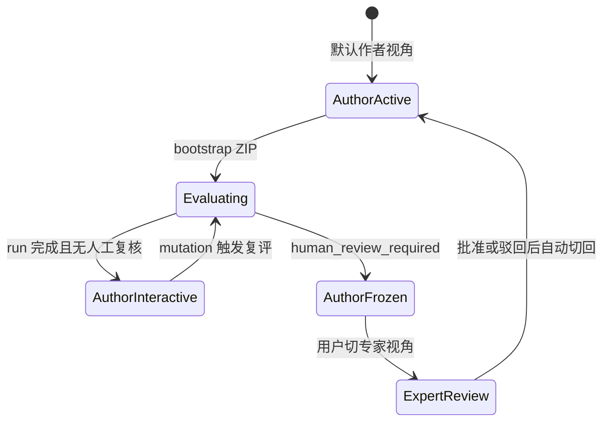

# Design: Wave 5 — Chat-First 对话壳

> 实现参考。Subagent 执行前必读；接口即合约。Wave 4 后端（LUI / staging / engine）**复用**，本设计只定义 **壳层 + 消息模型 + 必要 API**。

---

## 0. 产品信息架构

```
┌─────────────────────────────────────────────────────────────┐
│  Header: SkillHub · [作者 | 专家] 视角切换 · 连接状态        │
├──────────┬──────────────────────────────────────────────────┤
│ 会话列表  │  消息流（user / agent / system / rich_report）    │
│ + 新建   │  ┌─ Rich Report 气泡 ─────────────────────────┐  │
│ + 待人工  │  │ 补全状态 · 分数 · 缺口 · 安全 · 题型 · 摘要  │  │
│   badge  │  │ [整包确认] [查看 per-case]（专家:[批准][驳回]）│  │
│          │  └────────────────────────────────────────────┘  │
│          │  Composer: [📎 ZIP] [消息…] [发送]  （无常驻 Skill ID 框）│
└──────────┴──────────────────────────────────────────────────┘

Tab 2: 评估历史（run 表格 + 对话列 + 详情模态「对话摘要」+ 打开完整对话）
```

**删除**：Tab「专家审核台」、Tab1 右侧固定报告卡片、Tab1 入口表单卡片、默认可见 Debug 面板。

---

## 1. 消息模型扩展（DB v3）

### 1.1 `lui_messages` 新增列

```python
# SCHEMA_VERSION → 3
# message_type TEXT NOT NULL DEFAULT 'text'
# payload_json  TEXT  -- JSON，rich_report / action 等结构化载荷
```

| message_type | role | content | payload_json |
|--------------|------|---------|--------------|
| `text` | user/agent | 纯文本 | null |
| `system` | system | 系统通知（冻结/解冻/配额） | null |
| `rich_report` | agent | 短摘要一行（列表预览用） | `{run_id, report_snapshot, actions[]}` |
| `welcome` | agent | 欢迎引导（确定性） | `{expected_inputs: ["skill_id","bundle"]}` |

**rich_report.payload_json 结构**（与现有 `GET /eval/report/{run_id}` 对齐，避免重复字段名）：

```json
{
  "run_id": "uuid",
  "status": "completed|awaiting_confirm|awaiting_human_review|failed",
  "review_status": "pass|warn|fail|null",
  "score_total": null,
  "score_total_source": "null_due_to_disagreement",
  "reason_codes": [],
  "human_review_required": true,
  "report": { "gaps": [], "security_status": "passed", "case_type_coverage": {}, "skill_summary": {} },
  "actions": [
    {"id": "confirm_all", "label": "整包确认", "enabled": false, "reason": "gap 未清零"},
    {"id": "expert_approve", "label": "批准", "visible_in": "expert"},
    {"id": "expert_reject", "label": "驳回", "visible_in": "expert"}
  ]
}
```

### 1.2 Port 扩展

```python
def append_lui_message(
    self,
    conversation_id: str,
    role: str,
    content: str,
    run_id: str | None = None,
    message_type: str = "text",
    payload_json: dict | None = None,
) -> None: ...

def list_conversations(
    self,
    limit: int = 50,
    status: str | None = None,
) -> list[dict]: ...
# 返回 conversation_id, skill_id, status, active_run_id, updated_at,
#       last_message_preview, human_review_pending (bool)
```

---

## 2. 评估完成 → Rich Report 写入

### 2.1 钩子位置

在 **run 进入终态** 时写入 rich_report（不依赖前端轮询触发 opening 后再写报告）：

| 终态 | 写入时机 |
|------|----------|
| `awaiting_confirm` | `engine._park_awaiting_confirm` 末尾 |
| `completed` / `awaiting_human_review` / `failed` | `engine._finalize_run` 末尾 |

新建 `core/chat_notifications.py`：

```python
def build_rich_report_payload(run_id: str, repo: Repository) -> dict: ...
def append_rich_report_message(conversation_id: str, run_id: str, repo: Repository) -> None: ...
```

- 从 `repo.get_run` + `repo.get_report` 组装 payload
- `actions[].enabled` 由 `gap_zero` + `case_gate_passed` + `auto_confirmed` 计算（复用 chat.py 逻辑）
- 幂等：同一 `run_id` 已存在 `message_type=rich_report` 且 payload.run_id 相同 → 跳过

### 2.2 Opening 消息

保留 `__TRIGGER_AGENT_OPENING__`，但改为 **rich_report 之后的补充文字**（或合并：opening 仅在没有 rich_report 时发送）。grill-me 可定：MVP **取消独立 opening**，rich_report 气泡 + 一条 agent text 摘要即可。

---

## 3. API 扩展

### 3.1 `GET /conversations`

```python
# Query: limit=50, pending_review=true（专家视角筛选用）
# Response: { "conversations": [ { conversation_id, skill_id, status, ... } ] }
```

### 3.2 `POST /conversations/{id}/bootstrap`

在 **已有空会话** 上启动评估（替代 Tab1 表单 `start`）：

```python
class BootstrapRequest(BaseModel):
    skill_id: str
    source: Literal["local_ref", "upload"]
    skill_bundle_path: str = ""  # local_ref 必填

# multipart: skill_id + bundle_zip → 同 conversations/start 内部逻辑
# 成功: 202 { run_id, security_status, ... } + 写入 system 消息「已开始评估…」
# 失败: 422 security blocked 等 → system 消息说明原因
```

**或** 合并进 `POST /conversations/start` 支持 `conversation_id` 可选（复用已有会话）。design 选定：**bootstrap 专用**，避免 start 语义混乱。

### 3.3 `POST /conversations/{id}/chat` 扩展

支持 multipart：

- `message`（文本，可空）
- `bundle_zip`（可选，仅当会话尚未 bootstrap 且 message 为空时触发 bootstrap）

文本启发式（MVP 确定性，不调 LLM）：

- 有 zip 附件 → bootstrap upload
- **Demo only**：`demo_allow_local_ref` 且 Composer 路径框有值 → bootstrap local_ref
- 用户纯文本路径（无 Demo）→ **不 bootstrap**；Agent/系统回复引导用 ZIP

### 3.5 `GET /eval/history` 与对话查询（D7）

- `list_history` SELECT 增加 `conversation_id`（已有 run 列）
- 批量查询 `lui_message_count` + last preview（JOIN 或 N+1 优化在 sqlite 层）
- `GET /eval/history/{run_id}/conversation` → 404 if no conversation_id else messages

### 3.6 `POST /eval/review/{run_id}` UI 联动（已有）

Approve/Reject 后 **追加 system 消息**（approve 当前仅 reset count，需补）：

```
专家已批准本次评估。review_status: pass
专家已驳回。意见：… 你已获得新的 5 次修改机会。
```

Reject 已有；Approve 对齐。

---

## 4. 前端

**决策**：重写 `index.html` 为 Chat-First（单文件 Vanilla JS + Tailwind，与现有一致），旧布局代码删除；`/ui/` 仍 serve 同一入口。

### 4.1 布局组件

| 组件 | 职责 |
|------|------|
| `SessionSidebar` | `GET /conversations`；新建空会话；待人工 badge |
| `MessageList` | 渲染 text / system / rich_report；rich 复用现有 `renderReportCards` 逻辑内联为 bubble |
| `Composer` | skill_id + 📎 ZIP +（Demo 时路径框）+ 文本 |
| `PerspectiveToggle` | `author` \| `expert`；待审 badge；§4.5 切换逻辑 |
| `HistoryTab` | run 表 + 对话列；详情 **对话摘要区** +「打开完整对话」|

### 4.2 状态机（前端）

```
idle → (新建会话) → awaiting_bundle
awaiting_bundle → (bootstrap 202) → evaluating (poll status)
evaluating → (run terminal) → (messages 含 rich_report) → interactive
interactive → (chat mutation) → evaluating
frozen → 只读（作者）；专家视角可 review
```

轮询：`GET /conversations/{id}/status` + `GET /messages`（rich_report 到达后停 aggressive poll）

### 4.3 Action Chips 行为

| action id | 条件 | 调用 |
|-----------|------|------|
| `confirm_all` | enabled | `POST /chat` body `{message: "__SYSTEM_ACTION_CONFIRM_ALL__"}` |
| `expert_approve` | expert 视角 + human_review_required | `POST /eval/review/{run_id}` approve |
| `expert_reject` | 同上 | reject + prompt 可选 comment |

Chip 点击后禁用 + 刷新 messages。

### 4.4 专家视角 · 待审队列

侧栏分组：

- **进行中** — status=active
- **待人工** — 关联 run `human_review_required=true` 且未完成 review
- **已完成** — frozen/published 或 run completed

EQ5 默认实现侧栏分组；grill-me 可调整。

---

## 4.5 warn / 人工复核 · 作者 ↔ 专家视角（D9）

### 4.5.1 何时需要切换视角

| 条件 | 作者视角 | 专家视角 |
|------|----------|----------|
| `human_review_required=false`（含 warn 仅提示、可继续改） | 正常聊天 + mutation | 无额外 chip |
| `human_review_required=true` + run 终态 `awaiting_human_review` | **只读**（frozen 或 explain_only） | 显示 **批准 / 驳回** chip |
| 专家操作完成后 | 自动切回（见下） | chip 禁用 |

**区分**：`review_status=warn` 且 **无** `human_review_required` → 不需要专家视角，Agent 文字说明即可继续迭代。

### 4.5.2 作者视角（待复核期间）

1. Rich Report 气泡正常展示（含 R5 分歧说明）
2. 追加 **system** 消息（服务端写入，非 LLM）：
   ```
   本次评估需人工复核（原因：双模型分歧 / 红线分歧 / …）。
   会话已只读。若你有复核权限，请点击右上角切换到【专家视角】进行裁定。
   ```
3. Composer：**禁用**发送（`conversation.status=frozen` 或 `human_review_pending`）
4. Header **「专家」** 按钮显示 **红点 badge**（当前会话待审）

### 4.5.3 切换到专家视角

- 用户点击 Header `[作者 | 专家]` → 切到 **专家**（`localStorage skillhub_perspective=expert`）
- **同一 conversation_id**，消息流不变；Rich Report 上 **批准 / 驳回** chip 变为可见（`visible_in: expert`）
- 首次点击 chip 前：可选弹窗填 **operator**（默认 `self` 或用户自填；**允许自批**，EQ1）
- 侧栏「待人工」分组：列出所有 `human_review_pending` 会话，点击跳转

### 4.5.4 专家操作后

| 动作 | 后端 | 对话流 | 视角 |
|------|------|--------|------|
| **批准** | `POST /eval/review` approve；reset auto_run_count | system：「专家已批准，review_status: pass」；可选更新 rich_report | **自动切回作者** |
| **驳回** | reject；conv→active；注入驳回意见 | system：「专家已驳回：…；已解冻，可继续修改（5 次机会已重置）」 | **自动切回作者** |

批准后若 conv 仍 frozen（仅 quota 场景），system 消息说明下一步；MVP 以 reject 解冻路径为主测。

### 4.5.5 状态机（视角 × 会话）



---

## 4.6 上传策略（D8）

### 4.6.1 环境开关

```python
# skillhub_eval/settings.py
demo_allow_local_ref: bool = False  # env: SKILLHUB_DEMO_LOCAL_REF=true
```

| 环境 | UI | API bootstrap |
|------|-----|----------------|
| 默认 / 生产 | 仅 📎 ZIP + Skill ID | `source=upload` only；`local_ref` → **403** |
| Demo（env=true） | 额外显示「Demo 本地路径」输入框 | 接受 `local_ref` + path |

### 4.6.2 Composer 行为

- **ZIP**：`multipart` → `POST /conversations/{id}/bootstrap` 或 `/chat`（带 `bundle_zip`）
- **Demo 路径**：仅 env 开启；须在对话中提供 skill_id 或包内 frontmatter 可解析
- **Skill ID**：来自用户消息或 §4.8 自动识别，**非** Composer 固定字段

---

## 4.7 评估历史 × 对话查询（D7）

### 4.7.1 API

扩展 `GET /eval/history` 每条 run：

```python
{
  "run_id": "...",
  "conversation_id": "...",       # 已有字段扩展
  "lui_message_count": 12,
  "last_message_preview": "专家已批准…",
  "human_review_required": true,
  ...
}
```

新增 `GET /eval/history/{run_id}/conversation`（或 `GET /conversations/{id}/messages?run_id=`）：

```python
{
  "conversation_id": "...",
  "messages": [...],              # 全量或 limit=50
  "message_count": 12
}
```

无 `conversation_id` 的旧 run（Wave 4 前）：返回 404 + UI 显示「该记录无对话存档」。

### 4.7.2 历史 Tab UI

| 区域 | 内容 |
|------|------|
| 表格列 | Skill ID、Run、状态、得分 + **对话**（消息数 / 有无会话） |
| 详情模态 · 评估区 | 现有 report 卡片（分数/R5/摘要） |
| 详情模态 · **对话摘要区** | 最近 N 条消息滚动预览（只读） |
| 主操作 | **打开完整对话** → `switchTab('chat')` + `selectConversation(id)` |

**两个 Tab 数据一致**：历史里看到的对话摘要与对话 Tab 打开同一会话 `GET /messages` 一致（EQ3 服务端持久化）。

---

## 4.8 Skill ID 自动识别（EQ2）

**原则**：不在 Composer 常驻 Skill ID 框；用户可在聊天里说明，未说明时系统推断。

### 4.8.1 解析优先级（ZIP bootstrap）

```
1. 用户消息中显式 skill_id — 确定性解析（不调 LLM）
2. 解压 ingest 后 SKILL.md frontmatter 的 name / skill_id（**用户未说明时优先于 zip 名**，EQ2b）
3. ZIP 文件名 stem（去 .zip；规范化）
4. 仍无法唯一确定 → Agent 追问，不启动评估
```

### 4.8.2 识别成功 → 用户确认（EQ2b）

解压并解析出候选 `skill_id` 后、**Security/评估流水线启动前**：

1. Agent 发消息：「识别到你的 Skill 名称是 **`{skill_id}`**（来源：SKILL.md / 压缩包文件名）。请回复 **确认** 继续评估，或直接告诉我正确名称。」
2. 用户回复 **确认 / 对 / 是的**（确定性关键词）→ 写入 `conversations.skill_id` → 继续 bootstrap 流水线
3. 用户给出新名称 → 更新 skill_id → 可再确认一轮（MVP 一轮即可）→ 再开评
4. 在确认前：**不创建 evaluation run**（仅 staging 解压 + ingest 预览）

**EQ2c（用户 2026-06-10）**：若 skill_id **来自用户消息显式说明** → **跳过确认**，直接 `phase_eval`；Agent 仅回「好的，按 `{skill_id}` 开始评估」。仅 **自动识别**（SKILL.md / zip 名）走确认流程。

会话状态：`awaiting_skill_id_confirm`（确认前；见 §4.8.4）

### 4.8.3 冲突处理

用户消息中的 ID 与包内/zip 不一致：**以用户消息为准**；system 注明与包内元数据不一致。

### 4.8.4 实现位置

- `core/skill_id_resolver.py`（新建）：`resolve_skill_id(...)` + `needs_user_confirm(source) -> bool`
- bootstrap 分两阶段：`phase_intake`（解压+解析+确认）→ `phase_eval`（Security→…→run）
- `conversations.status` 新增 `awaiting_skill_id_confirm`（确认前）

### 4.8.5 Demo local_ref

Demo 路径模式：用户须在对话中提供 skill_id 或路径指向的包可 ingest 出 frontmatter；**无 zip 文件名兜底时**必须对话明确 ID。

---

## 5. 与 Wave 4 差异对照

| Wave 4 | Wave 5 |
|--------|--------|
| 表单 start → 聊天 | Composer bootstrap → 聊天 |
| 右栏 report 卡片 | rich_report 气泡 |
| 专家 Tab | 视角切换 + 侧栏待人工 |
| 整包确认底部按钮 | 消息内 chip |
| 单会话内存 | 会话列表 + localStorage 最后选中 |
| 前端 trigger opening | 服务端 rich_report 为主 |

---

## 6. 文件映射

| 路径 | 变更 |
|------|------|
| `persistence/sqlite.py` | v3 migration, list_conversations, append_lui_message 扩展 |
| `core/ports.py` | 签名扩展 |
| `core/chat_notifications.py` | **新建** rich report 构建 |
| `core/engine.py` | 终态钩子调用 append_rich_report_message |
| `adapters/api/routes/conversations.py` | GET list, POST bootstrap |
| `adapters/api/routes/chat.py` | multipart chat |
| `adapters/api/routes/eval.py` | approve 追加 system 消息 |
| `adapters/ui/static/index.html` | **重写** Chat-First |
| `tests/integration/test_wave5_chat_shell.py` | **新建** E2E |
| `tests/persistence/test_wave5_messages.py` | **新建** message_type |

---

## 7. grill-me 决策记录（待填）

| ID | 问题 | 决议 | 日期 |
|----|------|------|------|
| EQ1 | 自批 allowed? | **Yes（MVP）**；审批权限 IAM 阶段四细化 | 2026-06-10 |
| EQ2 | Skill ID | 对话 + 自动识别 + **确认后开评** | 2026-06-10 |
| EQ2b | 静默上传优先级 | SKILL.md > zip 名；自动识别须确认 | 2026-06-10 |
| EQ2c | 确认范围 | **仅自动识别**须确认；用户明说 ID **跳过** | 2026-06-10 |
| EQ3 | 服务端写 rich_report | Yes | 2026-06-10 |
| EQ4 | 删除 Debug UI | Yes | 2026-06-10 |
| EQ5 | 侧栏待人工分组 | Yes | 2026-06-10 |
| D7 | 历史查对话 | Yes | 2026-06-10 |
| D8 | ZIP 默认 / local_ref Demo only | Yes | 2026-06-10 |
| D9 | warn 视角切换 §4.5 | Yes | 2026-06-10 |
