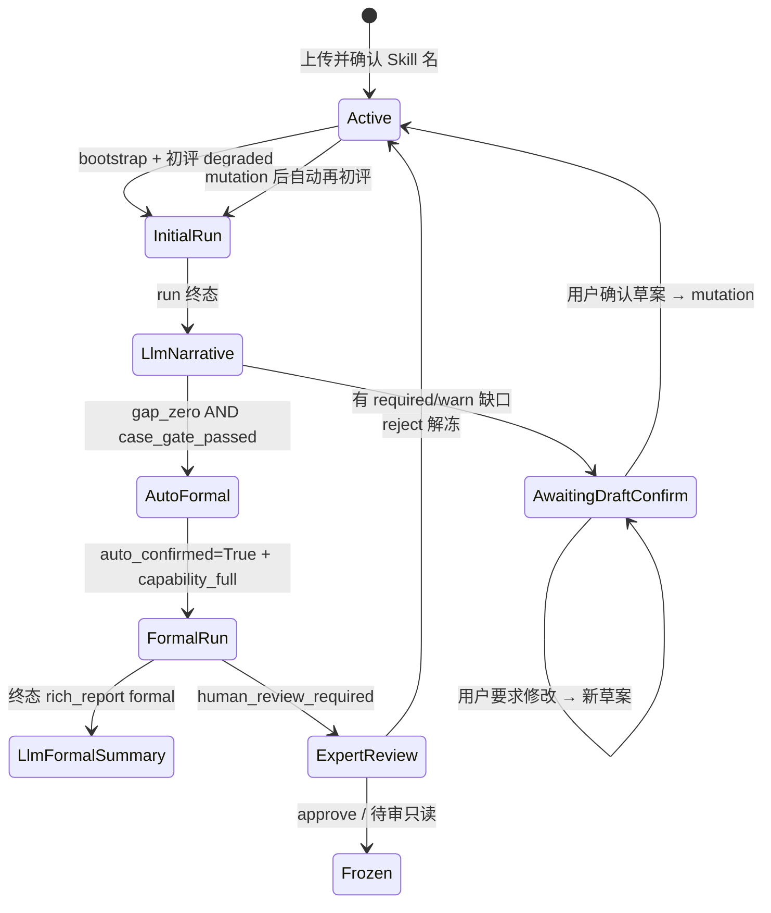

# Design: Wave 5.1 — 聊天简卡 + 报告分流 + 初评话术流

## 1. 信息架构

```
┌─────────────────────────────────────────────────────────────┐
│ Tab: 对话评估                                                │
│  · Agent/系统 消息（流程叙事、缺口草案 — LLM）                 │
│  · rich_report 简卡（服务端 payload，按阶段模板渲染）           │
│      - headline_zh                                         │
│      - score_line（仅 formal）                               │
│      - summary_one_liner                                     │
│      - CTA: openRunDetail(run_id)                          │
│      - actions: 仅 expert_approve/reject（待审时）            │
│  · 无 per-case / 无长折叠摘要 / 无【整包确认】主路径           │
└─────────────────────────────────────────────────────────────┘
┌─────────────────────────────────────────────────────────────┐
│ Tab: 评估历史 → 详情模态（全量报告，现有 helpers 复用）        │
│  · 运营结论、结构诊断、阶段轨迹、双模型、per-case、风险、摘要   │
└─────────────────────────────────────────────────────────────┘
```

## 2. 评估阶段与用户文案

| 内部 `evaluation_mode` | 对用户称呼 | 简卡 `report_phase` | 分数行 |
|------------------------|------------|---------------------|--------|
| `degraded` | **初评**（第一轮终态；内部仍可能双模型+summary，**不对用户展示分数**） | `initial` | **隐藏（C2）** |
| `capability_full` | **正式评估** | `formal` | 展示（含 R5 不可用文案） |
| `awaiting_human_review` | **正式评估·待专家** | `formal_pending_review` | 同 formal |

## 3. 用户旅程（状态机）



### 3.1 无缺口路径（R3）

**When** 初评 run 终态且 `gap_zero && case_gate_passed`:

1. 服务端 `set_conversation_auto_confirmed(conv_id, True)`（用户无感）
2. `staging_writer.trigger_next_run(..., capability_full, confirmed)` — 与现 W4 路由 C 一致
3. LuiAgent 发白话消息：「结构检查已通过，正在为你做正式评估，请稍候。」
4. **不** 渲染 `confirm_all` action

### 3.2 有缺口路径（R4 + 必须先展示草案）

**When** 初评终态且存在 blocking gaps（`required` / `block` severity）或 case_gate 未过：

1. LuiAgent 调用（新）`_handle_post_initial_review`：
   - 输入：`report`, `gaps[]`, `case_gate`, `staging_path`（只读）
   - 输出：`reply`（白话缺口列表 + **草案全文说明**）
   - 同时生成 **`pending_patch` JSON** 并 **持久化** 到 `conversations.pending_patch_json`（GQ1/GQ3）
   - `intent=explain_only`；**不在此步写 staging**
2. 设置 `conversation.status = awaiting_draft_confirm`
3. **Session gate**：`awaiting_draft_confirm` 下 `/chat` 仅允许：
   - `explain_only` 回复（用户追问）
   - 用户明确确认后下一次消息 → `intent=mutation` + patch（**仅此路径可写 staging**）
4. 用户回复示例：
   - 确认：「确认」「可以，按这个补」「没问题」
   - 修改：「把禁止事项改成…」「权限范围太宽了」
5. 用户修改意见 → 重新生成白话 + **更新 `pending_patch_json`**（仍不写 staging）
6. 用户确认 → **`staging_writer.apply_patch(pending_patch)` 原样写入**（GQ1）；清空 `pending_patch_json` → `status=active` → 自动 **新一轮初评**

**硬规则**：`awaiting_draft_confirm` 下未确认不得写 staging；确认路径 **禁止** 二次 LLM 重新生成 patch。

### 3.3 gaps vs case_gate 分叉（R6）

LLM prompt 必须分支：

| gap_zero | case_gate_passed | LLM 必须说 |
|----------|------------------|------------|
| false | * | 列缺口 + 草案 + 存 `pending_patch`；**不说**「可以正式评估」 |
| true | false | 「字段已齐，评测题型仍在补充/不足」；列缺失题型 |
| true | true | 「结构检查已通过，正在正式评估…」；若有 `warn` 缺口 **顺带**提示可稍后优化（GQ2，不拦流程）→ 走 §3.1 |

## 4. rich_report payload 扩展

`build_rich_report_payload` 增加：

```python
{
  "report_phase": "initial" | "formal" | "formal_pending_review",
  "headline_zh": str,           # 来自 narrative 或确定性模板
  "summary_one_liner": str,     # skill_summary.overall_verdict 或 narrative.headline
  "score_line_html": str | null,  # 仅 formal；初评为 null
  "run_id": str,
  "evaluation_mode": str,       # 内部用，UI 不直出
  "actions": [...],             # 见 §5
  # 保留 report 嵌套供历史详情；聊天简卡不消费深层字段
}
```

### 4.1 简卡 UI 渲染（`renderReportHtml`）

- `initial`：headline + summary_one_liner + `查看完整报告 →`
- `formal`：+ `score_line_html`
- `formal_pending_review`：+ expert actions（W5 已有）

**删除**聊天简卡内：`renderSkillSummaryCard` 折叠块、`renderPerCaseDetails`、`renderCompletenessStatusCard` 长列表（迁至历史详情）。

## 5. Actions 修订

| action id | 初评简卡 | 正式简卡 | 待专家 |
|-----------|----------|----------|--------|
| `confirm_all` | **移除** | **移除** | **移除** |
| `expert_approve` | — | — | visible |
| `expert_reject` | — | — | visible |

`__SYSTEM_ACTION_CONFIRM_ALL__` 保留于 API/chat 供调试；UI **不暴露**。

## 6. LuiAgent 变更

### 6.1 新触发点

终态钩子 **顺序（GQ4）**：

1. 若 `evaluation_mode == degraded`：`compose_post_initial_narrative` → **先**写入 `role=agent` 白话消息
2. **再** `append_rich_report_message`（initial 简卡）
3. 若 `capability_full` 终态：先 `compose_post_formal_narrative`，再 formal 简卡

正式评估叙事含「点击查看完整报告」引导；额度 **仅**在 badge 展示，≥4/5 或冻结时 LLM 强调（GQ5）。

### 6.2 Prompt 约束（R5 + R7）

System 补充：

- 使用「初评」「正式评估」；禁止 degraded/摸底/capability_full
- 必须包含：当前阶段、缺口列表（或明确无缺口）、下一步
- 草案模式：**只输出建议文案**，`intent` 必须为 `explain_only`
- 确认模式：用户已确认后，`intent=mutation`，`patch` 仅含 frontmatter / cases

### 6.3 草案确认检测

`_is_draft_confirmation(message: str) -> bool` — 确定性前缀 + LLM 二次分类：

- 确定性：`确认`, `可以`, `按这个补`, `没问题`, `好的`（在 `awaiting_draft_confirm` 下）
- 否则走修改意图 → 新草案，不写盘

## 7. 自动正式评估钩子

**文件**：`skillhub_eval/core/chat_notifications.py` 或 `engine.py` 终态钩子

```python
def maybe_auto_start_formal_eval(conv_id, run_id, repo, background_tasks, ...):
    run = repo.get_run(run_id)
    if run["evaluation_mode"] != "degraded":
        return
    if run["status"] not in TERMINAL_OK_FOR_AUTO_FORMAL:
        return
    conv = repo.get_conversation(conv_id)
    if conv.get("auto_confirmed"):
        return  # 已在正式链
    staging_path = ...
    if not (gap_zero(staging_path) and case_gate_passed(staging_path)):
        return
    repo.set_conversation_auto_confirmed(conv_id, True)
    staging_writer.trigger_next_run(..., capability_full)
```

**注意**：与 quota / frozen / active running 互斥 — 沿用 `check_session_gate`。

### 7.1 Quota 计数（GQ6）

- `staging_writer.trigger_next_run` / `increment_auto_run_count`：**仅当** `evaluation_mode == capability_full` 时递增
- `degraded` 初评、自动触发的衔接 run 若为 degraded **不计数**
- badge 仍显示 `auto_run_count / max_auto_runs`（含义变为「正式评估次数」）

## 8. UI 修复

### 8.1 轮询

- `pollConversation` 重绘消息时 **不再** 使用聊天内 `<details>` 长块
- 或：轮询时 `run_id` 不变则 **跳过** `innerHTML` 全量替换（仅 append 新消息）

### 8.2 CTA

```javascript
function openReportFromChat(runId) {
  switchTab('history');
  openRunDetail(runId);
}
```

简卡底部按钮调用上述函数。

## 9. DB / 会话状态

**DB v4（本 change）**：

- `conversations.status` 新增 `awaiting_draft_confirm`
- `conversations.pending_patch_json TEXT` — 草案 patch（GQ1/GQ3）；确认后清空
- `check_session_gate`：`awaiting_draft_confirm` 允许 explain + 确认后 apply pending_patch；禁止 bootstrap 新 zip

## 10. 测试策略

| 场景 | 断言 |
|------|------|
| 初评无缺口 | 无 confirm_all；`auto_confirmed=1`；第二个 run `capability_full` |
| 初评有缺口 | LLM 消息含草案；未确认前 mutation 403；确认后 patch + 再初评 |
| C2 | 初评 rich_report `score_line_html` null；UI 无分数字样 |
| 正式完成 | 简卡含 score_line；CTA 打开 history modal |
| 轮询 | 模拟两次 poll，简卡 CTA 仍可用（无秒收回归） |

## 11. 文件触点

| 文件 | 变更 |
|------|------|
| `skillhub_eval/core/chat_notifications.py` | `report_phase`, 简卡字段, auto formal 钩子 |
| `skillhub_eval/core/lui_agent.py` | 初评/正式叙事、草案/确认意图 |
| `skillhub_eval/core/staging_writer.py` | 与 auto formal 衔接（必要时） |
| `skillhub_eval/adapters/api/_session.py` | `awaiting_draft_confirm` gate |
| `skillhub_eval/adapters/api/routes/chat.py` | 草案确认路径 |
| `skillhub_eval/adapters/ui/static/index.html` | 三套简卡、CTA、去 confirm_all、轮询修复 |
| `skillhub_eval/persistence/sqlite.py` | 若需 status 文档化 |
| `tests/core/test_lui_agent.py` | 草案/确认 |
| `tests/core/test_chat_notifications.py` | phase payload |
| `tests/integration/test_wave5_1_report_split.py` | E2E |
