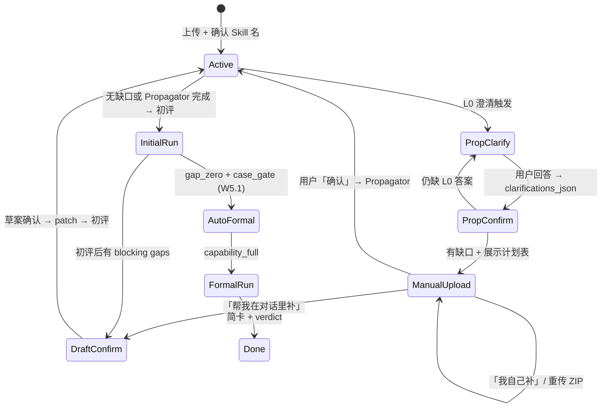

# Design: Wave 5.2 — UI 透明化 + 补题确认 + 全对话澄清

> **源文档**：`docs/superpowers/specs/2026-06-10-chat-ui-transparency-design.md`  
> **前置**：W5 Chat-First ✅、W5.1 简卡分流 ✅（413 tests）

---

## 1. 信息架构（修订）

```
┌─────────────────────────────────────────────────────────────┐
│ Tab: 对话评估                                                │
│  · propagation_plan 卡片（缺题时：表格 + 三方式 + 交流引导）   │
│  · propagation_summary（系统自动出题后：写了哪些 prop_* 文件）│
│  · Agent clarify / 叙事 / 草案（LLM + L0 模板）               │
│  · readiness_result 卡片（初评 GQ12–13：自包含，无报告 CTA）   │
│  · rich_report 简卡（**仅 formal**；verdict + next_action）   │
│  · CTA: openRunDetail(run_id) — **仅 capability_full**       │
└─────────────────────────────────────────────────────────────┘
┌─────────────────────────────────────────────────────────────┐
│ Tab: 评估历史 → **仅 capability_full**；详情模态；初评不入列表(GQ15 B) │
└─────────────────────────────────────────────────────────────┘
```

**不变**：2 Tab；专家视角切换；W5.1 草案确认；自动正式评估（结构齐 → capability_full）。

---

## 2. 用户旅程（状态机）



---

## 3. 三种补题方式（UI-B3）

### 3.1 触发

**When** `CaseSanitizer.needs_propagation == True`（`gap_by_type` 任一项 > 0 和/或 sample_io 缺口）：

1. **不**调用 `CasePropagator.propagate()`
2. **不**创建 evaluation run
3. `conversation.status = awaiting_propagation_confirm`（若 L0 未满足则先 `awaiting_propagation_clarify`）
4. `append_lui_message(..., message_type=propagation_plan, payload_json=...)`

### 3.2 用户选择

| 用户输入 | Handler | 下一状态 |
|----------|---------|----------|
| `确认` / `允许自动出题` | `CasePropagator.propagate()` → `propagation_summary` → `_phase_eval` 创建 run | `active` |
| `我自己补` | 白话 + 模板链接；`awaiting_manual_upload` | 等重传 ZIP |
| `帮我在对话里补` | LuiAgent 生成 eval_cases 草案 → `set_pending_patch` | `awaiting_draft_confirm` |
| 自由文本（业务描述） | merge `clarifications_json` 或 L1 `clarify`；可选刷新 plan | 视意图 |

### 3.3 话术与呈现（GQ3 / GQ9 / GQ10）

**同一条消息**包含：

1. 清点结论（原包 / `_broken/` / staging 仅练习区）
2. L0 澄清问题（可跳过，GQ6）— 与表同屏
3. 补题计划表（见 §5）
4. 三方式 + 「也可以直接跟我聊…」
5. **三个 Action Chip**：`自动出题` | `我自己补` | `对话里补`（GQ10）

**表刷新（GQ9）**：用户回答澄清后 **更新同一条** `propagation_plan`（`plan_version` 递增）；UI 只渲染最新版，不堆叠历史表。

**GQ1**：`gap_by_type` 任一项 > 0（含部分已有）均触发暂停。

**GQ2**：Chip 或自然语言（「确认」「按表出题」）在 `awaiting_propagation_confirm` 下由 LLM 归类；**status** 门控 Propagator 执行。

**GQ11**：high 风险红线题型仅在表内标注；**无**二次确认弹窗。

---

## 4. 全对话澄清（UI-S2）

### 4.1 LuiAgent 新 intent

```python
@dataclass
class LuiResponse:
    intent: str  # explain_only | mutation | system_action | clarify
    reply: str
    patch: dict | None
    clarification_keys: list[str] | None  # clarify 时可选
```

**Prompt 硬规则**：

- Skill 设计不确定 → **必须 `clarify`**，禁止 `mutation`
- `clarify` 时 `patch` 必须为 null
- 用户回答 merge 到 `conversations.clarifications_json`
- Propagator / 草案 / 叙事 prompt **必须注入** `clarifications_json`

### 4.2 L0 触发（`core/propagation_plan.py`）

| 条件 | 问题 key |
|------|----------|
| `category` 缺失或 slug 非法 | `category` |
| `description` 空或 len < 30 | `purpose` |
| risk 与正文关键词不符 | `risk_level` |
| eval_cases 全空且 excerpt < 200 | `success_output_shape` |
| user_message 与 SKILL.md 矛盾 | `intent_source` |
| high risk + 将生成 refusal/adversarial | `refusal_scope` |

上限 3 问/轮；优先 A/B/C 选项。

### 4.3 Session gate（`adapters/api/_session.py`）

| status | 允许 | 禁止 |
|--------|------|------|
| `awaiting_propagation_clarify` | 回答、explain、clarify | Propagator、run、mutation |
| `awaiting_propagation_confirm` | 三方式、clarify、explain | Propagator（未确认）、mutation* |
| `awaiting_manual_upload` | 重传 ZIP、explain、clarify | Propagator、mutation |
| `awaiting_clarify` | 回答、explain | mutation、Propagator、trigger_next_run |
| `awaiting_draft_confirm` | W5.1 + clarify | 未确认 mutation |

\* 方式二「帮我在对话里补」显式切换后进入 draft 流。

---

## 5. `propagation_plan` payload

**模块**：`skillhub_eval/core/propagation_plan.py`（新建）

```python
def build_propagation_plan(
    staging_path: Path,
    bundle: dict,
    sanitizer_result: SanitizerResult,
    clarifications: dict | None,
) -> dict:
    """Deterministic table payload — no LLM for row counts."""
```

**payload 字段**：

| 字段 | 来源 |
|------|------|
| `risk_level_declared` | bundle frontmatter |
| `existing_counts`, `gap_by_type` | `CaseSanitizer` |
| `broken_moved` | sanitizer |
| `sample_io_gap` | ingest `has_sample_io` + case count |
| `rows[].type_zh` | 映射 happy_path→正常场景 等 |
| `rows[].tests_what` | `TYPE_DESCRIPTIONS`（propagator.py） |
| `rows[].business_expectation` | taxonomy `case_template_hint` |
| `rows[].redline` | true for refusal/adversarial |

**message_type**：`propagation_plan` | `propagation_summary`

---

## 6. Bootstrap / `_phase_eval` 拆分

**文件**：`skillhub_eval/adapters/api/routes/conversations.py`

**现况**（简化）：

```
security_scan → sanitizer → propagate (immediate) → create_run → engine
```

**修订**：

```
security_scan → sanitizer → build_propagation_plan
  → if L0 pending: return (no run_id, status=awaiting_propagation_clarify)
  → if needs_propagation: append plan, return (status=awaiting_propagation_confirm)
  → else: create_run → engine
```

**Chat 确认路径**（`routes/chat.py`）：

```
用户「确认」+ status=awaiting_propagation_confirm
  → propagate(clarifications_json)
  → append propagation_summary
  → create_run + engine (reuse _phase_eval tail)
```

**API 响应**（`BootstrapResponse` / `ChatResponse`）：

- 保留 `propagator_used`
- 新增 `propagation_deferred: bool` — 计划已展示、Propagator 未执行

---

## 7. 初评瘦身 — readiness 路径（GQ12–GQ13）

**When** `evaluation_mode == degraded`（对用户称「初评」）：

### 7.1 执行范围（R2）

| 阶段 | 初评 | 正式 capability_full |
|------|------|----------------------|
| ingest + Level0 结构 | ✅ | ✅ |
| security_scan | ✅ | ✅ |
| 规则 risk_lock（①+②） | ✅ | ✅ |
| 风险 AI ③ `review_risk_level` | ❌ | ✅ |
| gaps 快照 + completeness_score | ✅ | ✅ |
| case_gate（题型数量） | ✅ | ✅ |
| case_executing / code_assert | ❌ | ✅ |
| model_judging（双模型） | ❌ | ✅ |
| skill_summary LLM | ❌ | ✅ |
| 全量 `EvaluationReport` | ❌ | ✅ |

**终态**：`status=completed`，`review_status=warn`（或内部 `readiness_ok` / `readiness_blocked` 写入 readiness payload）；`score_total=null`。

### 7.2 对话输出（GQ13）

**不**调用 `append_rich_report_message` 于初评 run。

新增 `append_readiness_result_message(conversation_id, run_id, repo)`：

- `message_type=readiness_result`
- `payload_json` 含：`gaps[]`, `required_actions[]`, `security_status`, `risk_level_locked`, `case_gate`, `completeness_score`, `gap_zero`, `can_enter_formal`（gap_zero ∧ case_gate_passed）, `headline_zh`, `body_sections[]`
- **无** `report` 嵌套；**无** `openRunDetail` action

叙事（LLM 或模板）在 readiness 卡片 **之前**（沿用 GQ4 顺序）。

### 7.3 持久化与历史 Tab（GQ15 B）

- `evaluation_runs` 行仍创建（后端/审计可追溯）
- `report_json` 仅存 **轻量 readiness 快照**（非 EvaluationReport 全量），或 `report_json` null + gaps 表已有快照（实现择一，测试锁定）
- **历史 Tab UI**：`GET /history` 或前端过滤 **排除** `evaluation_mode=degraded`；用户只看正式 run + 详情模态

---

## 8. 正式结论卡增强（GQ14）

在 §9 原 verdict 基础上增加 `next_action_zh`：

| 条件 | `verdict_zh` | `next_action_zh` |
|------|----------------|------------------|
| pass | 通过 | 已达到上架标准，可进入后续上架流程 |
| warn, 无专家 | 通过（有改进建议） | 建议按报告优化后再次提交 |
| awaiting_human_review | 需人工复核 | 请等待专家裁定；作者暂不可改包 |
| fail | 未通过 | 请按完整报告修改后重新评估 |

`rich_report` formal 保留 `summary_one_liner` + **「查看完整报告 →」**（仅正式）。

---

## 9. 正式结论徽标（FB-01 / GQ5）

**文件**：`skillhub_eval/core/chat_notifications.py`

```python
def _resolve_verdict(run: dict, report: dict | None) -> tuple[str, str]:
    """Returns (verdict_zh, verdict_badge_class). GQ5 mapping."""
    # pass → ("通过", "pass")
    # warn, not awaiting_human_review → ("通过（有改进建议）", "pass_warn")
    # awaiting_human_review / frozen → ("需人工复核", "warn")
    # fail → ("不通过", "fail")
    # initial phase → omit (W5.1 C2)
```

写入 `build_rich_report_payload`：`verdict_zh`, `verdict_badge_class`（仅 `formal` / `formal_pending_review`）。

**UI**：`renderReportHtml` 在 score_line 上方渲染徽标。

---

## 10. DB v5

**文件**：`skillhub_eval/persistence/sqlite.py`

| 变更 | 说明 |
|------|------|
| `SCHEMA_VERSION = 5` | migration idempotent |
| `conversations.clarifications_json TEXT` | `{key: value}` 累积 |
| `conversations.status` | +`awaiting_propagation_confirm`, `awaiting_propagation_clarify`, `awaiting_manual_upload`, `awaiting_clarify` |

**Port**（`core/ports.py`）：

- `get_clarifications(conversation_id) -> dict | None`
- `merge_clarifications(conversation_id, patch: dict) -> None`

---

## 11. UI 触点

**文件**：`skillhub_eval/adapters/ui/static/index.html`

| 函数 | 职责 |
|------|------|
| `renderPropagationPlanHtml(payload)` | 表格 + 三方式 + sample_io 行 |
| `renderPropagationSummaryHtml(payload)` | prop_* 文件列表 |
| `renderReportHtml` | + `verdict_zh` 徽标（formal only） |
| `renderMessages` | 分支 `propagation_plan` / `propagation_summary` / `readiness_result` |
| `loadHistory` / 历史表渲染 | **过滤** `evaluation_mode !== degraded`（GQ15 B） |

Composer：在 `awaiting_propagation_confirm` 下可提示「回复 确认 / 帮我在对话里补 / 我自己补」。

---

## 12. 场景规格（Given/When/Then）

### 10.1 缺题暂停

- **Given** ZIP 仅含 SKILL.md，risk=low  
- **When** POST bootstrap 完成 security  
- **Then** 无 `run_id`；`propagation_deferred=true`；messages 含 `propagation_plan`；staging 无 `prop_*`

### 10.2 确认后 Propagator

- **Given** status=`awaiting_propagation_confirm`  
- **When** POST chat `{message:"确认"}`  
- **Then** staging 有 `prop_*`；`propagation_summary` 消息；`run_id` 创建；status=`active`

### 10.3 方式二草案

- **Given** status=`awaiting_propagation_confirm`  
- **When** POST chat `{message:"帮我在对话里补"}`  
- **Then** status=`awaiting_draft_confirm`；`pending_patch_json` 含 eval_cases；无 Propagator 文件直至用户确认

### 10.4 L1 clarify

- **Given** 用户消息与 SKILL.md 用途明显矛盾  
- **When** POST chat  
- **Then** `intent=clarify`；无 patch；无 Propagator

### 12.5 初评无 model_judging

- **Given** bootstrap 触发 degraded run  
- **When** engine completes  
- **Then** stage_progress **无** `model_judging`；messages 含 `readiness_result`；**无** `rich_report`

### 12.6 正式 Pass + next_action

- **Given** capability_full run 终态 `review_status=pass`  
- **When** rich_report appended  
- **Then** `verdict_zh=通过`；`next_action_zh` 含上架指引；CTA 打开 history 详情

### 12.7 正式 Pass 徽标（legacy id）

- **Given** capability_full run 终态 `review_status=pass`  
- **When** rich_report appended  
- **Then** payload `verdict_zh=通过`；initial phase payload 无 verdict

### 12.8 历史 Tab 不含初评（GQ15 B）

- **Given** 对话内已完成 degraded 初评且后续有 capability_full 正式 run  
- **When** 用户打开评估历史 Tab  
- **Then** 列表 **仅** 含正式 run；初评 run 不可见；初评结论仅在对应对话 `readiness_result`

---

## 11. 文件触点汇总

| 文件 | 变更 |
|------|------|
| `core/propagation_plan.py` | **新建** — plan builder, L0 detect |
| `core/case_sanitizer.py` | sample_io gap 辅助 |
| `core/propagator.py` | clarifications 注入 prompt |
| `core/lui_agent.py` | `clarify` intent; S2 prompt |
| `core/chat_notifications.py` | `verdict_zh`; 叙事引用 propagator 摘要 |
| `adapters/api/routes/conversations.py` | deferred propagation |
| `adapters/api/routes/chat.py` | 三方式 + clarify merge |
| `adapters/api/_session.py` | 新 status gate |
| `persistence/sqlite.py` | v5 |
| `adapters/ui/static/index.html` | plan/summary/verdict 渲染 |
| `docs/guides/Skill评估系统全景说明.md` | §3 §4.4 去静默 Propagator |

---

## 12. 叙事与重传（GQ7 / GQ8 / GQ4）

- **GQ7**：`awaiting_manual_upload` 下重传 ZIP → **整包重载** staging → 重新 sanitizer + plan（不 merge 旧 `prop_*`）。
- **GQ8**：`propagation_summary` 之后、初评叙事 **必须** 引用「已按同意补 N 道」再述初评/正式下一步。
- **GQ4**：`awaiting_manual_upload` 仅 explain/模板；用户描述题目内容 → Agent **提议** 切 `awaiting_draft_confirm`，不 silent patch。

## 13. 已闭合决策

| ID | 决议 |
|----|------|
| UI-B3 | 缺题暂停；三方式；B3 组合 |
| UI-S2 | 全对话 clarify |
| UI-TBL | propagation_plan 结构化表 |
| UI-VERDICT | 正式简卡结论徽标（GQ5） |
| GQ1–GQ11 | 见 proposal grill-me 表 |
