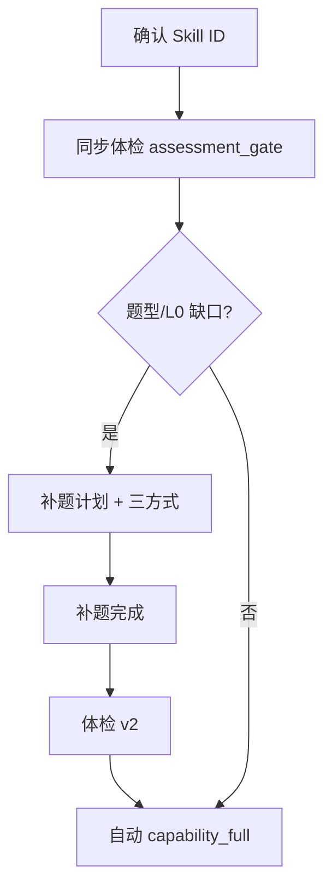

# Design: Wave 5.3.2 Assessment Gate Flow

## Journey

## Artifacts

| message_type | When |
|--------------|------|
| `assessment_gate_result` | 每次同步体检（可 gate_version） |
| `propagation_plan` | 仅 needs_propagation 或 L0 |
| `propagation_summary` | 自动出题后 |
| `rich_report` | 正式评估终态 |

## Auto formal

`start_capability_full_eval()` — `bundle_state=confirmed`, `evaluation_mode=capability_full`, 无 parent degraded run。可选改进（warn gaps）**不阻断**自动正式评估。

## Copy

- 等待：`正在分析 Skill 并检查是否满足评估需求，请稍候…`
- 缺题型：`当前不满足正式评估的题型要求，需补充评估测试用例。`
- 满足后：`评估需求已满足，正在开始正式双模型评估，请稍候…`
